# GitHub Actions — Automated DataOps Platform

> Plataforma de automatización end-to-end para el pipeline Medallion v6.0 sobre IBM Cloud, orquestada enteramente con GitHub Actions como **scheduler externo serverless**.

---

## Arquitectura General — Event-Driven DataOps

```mermaid
graph TB
    subgraph TRIGGERS["🎯 Trigger Layer"]
        direction LR
        CRON_H["⏰ Cron Horario<br/>Pipeline Scheduler"]
        CRON_6H["⏰ Cron 6h<br/>Drift Detection"]
        CRON_W["⏰ Cron Semanal<br/>Monitor + Catalog"]
        PUSH["🔀 Push to main<br/>Scala code changes"]
        MANUAL["👤 workflow_dispatch<br/>On-demand"]
    end

    subgraph PLATFORM["GitHub Actions — DataOps Platform"]
        direction TB

        subgraph CICD_LAYER["🔧 CI/CD Layer"]
            CI["CI/CD Pipeline<br/>Build → Test → Deploy"]
        end

        subgraph EXEC_LAYER["⚡ Execution Layer"]
            SCHED["Spark Pipeline<br/>Scheduler"]
        end

        subgraph QUALITY_LAYER["🛡️ Quality & Governance Layer"]
            direction LR
            DQ["Data Quality<br/>Gate"]
            DRIFT["Drift<br/>Detection"]
        end

        subgraph OBSERVE_LAYER["📊 Observability Layer"]
            direction LR
            COST["Cost & Resource<br/>Monitor"]
            LINEAGE["Data Lineage<br/>& Catalog"]
        end
    end

    subgraph IBM_CLOUD["☁️ IBM Cloud — Runtime"]
        direction LR
        COS["IBM COS<br/>4 Buckets Medallion"]
        AE["Analytics Engine<br/>Serverless Spark 3.5"]
        DB2["Db2 on Cloud<br/>Gold Persistence"]
    end

    subgraph FEEDBACK["📋 Feedback Loop"]
        SUMMARY["Step Summary<br/>Reports"]
        ISSUES["GitHub Issues<br/>Auto-created"]
        ALERTS["Threshold<br/>Alerts"]
    end

    %% Triggers
    PUSH -->|"code change"| CI
    CRON_H -->|"every hour"| SCHED
    CRON_6H -->|"every 6h"| DRIFT
    CRON_W -->|"weekly"| COST
    CRON_W -->|"weekly"| LINEAGE
    MANUAL -->|"on-demand"| SCHED
    MANUAL -->|"on-demand"| DQ

    %% CI/CD flow
    CI -->|"JAR → COS"| COS
    CI -->|"deploy"| AE

    %% Execution flow
    SCHED -->|"CSV upload"| COS
    SCHED -->|"REST API submit"| AE
    AE -->|"s3a read/write"| COS
    AE -->|"JDBC export"| DB2

    %% Post-pipeline
    SCHED -->|"triggers"| DQ
    DQ -->|"validates"| COS
    DQ -->|"validates"| DB2

    %% Drift
    DRIFT -->|"schema check"| COS
    DRIFT -->|"anomaly check"| COS

    %% Observability
    COST -->|"bucket sizes"| COS
    COST -->|"app history"| AE
    COST -->|"row counts"| DB2
    LINEAGE -->|"parquet schema"| COS

    %% Feedback
    DQ --> SUMMARY
    COST --> SUMMARY
    LINEAGE --> SUMMARY
    DRIFT -->|"on drift"| ISSUES
    COST -->|"on threshold"| ALERTS

    style TRIGGERS fill:#24292e10,stroke:#24292e,stroke-width:2px
    style PLATFORM fill:#0f62fe08,stroke:#0f62fe,stroke-width:3px
    style CICD_LAYER fill:#42be6515,stroke:#42be65,stroke-width:2px
    style EXEC_LAYER fill:#ff832b15,stroke:#ff832b,stroke-width:2px
    style QUALITY_LAYER fill:#da1e2815,stroke:#da1e28,stroke-width:2px
    style OBSERVE_LAYER fill:#0072c315,stroke:#0072c3,stroke-width:2px
    style IBM_CLOUD fill:#16161608,stroke:#0f62fe,stroke-width:3px
    style FEEDBACK fill:#8a3ffc15,stroke:#8a3ffc,stroke-width:2px
    style CI fill:#42be65,color:#fff
    style SCHED fill:#ff832b,color:#fff
    style DQ fill:#da1e28,color:#fff
    style DRIFT fill:#da1e28,color:#fff
    style COST fill:#0072c3,color:#fff
    style LINEAGE fill:#0072c3,color:#fff
    style COS fill:#0072c3,color:#fff
    style AE fill:#ff832b,color:#fff
    style DB2 fill:#009d9a,color:#fff
    style ISSUES fill:#8a3ffc,color:#fff
```

---

## Flujo de Ejecución — Cadena de Workflows

El diseño sigue un patrón **event-driven chain** donde cada workflow puede disparar o ser disparado por otros, formando un grafo de dependencias inteligente:

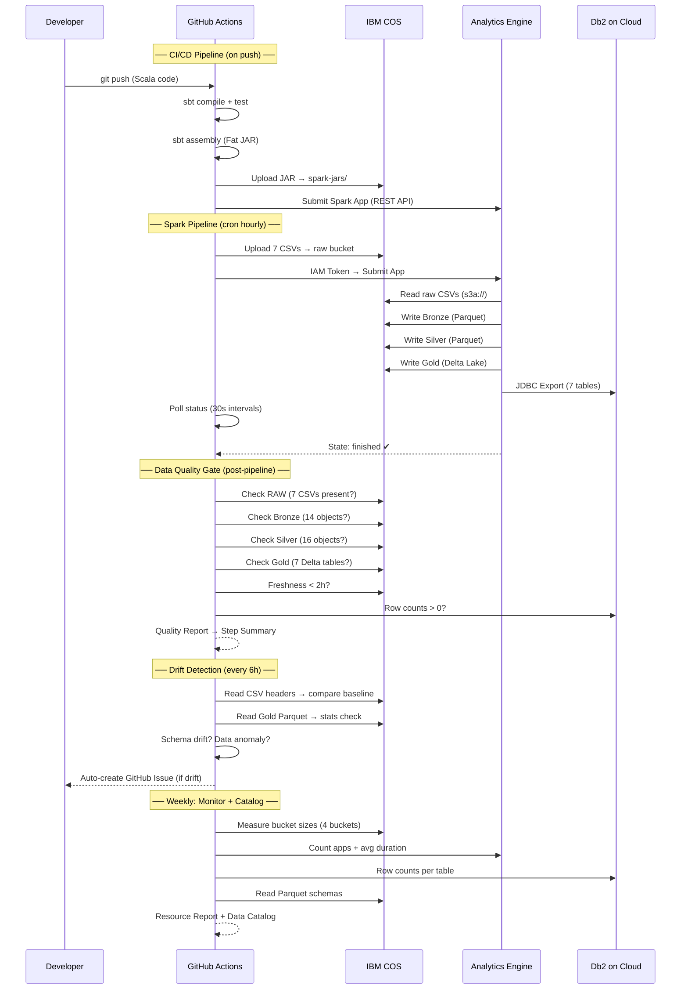

---

## Inventario de Workflows

### 1. Spark Pipeline Scheduler

> Orquestador principal del pipeline Medallion. Sube datos, ejecuta Spark en AE Serverless y monitorea hasta completar.

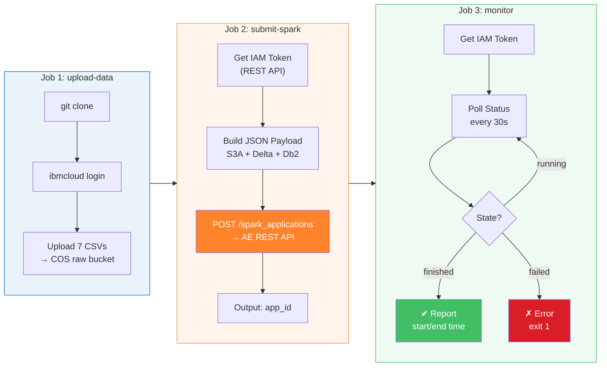

| Propiedad | Valor |
|-----------|-------|
| **Archivo** | `spark-pipeline-scheduler.yml` |
| **Trigger** | `cron: 0 * * * *` (cada hora) + `workflow_dispatch` |
| **Jobs** | 3 (upload-data → submit-spark → monitor) |
| **API** | IBM AE REST API (no requiere CLI en runner) |
| **Timeout** | 30 min (60 polls × 30s) |
| **Parámetros** | `skip_csv_upload`, `spark_version` |

---

### 2. CI/CD Pipeline — Build, Test & Deploy

> Integración continua con deploy automático. Cada push a `main` en código Scala compila, testea y despliega a producción.

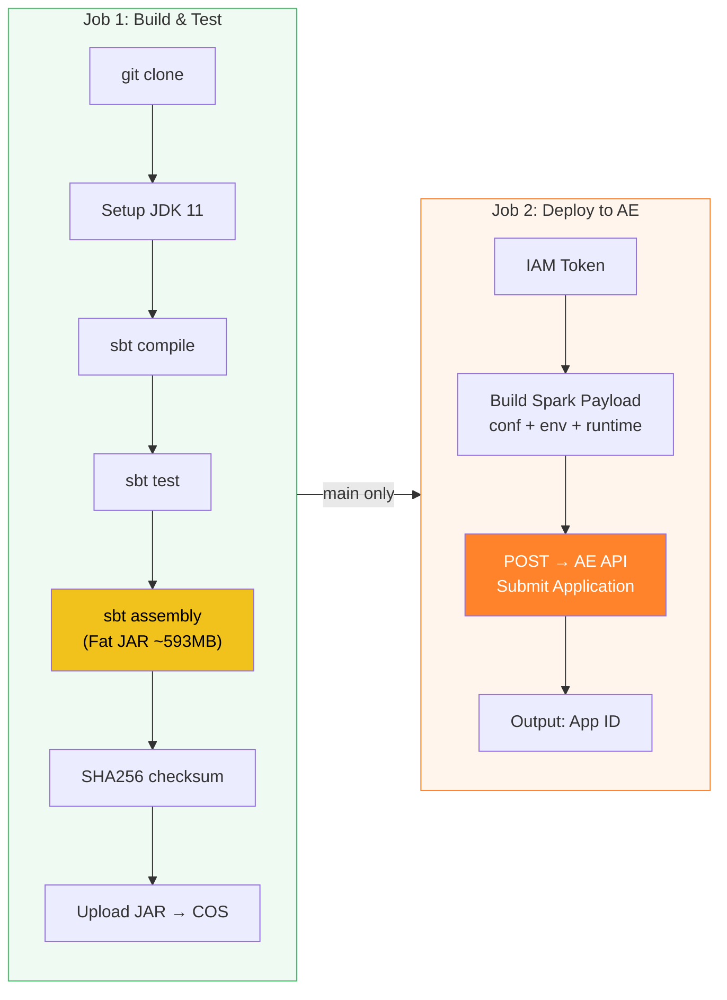

| Propiedad | Valor |
|-----------|-------|
| **Archivo** | `ci-cd-pipeline.yml` |
| **Trigger** | Push a `main` (paths: `batch-etl-scala/**`) + PR + manual |
| **Scope** | Solo se dispara si cambia código Scala |
| **Deploy** | Solo en push a `main` (no en PRs) |
| **Artifact** | `root-assembly-2.0.0.jar` → SHA256 verificado |

---

### 3. Data Quality Gate

> Validación post-ETL automatizada. Verifica integridad de datos en las 4 capas + Db2 después de cada ejecución del pipeline.

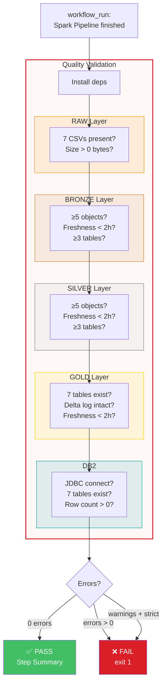

| Propiedad | Valor |
|-----------|-------|
| **Archivo** | `data-quality-gate.yml` |
| **Trigger** | `workflow_run` (post-pipeline) + `workflow_dispatch` |
| **Checks** | 30+ validaciones across 5 layers |
| **Modes** | Normal (errors only) / Strict (warnings = fail) |
| **Parámetros** | `layer` (all/raw/bronze/silver/gold/db2), `fail_on_warning` |
| **Output** | Tabla markdown en Step Summary con ✅/❌/⚠️ |

---

### 4. Cost & Resource Monitor

> Reporte semanal de consumo de recursos IBM Cloud. Detecta anomalías de costo y uso antes de que escalen.

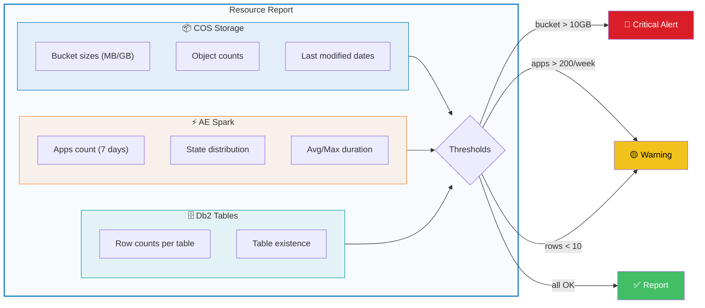

| Propiedad | Valor |
|-----------|-------|
| **Archivo** | `cost-resource-monitor.yml` |
| **Trigger** | `cron: 0 8 * * 1` (lunes 08:00 UTC) + manual |
| **Métricas** | Storage size, object count, app count, duration, row counts |
| **Thresholds** | Bucket > 10GB (🔴), Apps > 200/week (🟡), Rows < 10 (🟡) |
| **Output** | Reporte markdown con tablas y alertas |

---

### 5. Data Lineage & Catalog

> Genera documentación automática del linaje de datos completo y catálogo con schemas Parquet reales leídos desde COS.

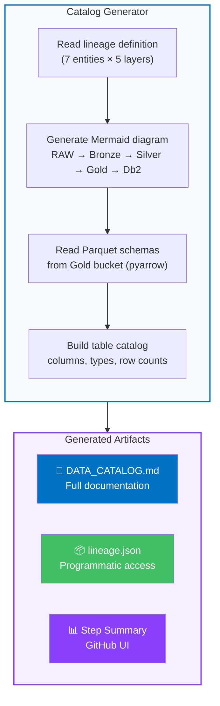

**Mermaid diagram generado automáticamente:**

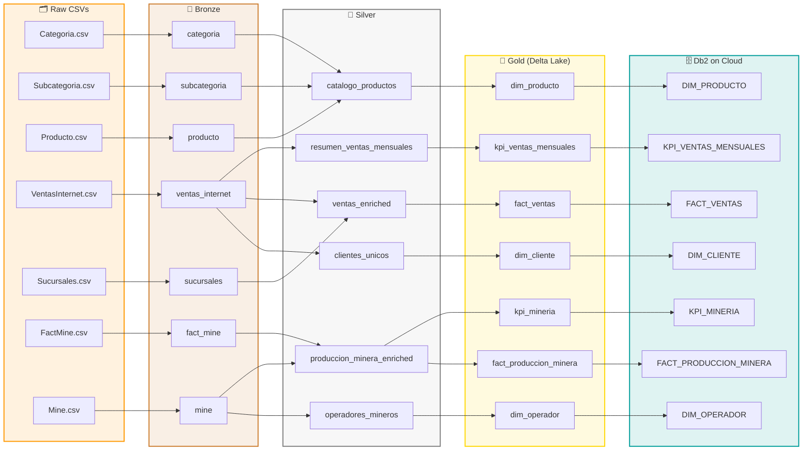

| Propiedad | Valor |
|-----------|-------|
| **Archivo** | `data-lineage-catalog.yml` |
| **Trigger** | `cron: 0 7 * * 1` (lunes 07:00 UTC) + manual |
| **Entities** | 7 tablas Gold × 5 capas de linaje |
| **Schema** | Lectura real de Parquet con pyarrow (columnas + tipos) |
| **Output** | `DATA_CATALOG.md` + `lineage.json` + Step Summary |

---

### 6. Drift Detection — Schema & Data

> Detección proactiva de cambios no esperados en los datos fuente y tablas Gold. Abre issues automáticos en GitHub cuando detecta anomalías.

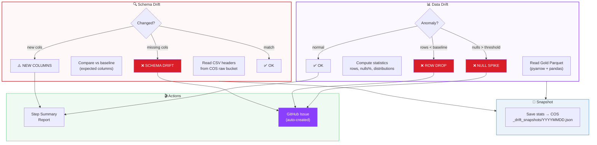

| Propiedad | Valor |
|-----------|-------|
| **Archivo** | `drift-detection.yml` |
| **Trigger** | `cron: 30 */6 * * *` (cada 6 horas) + manual |
| **Schema check** | 7 CSVs × headers vs baseline esperado |
| **Data check** | 7 Gold tables × row count + null% + distributions |
| **Sensibilidad** | `low` / `medium` / `high` (configurable) |
| **Snapshots** | Guardados en COS para comparación histórica |
| **Auto-issue** | Crea GitHub Issue con label `drift-detection` si detecta |

---

## Configuración de Secrets

Los 4 secrets se configuran en **Settings → Secrets and variables → Actions**:

| Secret | Usado por | Descripción |
|--------|-----------|-------------|
| `IBMCLOUD_API_KEY` | Todos | API Key de IBM Cloud (IAM authentication) |
| `COS_ACCESS_KEY` | Todos | HMAC Access Key para IBM COS (S3A) |
| `COS_SECRET_KEY` | Todos | HMAC Secret Key para IBM COS (S3A) |
| `DB2_PASSWORD` | Scheduler, Quality Gate, Cost Monitor | Password de Db2 on Cloud |

---

## Schedule Completo

```mermaid
gantt
    title Cronograma de Ejecución — 24 horas (UTC)
    dateFormat HH:mm
    axisFormat %H:%M

    section Pipeline
    Spark Pipeline (hourly)     :crit, 00:00, 1h
    Spark Pipeline              :crit, 01:00, 1h
    Spark Pipeline              :crit, 02:00, 1h
    Spark Pipeline              :crit, 03:00, 1h
    Spark Pipeline              :crit, 04:00, 1h
    Spark Pipeline              :crit, 05:00, 1h

    section Drift Detection
    Drift Check (every 6h)      :active, 00:30, 30min
    Drift Check                 :active, 06:30, 30min
    Drift Check                 :active, 12:30, 30min
    Drift Check                 :active, 18:30, 30min

    section Weekly (Monday)
    Data Lineage Catalog        :07:00, 30min
    Cost & Resource Monitor     :08:00, 30min
```

| Workflow | Cron | Frecuencia | Día |
|----------|------|-----------|-----|
| Spark Pipeline | `0 * * * *` | Cada hora | Todos |
| Drift Detection | `30 */6 * * *` | Cada 6 horas | Todos |
| Data Lineage | `0 7 * * 1` | Semanal | Lunes 07:00 |
| Cost Monitor | `0 8 * * 1` | Semanal | Lunes 08:00 |
| CI/CD | On push | Event-driven | — |
| Quality Gate | Post-pipeline | Event-driven | — |

---

## Decisiones de Diseño

### ¿Por qué GitHub Actions como scheduler?

| Criterio | GitHub Actions | Airflow | IBM Code Engine |
|----------|---------------|---------|-----------------|
| Costo | **Gratis** (2,000 min/mes) | Self-hosted | Pay-per-run |
| Setup | **0 infraestructura** | Servidor dedicado | Config COS + IAM |
| CI/CD integrado | **Nativo** | Plugin | Externo |
| Secrets management | **Built-in** | Vault/env | Secrets Manager |
| Monitoring | **Step Summary + Issues** | Airflow UI | Log Analysis |
| Complejidad | **Baja** (YAML) | Alta (Python DAGs) | Media |

### ¿Por qué sin external actions?

La organización tiene una política que restringe actions a repositorios del mismo owner. Todos los workflows usan exclusivamente `run:` steps con:
- **`curl`** para REST APIs (IBM IAM + AE)
- **`python3`** para lógica de validación y reportes
- **`ibmcloud` CLI** para operaciones COS (instalado on-the-fly)
- **`git clone`** en lugar de `actions/checkout`

### Patrón de autenticación

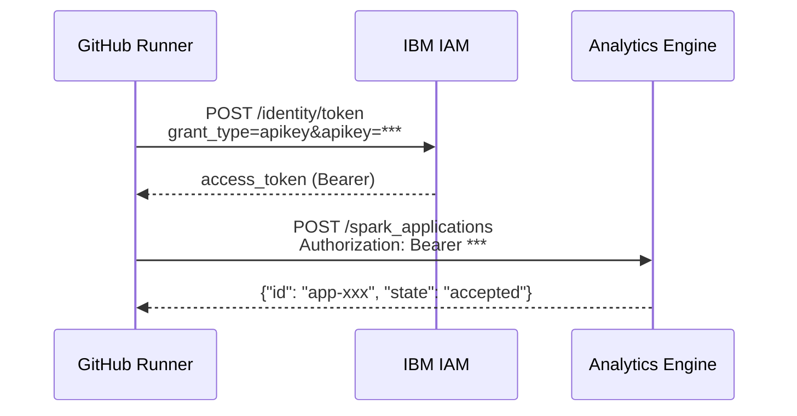

Todos los workflows usan **IAM token exchange** directo via REST, sin depender del `ibmcloud` CLI para la autenticación con AE.

---

## Ejecución Manual

Todos los workflows soportan `workflow_dispatch` desde la UI de GitHub:

```
GitHub → Actions → [Workflow] → Run workflow → Select branch → Run
```

O via CLI (requiere PAT con scope `repo`):

```bash
# Ejecutar pipeline
gh workflow run spark-pipeline-scheduler.yml

# Ejecutar quality gate en gold solamente
gh workflow run data-quality-gate.yml -f layer=gold -f fail_on_warning=true

# Ejecutar drift detection con alta sensibilidad
gh workflow run drift-detection.yml -f sensitivity=high

# Ver estado de ejecuciones
gh run list --workflow=spark-pipeline-scheduler.yml
gh run watch <run_id>
```
