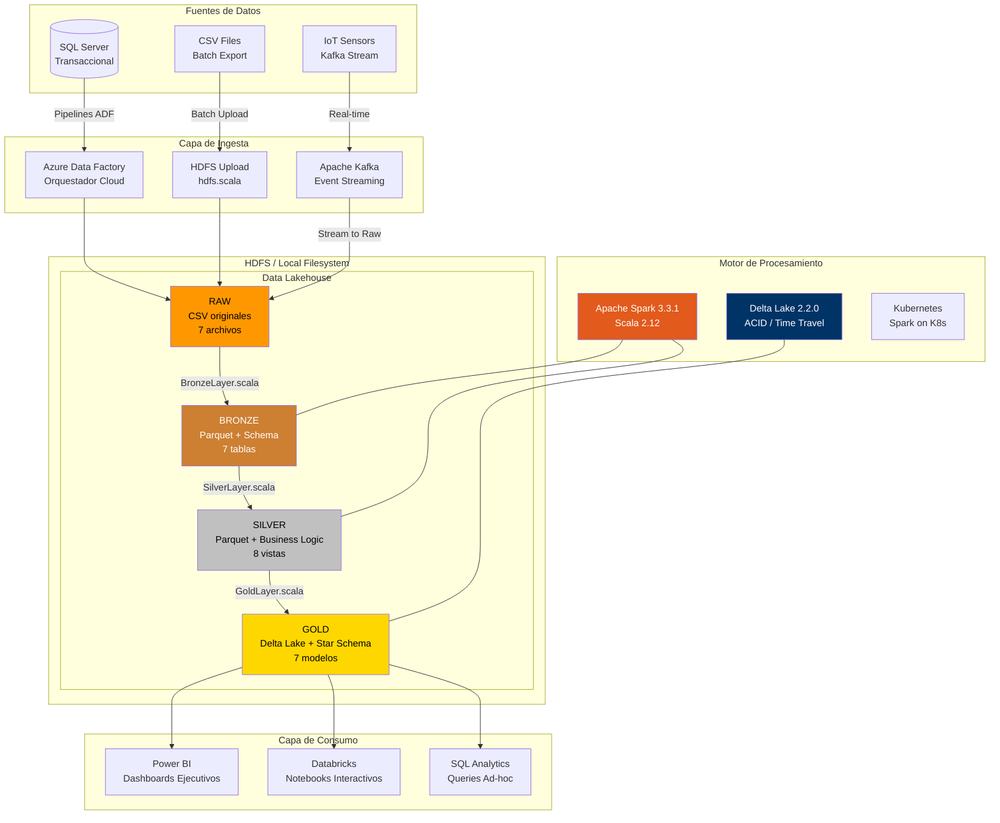
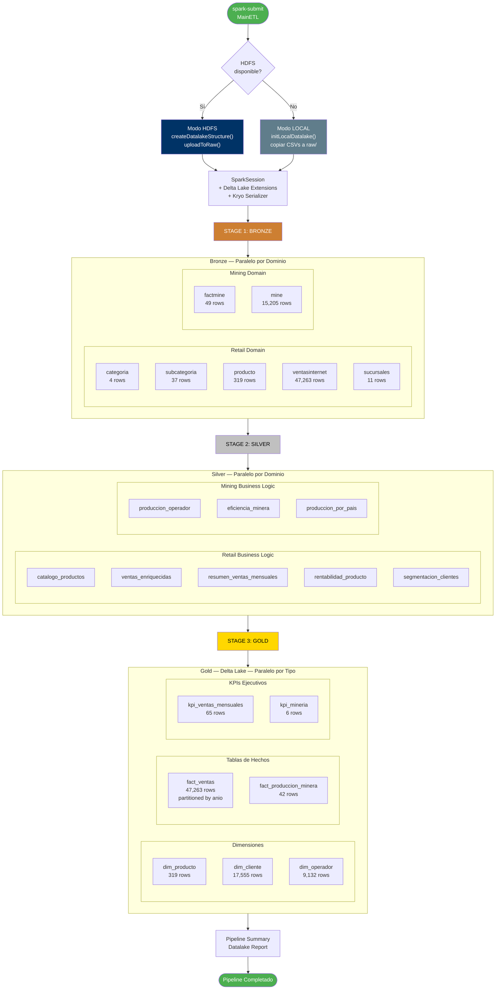
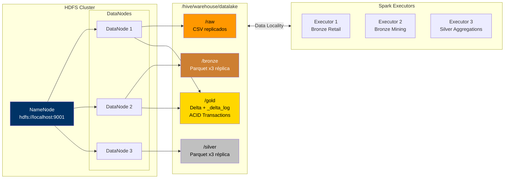
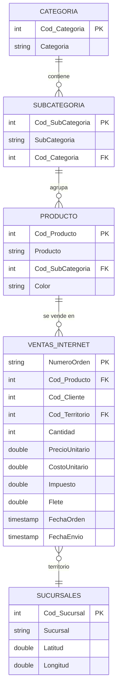
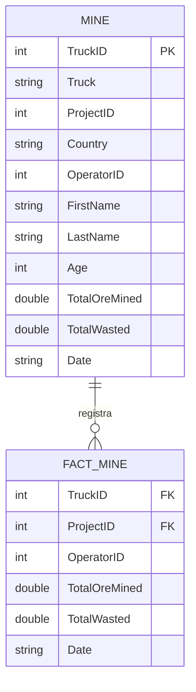
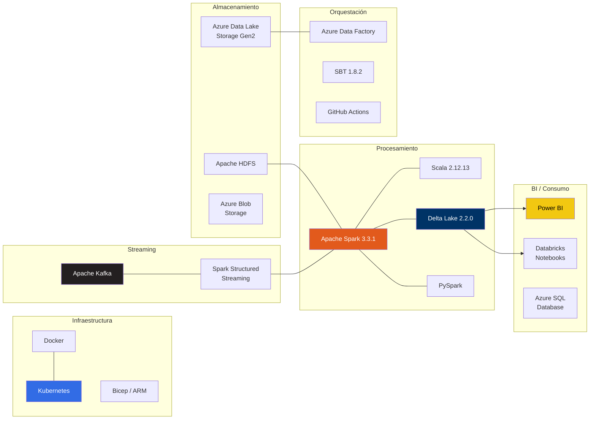

# Data Engineering Platform — Lakehouse Medallion Architecture

## Idea de Negocio

Este proyecto implementa una plataforma de datos empresarial para dos unidades de negocio complementarias de una corporación multinacional:

**Retail — Venta de Bicicletas y Componentes**: Operación de comercio electrónico con ventas por internet a nivel global. El negocio gestiona un catálogo de productos organizados en categorías y subcategorías (bicicletas de montaña, ruta, touring, componentes, accesorios), con operaciones en múltiples territorios, una red de sucursales y campañas promocionales activas. El desafío principal es optimizar la rentabilidad por producto, identificar patrones de compra del cliente y anticipar la demanda por categoría y temporada.

**Mining — Extracción Mineral Industrial**: Operación minera distribuida en múltiples países con flotas de camiones, operadores especializados y proyectos de extracción concurrentes. El negocio necesita maximizar la producción de mineral, minimizar el desperdicio operativo y evaluar la eficiencia de cada operador y equipo para optimizar la asignación de recursos.

La plataforma de datos unifica ambos dominios en un único Data Lakehouse, permitiendo a la dirección ejecutiva tomar decisiones basadas en datos con una visión consolidada de toda la operación.

---

## Definición de Business Intelligence

La estrategia de BI se estructura en tres niveles de análisis materializados como tablas Delta en la capa Gold, listos para ser consumidos por Power BI:

### Dashboard Ejecutivo — Retail
| KPI | Descripción | Tabla Gold |
|-----|-------------|------------|
| Ingreso Bruto MoM | Variación mensual de ingresos con acumulado YTD | `kpi_ventas_mensuales` |
| Margen por Categoría | Rentabilidad neta por línea de producto | `kpi_ventas_mensuales` |
| Segmentación de Clientes | Distribución VIP / Premium / Regular / Ocasional | `dim_cliente` |
| Ticket Promedio | Valor promedio por transacción y tendencia temporal | `kpi_ventas_mensuales` |
| Top Productos | Ranking por margen total y clasificación de rotación | `dim_producto` |
| LTV Anualizado | Lifetime Value proyectado por segmento de cliente | `dim_cliente` |

### Dashboard Ejecutivo — Mining
| KPI | Descripción | Tabla Gold |
|-----|-------------|------------|
| Producción Neta por País | Total mineral menos desperdicio por geografía | `kpi_mineria` |
| Tasa de Desperdicio | % de mineral perdido sobre el total extraído | `kpi_mineria` |
| Eficiencia por Operador | Ranking y clasificación Elite/Eficiente/Promedio | `dim_operador` |
| Mineral por Truck | Productividad de cada unidad de transporte | `kpi_mineria` |
| Coeficiente de Variación | Estabilidad operativa por proyecto | `fact_produccion_minera` |

### Análisis Operativo (Self-Service)
Las tablas `fact_ventas` y `fact_produccion_minera` están diseñadas como modelos Star Schema que permiten análisis ad-hoc con filtros por período, categoría, territorio, segmento de cliente, país, proyecto y operador.

---

## Arquitectura Lakehouse



---

## Pipeline de Procesamiento — Workflow Paralelizable

El pipeline se diseña con etapas independientes por dominio que pueden ejecutarse en paralelo, sincronizándose solo cuando hay dependencias entre capas.



### Estrategia de Paralelización

| Etapa | Paralelismo | Descripción |
|-------|-------------|-------------|
| **Bronze** | Por tabla | Las 7 tablas son independientes: cada una lee su CSV, aplica schema y escribe Parquet sin dependencia entre sí |
| **Silver — Retail** | Parcial | `catalogo_productos` debe construirse primero (join Producto+Subcategoría+Categoría). Luego `ventas_enriquecidas` y `rentabilidad_producto` pueden ejecutarse en paralelo. `segmentacion_clientes` es independiente |
| **Silver — Mining** | Total | Las 3 vistas mining leen directamente de `mine` y `factmine`, sin dependencias cruzadas |
| **Gold — Dimensiones** | Total | `dim_producto`, `dim_cliente` y `dim_operador` son independientes entre sí |
| **Gold — Facts** | Parcial | `fact_ventas` necesita `silver_segmentacion_clientes`. `fact_produccion_minera` necesita `silver_eficiencia_minera` + `silver_produccion_por_pais` |
| **Gold — KPIs** | Total | `kpi_ventas_mensuales` y `kpi_mineria` leen de silver sin dependencia cruzada |

### Arquitectura HDFS — Datalake Distribuido

Cuando HDFS está disponible, el datalake se extiende sobre un filesystem distribuido con replicación y tolerancia a fallos:



---

## Capas del Lakehouse — Detalle

### RAW — Zona de Ingesta
Archivos CSV originales tal como llegan desde los sistemas transaccionales. Sin transformación alguna.

| Archivo | Dominio | Registros |
|---------|---------|-----------|
| `Categoria.csv` | Retail | 4 |
| `Subcategoria.csv` | Retail | 37 |
| `Producto.csv` | Retail | 319 |
| `VentasInternet.csv` | Retail | 47,263 |
| `Sucursales.csv` | Retail | 11 |
| `FactMine.csv` | Mining | 49 |
| `Mine.csv` | Mining | 15,205 |

### BRONZE — Data Cleansing (Parquet)
Primera capa de calidad. Aplica schema explícito con tipos estrictos, elimina filas con claves nulas, deduplica por claves naturales y agrega metadatos de auditoría (`_bronze_ingested_at`, `_bronze_source_file`).

| Tabla | Claves de Deduplicación | Registros |
|-------|------------------------|-----------|
| `categoria` | `Cod_Categoria` | 4 |
| `subcategoria` | `Cod_SubCategoria` | 37 |
| `producto` | `Cod_Producto` | 319 |
| `ventasinternet` | `NumeroOrden`, `Cod_Producto` | 47,263 |
| `sucursales` | `Cod_Sucursal` | 11 |
| `factmine` | `TruckID`, `ProjectID`, `Date` | 49 |
| `mine` | `TruckID`, `ProjectID`, `OperatorID`, `Date` | 15,205 |

### SILVER — Business Logic (Parquet)
Lógica de negocio materializada: joins entre entidades, cálculos financieros, métricas de rendimiento y segmentación.

#### Dominio Retail
| Vista | Descripción |
|-------|-------------|
| `catalogo_productos` | Jerarquía completa Producto → Subcategoría → Categoría |
| `ventas_enriquecidas` | Cada venta con ingreso bruto, margen, ganancia neta, tipo de envío y flag de promoción |
| `resumen_ventas_mensuales` | Agregado mensual por categoría: órdenes, clientes únicos, ingreso, margen, ticket promedio |
| `rentabilidad_producto` | Ranking de productos por revenue, margen total y % de margen promedio |
| `segmentacion_clientes` | Análisis RFM: frecuencia, monetary, ticket promedio y segmento (VIP/Premium/Regular/Ocasional) |

#### Dominio Mining
| Vista | Descripción |
|-------|-------------|
| `produccion_operador` | Producción total por operador: mineral extraído, desperdicio y % de desperdicio |
| `eficiencia_minera` | Eficiencia por truck/proyecto: producción neta, desviación estándar, clasificación Alta/Media/Baja |
| `produccion_por_pais` | Agregado por país: operadores, trucks, proyectos, producción neta y edad promedio |

### GOLD — BI & Analytics Models (Delta Lake)
Modelos dimensionales Star Schema optimizados para consumo por Power BI. Escritos en formato **Delta Lake** con soporte para time travel, ACID transactions y schema evolution.

#### Dimensiones
| Tabla | Tipo | Registros | Descripción |
|-------|------|-----------|-------------|
| `dim_producto` | Dimensión | 319 | Producto con clasificación de rentabilidad (Estrella/Rentable/Standard/Bajo Margen) y rotación (Alta/Media/Baja) |
| `dim_cliente` | Dimensión | 17,555 | Cliente con segmento RFM, scores de frecuencia y monetario, LTV anualizado |
| `dim_operador` | Dimensión | 9,132 | Operador minero con clasificación de eficiencia (Elite/Eficiente/Promedio/Bajo) y rankings |

#### Tablas de Hechos
| Tabla | Tipo | Registros | Partición | Descripción |
|-------|------|-----------|-----------|-------------|
| `fact_ventas` | Fact | 47,263 | `anio` | Cada línea de venta con claves a dim_producto, dim_cliente y segmento |
| `fact_produccion_minera` | Fact | 42 | — | Producción por truck/proyecto con coeficiente de variación y % contribución al país |

#### KPIs Pre-calculados
| Tabla | Tipo | Registros | Descripción |
|-------|------|-----------|-------------|
| `kpi_ventas_mensuales` | KPI | 65 | Métricas mensuales con variación MoM (%), ingreso YTD y margen YTD |
| `kpi_mineria` | KPI | 6 | KPIs por país: mineral/operador, mineral/truck, tasa de desperdicio, evaluación operativa |

---

## Dominios de Datos

### Retail — Modelo Relacional



- **Producto**: 319 artículos en 37 subcategorías y 4 categorías principales
- **VentasInternet**: 47,263 transacciones con métricas de precio, costo, impuesto y flete
- **Sucursales**: 11 puntos con coordenadas geográficas (latitud/longitud)

### Mining — Modelo Relacional



- **Mine**: 15,205 registros de operación diaria con detalle de operador
- **FactMine**: 49 registros agregados de producción por truck/proyecto/fecha

---

## Estructura del Proyecto

```
data-engineer/
│
├── database/                        → Objetos SQL Server
│   ├── schemas/                     → Esquemas de clientes
│   │   └── Clientes/
│   │       ├── Cerveceria/          → Modelo cervecería
│   │       └── Ecommerce/           → Modelo e-commerce
│   ├── stored-procedures/           → 10 procedimientos almacenados
│   └── views/                       → 15 vistas analíticas
│
├── orchestration/                   → Azure Data Factory
│   ├── factory/                     → Configuración de factories
│   ├── linked-services/             → 7 conexiones (Blob, ADLS, SQL)
│   ├── pipelines/                   → 7 pipelines de extracción
│   └── images/                      → Capturas de configuración
│
├── staging/                         → Datos intermedios
│   └── transform_csv/               → 9 CSVs de transformación
│
├── transformation/                  → Motor de procesamiento
│   ├── spark-jobs/pipelines/
│   │   ├── batch-etl-scala/         → Pipeline Medallion (Spark + Scala)
│   │   ├── stream-processing/       → Spark Streaming + Kafka
│   │   └── iot-ingestion/           → Kafka IoT Producer
│   └── notebooks/databricks/
│       ├── retail-client/            → Notebooks retail
│       └── airbnb-analytics/         → Notebooks Airbnb
│
├── infrastructure/                  → IaC y despliegue
│   ├── hadoop/                      → Docker Compose + Hadoop conf
│   ├── kafka/                       → Docker Compose Kafka
│   ├── postgresql/                  → Docker Compose PostgreSQL
│   ├── spark-k8s/                   → Spark on Kubernetes
│   └── databricks/                  → Bicep template
│
├── docs/                            → Documentación e imágenes
├── instalacion.md                   → Guía de instalación
└── README.md                        → Este archivo
```

### Navegación Rápida por Directorio

| Directorio | Descripción | Contenido Principal |
|------------|-------------|---------------------|
| [`database/`](database/) | Capa de base de datos relacional | Stored procedures, views, schemas SQL Server |
| [`database/stored-procedures/`](database/stored-procedures/) | Procedimientos almacenados | Agrega_cliente, Nueva_venta, Multi_procedure_ETL |
| [`database/views/`](database/views/) | Vistas analíticas SQL | Calcula_total_ventas, Ganancias_neta, Promedio_pedido |
| [`database/schemas/`](database/schemas/) | Esquemas de cliente | Cervecería, Ecommerce |
| [`orchestration/`](orchestration/) | Orquestación Azure Data Factory | Factories, linked services, pipelines |
| [`orchestration/pipelines/`](orchestration/pipelines/) | Pipelines ADF | ETL, Pipeline_extraccion, Copy_data_sql |
| [`orchestration/linked-services/`](orchestration/linked-services/) | Conexiones ADF | Blob Storage, ADLS, SQL Database |
| [`staging/`](staging/) | Zona de staging | CSVs intermedios de transformación |
| [`staging/transform_csv/`](staging/transform_csv/) | CSVs transformados | 9 archivos de transformación |
| [`transformation/`](transformation/) | Motor de transformación | Spark jobs, notebooks Databricks |
| [`transformation/spark-jobs/pipelines/batch-etl-scala/`](transformation/spark-jobs/pipelines/batch-etl-scala/) | Pipeline Medallion principal | Bronze → Silver → Gold en Scala/Spark |
| [`transformation/spark-jobs/pipelines/stream-processing/`](transformation/spark-jobs/pipelines/stream-processing/) | Procesamiento streaming | Spark Structured Streaming + Kafka |
| [`transformation/spark-jobs/pipelines/iot-ingestion/`](transformation/spark-jobs/pipelines/iot-ingestion/) | Ingesta IoT | Producer Kafka para sensores |
| [`transformation/notebooks/databricks/`](transformation/notebooks/databricks/) | Notebooks interactivos | Retail-client, Airbnb analytics |
| [`infrastructure/`](infrastructure/) | Infraestructura como código | Docker, Kubernetes, Bicep |
| [`infrastructure/hadoop/`](infrastructure/hadoop/) | Cluster Hadoop | Docker Compose + configuración HDFS |
| [`infrastructure/kafka/`](infrastructure/kafka/) | Cluster Kafka | Docker Compose + config |
| [`infrastructure/postgresql/`](infrastructure/postgresql/) | Base PostgreSQL | Docker Compose |
| [`infrastructure/spark-k8s/`](infrastructure/spark-k8s/) | Spark en Kubernetes | Dockerfiles + manifests K8s |
| [`infrastructure/databricks/`](infrastructure/databricks/) | Databricks IaC | Bicep template (main.bicep) |
| [`docs/`](docs/) | Documentación | Imágenes y diagramas |

---

## Stack Tecnológico



| Componente | Tecnología | Versión |
|------------|-----------|---------|
| Motor de Procesamiento | Apache Spark | 3.3.1 |
| Lenguaje | Scala | 2.12.13 |
| Formato Gold | Delta Lake | 2.2.0 |
| Build Tool | SBT | 1.8.2 |
| Runtime | Java (Microsoft) | 11 |
| Formato Bronze/Silver | Apache Parquet | — |
| Orquestación Cloud | Azure Data Factory | — |
| Streaming | Apache Kafka | — |
| Container Orchestration | Kubernetes | — |
| IaC | Docker Compose / Bicep | — |

---

## Pipeline Medallion — Código Fuente

El pipeline está modularizado en librerías independientes por capa. Cada archivo tiene una responsabilidad única:

| Librería | Archivo | Responsabilidad |
|----------|---------|-----------------|
| **Entry Point** | [`main.scala`](transformation/spark-jobs/pipelines/batch-etl-scala/src/main/scala/main.scala) | Auto-detección HDFS/Local, inicialización |
| **Workflow** | [`Workflow.scala`](transformation/spark-jobs/pipelines/batch-etl-scala/src/main/scala/workflow/Workflow.scala) | Orquestador: init → Bronze → Silver → Gold → Summary |
| **Common** | [`sparksession.scala`](transformation/spark-jobs/pipelines/batch-etl-scala/src/main/scala/common/sparksession.scala) | SparkSession singleton con Delta Lake + Kryo |
| **Common** | [`Schemas.scala`](transformation/spark-jobs/pipelines/batch-etl-scala/src/main/scala/common/Schemas.scala) | StructType explícitos para las 7 tablas |
| **Common** | [`DataLakeIO.scala`](transformation/spark-jobs/pipelines/batch-etl-scala/src/main/scala/common/DataLakeIO.scala) | readCsv, writeParquet, writeDelta, pathExists |
| **Ingest** | [`hdfs.scala`](transformation/spark-jobs/pipelines/batch-etl-scala/src/main/scala/ingest/hdfs.scala) | HDFS operations: isAvailable, upload, mkdir |
| **Bronze** | [`BronzeLayer.scala`](transformation/spark-jobs/pipelines/batch-etl-scala/src/main/scala/bronze/BronzeLayer.scala) | Schema enforcement, dedup, null filter, audit cols |
| **Silver** | [`SilverLayer.scala`](transformation/spark-jobs/pipelines/batch-etl-scala/src/main/scala/silver/SilverLayer.scala) | Joins, cálculos financieros, RFM, eficiencia |
| **Gold** | [`GoldLayer.scala`](transformation/spark-jobs/pipelines/batch-etl-scala/src/main/scala/gold/GoldLayer.scala) | Star Schema: dimensiones, facts, KPIs (Delta) |

---

## Ejecución

```bash
cd transformation/spark-jobs/pipelines/batch-etl-scala

# Compilar
sbt compile

# Construir fat JAR
sbt assembly

# Ejecutar pipeline completo
spark-submit \
  --class main.MainETL \
  --master "local[*]" \
  target/scala-2.12/root-assembly-0.0.1.jar
```

El pipeline detecta automáticamente si HDFS está disponible. Si no, opera en modo local creando el datalake en `./datalake/`.

### Variables de Entorno (opcionales)

| Variable | Default | Descripción |
|----------|---------|-------------|
| `HDFS_URI` | `hdfs://localhost:9001` | URI del NameNode HDFS |
| `CSV_PATH` | `./src/main/resources/csv` | Ruta a los archivos CSV fuente |

---

## Output del Pipeline

```
DATA ENGINEERING PIPELINE v0.3

  STAGE 1: BRONZE — Data Cleansing         → 7 tablas  (Parquet)
  STAGE 2: SILVER — Business Logic         → 8 tablas  (Parquet)
  STAGE 3: GOLD — BI & Analytics Models    → 7 tablas  (Delta Lake)

DATALAKE SUMMARY
  BRONZE (7 tablas — parquet)
  SILVER (8 tablas — parquet)
  GOLD   (7 tablas — delta)
    ├── dim_producto              319 filas
    ├── dim_cliente            17,555 filas
    ├── dim_operador            9,132 filas
    ├── fact_ventas            47,263 filas  (partitioned by anio)
    ├── fact_produccion_minera     42 filas
    ├── kpi_ventas_mensuales       65 filas
    ├── kpi_mineria                 6 filas
```
