# Fabric Analytics Engineer — Lakehouse Medallion Architecture

---

## Índice de Contenidos

1. [Idea de Negocio](#idea-de-negocio)
2. [Definición de Business Intelligence](#definición-de-business-intelligence)
   - [Dashboard Ejecutivo — Retail](#dashboard-ejecutivo--retail)
   - [Dashboard Ejecutivo — Mining](#dashboard-ejecutivo--mining)
   - [Análisis Operativo (Self-Service)](#análisis-operativo-self-service)
3. [Arquitectura Lakehouse](#arquitectura-lakehouse)
4. [Pipeline de Procesamiento — Workflow Paralelizable v3.0](#pipeline-de-procesamiento--workflow-paralelizable-v30)
   - [Estrategia de Paralelización](#estrategia-de-paralelización)
   - [Ejecución Paralela de Workflows (v3.0)](#ejecución-paralela-de-workflows-v30)
   - [Arquitectura HDFS — Datalake Distribuido](#arquitectura-hdfs--datalake-distribuido)
5. [Capas del Lakehouse — Detalle](#capas-del-lakehouse--detalle)
   - [RAW — Zona de Ingesta](#raw--zona-de-ingesta)
   - [BRONZE — Data Cleansing (Parquet)](#bronze--data-cleansing-parquet)
   - [SILVER — Business Logic (Parquet)](#silver--business-logic-parquet)
   - [GOLD — BI & Analytics Models (Delta Lake)](#gold--bi--analytics-models-delta-lake)
6. [Dominios de Datos](#dominios-de-datos)
7. [Modelo de Datos](#modelo-de-datos)
8. [Estructura del Proyecto](#estructura-del-proyecto)
   - [Navegación Rápida por Directorio](#navegación-rápida-por-directorio)
9. [Stack Tecnológico](#stack-tecnológico)
10. [Pipeline Medallion — Código Fuente (Scala)](#pipeline-medallion--código-fuente)
11. [Pipeline Medallion — Notebooks IBM Cloud (PySpark)](#pipeline-medallion--notebooks-ibm-cloud-pyspark)
12. [Infraestructura IBM Cloud — CI/CD y Terraform](#infraestructura-ibm-cloud--cicd-y-terraform)
    - [Arquitectura de Infraestructura Completa — IBM Cloud](#arquitectura-de-infraestructura-completa--ibm-cloud)
    - [CI/CD Pipeline — Tekton 9-Stage Architecture](#cicd-pipeline--tekton-9-stage-architecture)
    - [DevOps Lifecycle — Procesos Operativos](#devops-lifecycle--procesos-operativos)
13. [Ejecución](#ejecución)
    - [Modo 1 — Local (sin infraestructura)](#modo-1--local-sin-infraestructura)
    - [Modo 2 — Lakehouse completo (HDFS + Hive)](#modo-2--lakehouse-completo-hdfs--hive)
    - [Modo 3 — Script E2E automatizado](#modo-3--script-e2e-automatizado)
    - [Modo 4 — IBM Analytics Engine Serverless](#modo-4--ibm-analytics-engine-serverless)
    - [spark-submit (fat JAR)](#spark-submit-fat-jar)
    - [Variables de Entorno](#variables-de-entorno)
    - [Interfaces Web](#interfaces-web)
14. [Output del Pipeline](#output-del-pipeline)
15. [Workflows de Trazabilidad — WF4, WF5, WF6](#workflows-de-trazabilidad--wf4-wf5-wf6)
    - [WF4: Data Quality](#wf4-data-quality--dataqualityworkflow)
    - [WF5: Lineage](#wf5-lineage--lineageworkflow)
    - [WF6: Metrics](#wf6-metrics--metricsworkflow)
16. [Auditoría del Pipeline — WF3: Hive Audit](#auditoría-del-pipeline--wf3-hive-audit)

---

## Idea de Negocio

Este proyecto implementa una plataforma de datos empresarial para dos unidades de negocio complementarias de una corporación multinacional:

**Retail — Venta de Bicicletas y Componentes**: Operación de comercio electrónico con ventas por internet a nivel global. El negocio gestiona un catálogo de productos organizados en categorías y subcategorías (bicicletas de montaña, ruta, touring, componentes, accesorios), con operaciones en múltiples territorios, una red de sucursales y campañas promocionales activas. El desafío principal es optimizar la rentabilidad por producto, identificar patrones de compra del cliente y anticipar la demanda por categoría y temporada.

**Mining — Extracción Mineral Industrial**: Operación minera distribuida en múltiples países con flotas de camiones, operadores especializados y proyectos de extracción concurrentes. El negocio necesita maximizar la producción de mineral, minimizar el desperdicio operativo y evaluar la eficiencia de cada operador y equipo para optimizar la asignación de recursos.

La plataforma de datos unifica ambos dominios en un único Data Lakehouse, permitiendo a la dirección ejecutiva tomar decisiones basadas en datos con una visión consolidada de toda la operación.

---

## Definición de Business Intelligence

La estrategia de BI se estructura en tres niveles de análisis materializados como tablas Delta en la capa Gold, listos para ser consumidos por Power BI:

### Dashboard Ejecutivo — Retail
| KPI | Descripción | Tabla Gold |
|-----|-------------|------------|
| Ingreso Bruto MoM | Variación mensual de ingresos con acumulado YTD | `kpi_ventas_mensuales` |
| Margen por Categoría | Rentabilidad neta por línea de producto | `kpi_ventas_mensuales` |
| Segmentación de Clientes | Distribución VIP / Premium / Regular / Ocasional | `dim_cliente` |
| Ticket Promedio | Valor promedio por transacción y tendencia temporal | `kpi_ventas_mensuales` |
| Top Productos | Ranking por margen total y clasificación de rotación | `dim_producto` |
| LTV Anualizado | Lifetime Value proyectado por segmento de cliente | `dim_cliente` |

### Dashboard Ejecutivo — Mining
| KPI | Descripción | Tabla Gold |
|-----|-------------|------------|
| Producción Neta por País | Total mineral menos desperdicio por geografía | `kpi_mineria` |
| Tasa de Desperdicio | % de mineral perdido sobre el total extraído | `kpi_mineria` |
| Eficiencia por Operador | Ranking y clasificación Elite/Eficiente/Promedio | `dim_operador` |
| Mineral por Truck | Productividad de cada unidad de transporte | `kpi_mineria` |
| Coeficiente de Variación | Estabilidad operativa por proyecto | `fact_produccion_minera` |

### Análisis Operativo (Self-Service)
Las tablas `fact_ventas` y `fact_produccion_minera` están diseñadas como modelos Star Schema que permiten análisis ad-hoc con filtros por período, categoría, territorio, segmento de cliente, país, proyecto y operador.

> **📊 Dashboard Power BI**: La especificación completa de visuales, layouts con maquetas Mermaid y las 57 medidas DAX están documentadas en **[Power BI — Dashboard Retail Analytics](infrastructure/powerbi-export/README.md)**.

---

## Arquitectura Lakehouse

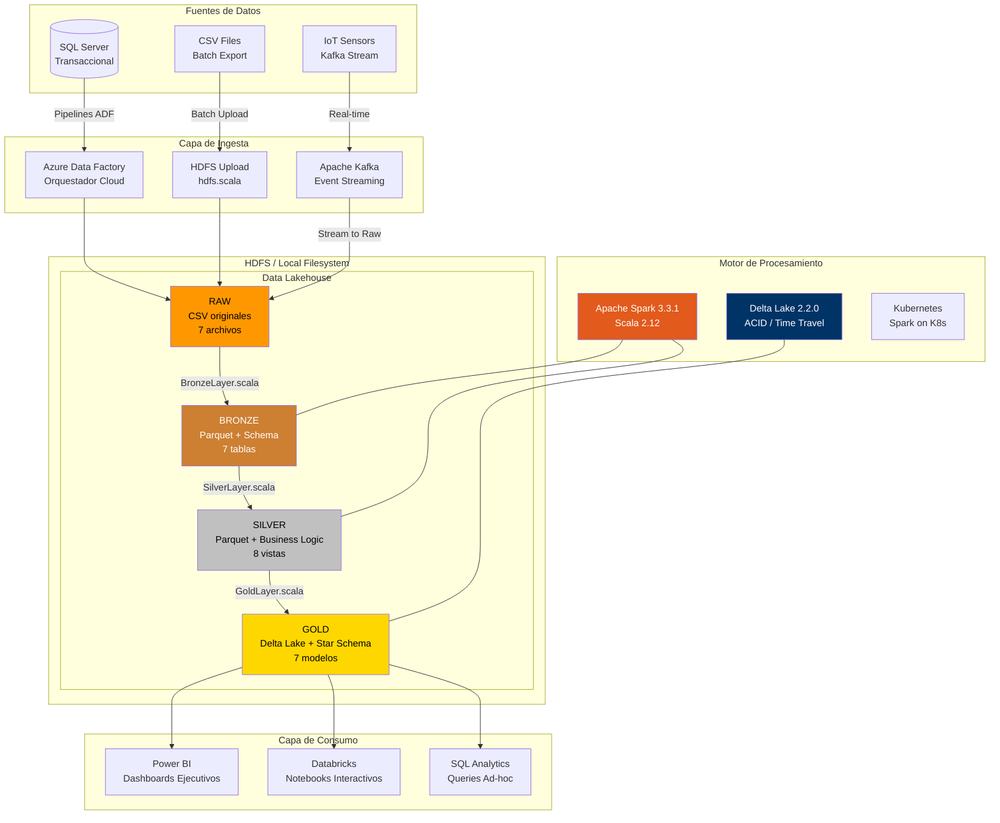

---

## Pipeline de Procesamiento — Workflow Paralelizable v3.0

El pipeline v3.0 implementa **ejecución paralela de workflows**, **retry con backoff exponencial** y **checkpoint para reanudación**. Los workflows post-ETL (Quality, Lineage, Analytics) se ejecutan concurrentemente usando un thread pool controlado.

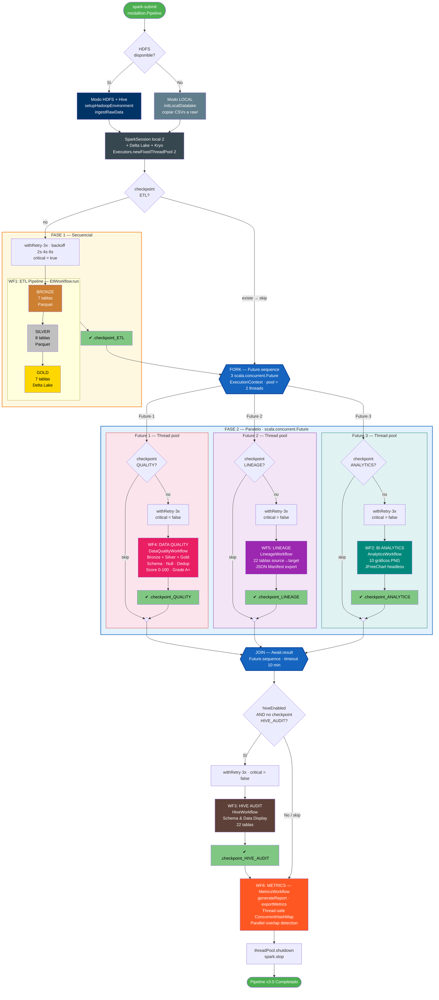

### Estrategia de Paralelización

| Etapa | Paralelismo | Descripción |
|-------|-------------|-------------|
| **Bronze** | Por tabla | Las 7 tablas son independientes: cada una lee su CSV, aplica schema y escribe Parquet sin dependencia entre sí |
| **Silver — Retail** | Parcial | `catalogo_productos` debe construirse primero (join Producto+Subcategoría+Categoría). Luego `ventas_enriquecidas` y `rentabilidad_producto` pueden ejecutarse en paralelo. `segmentacion_clientes` es independiente |
| **Silver — Mining** | Total | Las 3 vistas mining leen directamente de `mine` y `factmine`, sin dependencias cruzadas |
| **Gold — Dimensiones** | Total | `dim_producto`, `dim_cliente` y `dim_operador` son independientes entre sí |
| **Gold — Facts** | Parcial | `fact_ventas` necesita `silver_segmentacion_clientes`. `fact_produccion_minera` necesita `silver_eficiencia_minera` + `silver_produccion_por_pais` |
| **Gold — KPIs** | Total | `kpi_ventas_mensuales` y `kpi_mineria` leen de silver sin dependencia cruzada |

### Ejecución Paralela de Workflows (v3.0)

Post-ETL, los workflows **WF4 (Quality)**, **WF5 (Lineage)** y **WF2 (Analytics)** se ejecutan en paralelo usando `scala.concurrent.Future` con un `ExecutionContext` de 2 threads (`Executors.newFixedThreadPool(2)`). Un `Await.result(Future.sequence(...), 10.minutes)` actúa como barrera de sincronización.

| Característica | Implementación |
|---|---|
| **Parallel Execution** | `Future` + `ExecutionContext` con thread pool fijo de 2 hilos |
| **Barrera** | `Await.result(Future.sequence(futures), 10.minutes)` |
| **Retry con backoff** | `withRetry[T](name, critical, maxRetries=3)` — backoff exponencial (2s, 4s, 6s) |
| **Checkpoint/Resume** | Archivos `.checkpoints/.checkpoint_<STAGE>` — si existe, se salta el stage |
| **Thread Safety** | `MetricsWorkflow` usa `ConcurrentHashMap` + `ConcurrentLinkedQueue` + `@volatile` |
| **Spark master** | `local[2]` — 2 cores para paralelismo interno |
| **DAG Engine** | `DagExecutor` con detección de ciclos (DFS), ejecución paralela y reporte visual |
| **Delta MERGE** | `mergeDelta()` para upserts incrementales + `vacuumDelta()` para limpieza |

### Arquitectura HDFS — Datalake Distribuido

Cuando HDFS está disponible, el datalake se extiende sobre un filesystem distribuido con replicación y tolerancia a fallos:

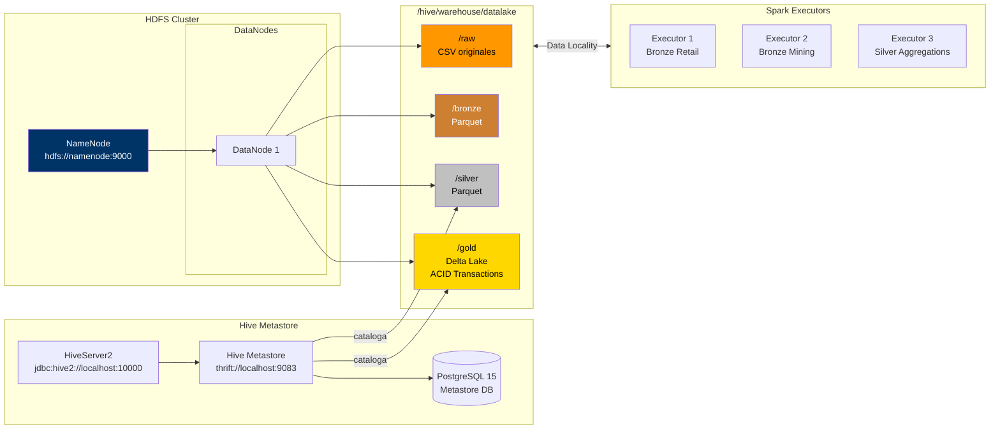

---

## Capas del Lakehouse — Detalle

### RAW — Zona de Ingesta
Archivos CSV originales tal como llegan desde los sistemas transaccionales. Sin transformación alguna.

| Archivo | Dominio | Registros |
|---------|---------|-----------|
| `Categoria.csv` | Retail | 4 |
| `Subcategoria.csv` | Retail | 37 |
| `Producto.csv` | Retail | 319 |
| `VentasInternet.csv` | Retail | 47,263 |
| `Sucursales.csv` | Retail | 11 |
| `FactMine.csv` | Mining | 49 |
| `Mine.csv` | Mining | 15,205 |

### BRONZE — Data Cleansing (Parquet)
Primera capa de calidad. Aplica schema explícito con tipos estrictos, elimina filas con claves nulas, deduplica por claves naturales y agrega metadatos de auditoría (`_bronze_ingested_at`, `_bronze_source_file`).

| Tabla | Claves de Deduplicación | Registros |
|-------|------------------------|-----------|
| `categoria` | `Cod_Categoria` | 4 |
| `subcategoria` | `Cod_SubCategoria` | 37 |
| `producto` | `Cod_Producto` | 319 |
| `ventasinternet` | `NumeroOrden`, `Cod_Producto` | 47,263 |
| `sucursales` | `Cod_Sucursal` | 11 |
| `factmine` | `TruckID`, `ProjectID`, `Date` | 49 |
| `mine` | `TruckID`, `ProjectID`, `OperatorID`, `Date` | 15,205 |

### SILVER — Business Logic (Parquet)
Lógica de negocio materializada: joins entre entidades, cálculos financieros, métricas de rendimiento y segmentación.

#### Dominio Retail
| Vista | Descripción |
|-------|-------------|
| `catalogo_productos` | Jerarquía completa Producto → Subcategoría → Categoría |
| `ventas_enriquecidas` | Cada venta con ingreso bruto, margen, ganancia neta, tipo de envío y flag de promoción |
| `resumen_ventas_mensuales` | Agregado mensual por categoría: órdenes, clientes únicos, ingreso, margen, ticket promedio |
| `rentabilidad_producto` | Ranking de productos por revenue, margen total y % de margen promedio |
| `segmentacion_clientes` | Análisis RFM: frecuencia, monetary, ticket promedio y segmento (VIP/Premium/Regular/Ocasional) |

#### Dominio Mining
| Vista | Descripción |
|-------|-------------|
| `produccion_operador` | Producción total por operador: mineral extraído, desperdicio y % de desperdicio |
| `eficiencia_minera` | Eficiencia por truck/proyecto: producción neta, desviación estándar, clasificación Alta/Media/Baja |
| `produccion_por_pais` | Agregado por país: operadores, trucks, proyectos, producción neta y edad promedio |

### GOLD — BI & Analytics Models (Delta Lake)
Modelos dimensionales Star Schema optimizados para consumo por Power BI. Escritos en formato **Delta Lake** con soporte para time travel, ACID transactions y schema evolution.

#### Dimensiones
| Tabla | Tipo | Registros | Descripción |
|-------|------|-----------|-------------|
| `dim_producto` | Dimensión | 319 | Producto con clasificación de rentabilidad (Estrella/Rentable/Standard/Bajo Margen) y rotación (Alta/Media/Baja) |
| `dim_cliente` | Dimensión | 17,555 | Cliente con segmento RFM, scores de frecuencia y monetario, LTV anualizado |
| `dim_operador` | Dimensión | 9,132 | Operador minero con clasificación de eficiencia (Elite/Eficiente/Promedio/Bajo) y rankings |

#### Tablas de Hechos
| Tabla | Tipo | Registros | Partición | Descripción |
|-------|------|-----------|-----------|-------------|
| `fact_ventas` | Fact | 47,263 | `anio` | Cada línea de venta con claves a dim_producto, dim_cliente y segmento |
| `fact_produccion_minera` | Fact | 42 | — | Producción por truck/proyecto con coeficiente de variación y % contribución al país |

#### KPIs Pre-calculados
| Tabla | Tipo | Registros | Descripción |
|-------|------|-----------|-------------|
| `kpi_ventas_mensuales` | KPI | 65 | Métricas mensuales con variación MoM (%), ingreso YTD y margen YTD |
| `kpi_mineria` | KPI | 6 | KPIs por país: mineral/operador, mineral/truck, tasa de desperdicio, evaluación operativa |

---

## Dominios de Datos

## Modelo de Datos

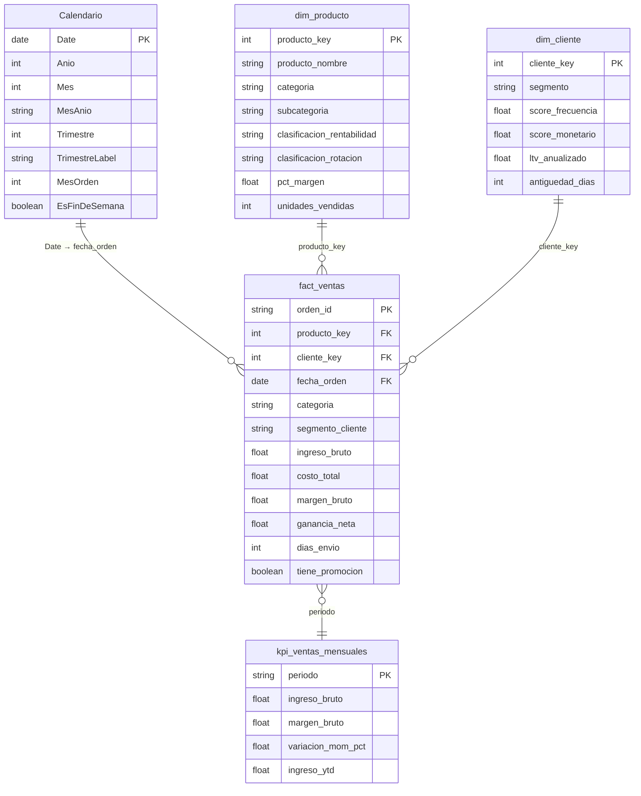

- **Producto**: 319 artículos en 37 subcategorías y 4 categorías principales
- **VentasInternet**: 47,263 transacciones con métricas de precio, costo, impuesto y flete
- **Sucursales**: 11 puntos con coordenadas geográficas (latitud/longitud)

### Mining — Modelo Relacional

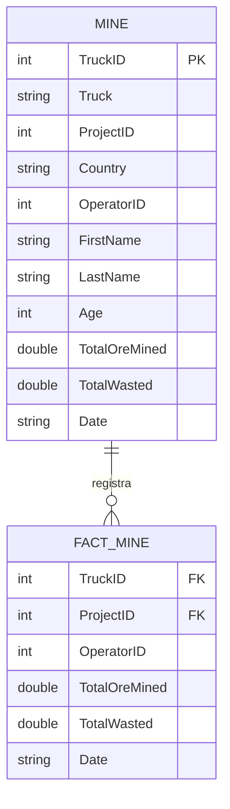

- **Mine**: 15,205 registros de operación diaria con detalle de operador
- **FactMine**: 49 registros agregados de producción por truck/proyecto/fecha

---

## Estructura del Proyecto

```
data-engineer/
│
├── database/                        → Objetos SQL Server
│   ├── schemas/                     → Esquemas de clientes
│   │   └── Clientes/
│   │       ├── Cerveceria/          → Modelo cervecería
│   │       └── Ecommerce/           → Modelo e-commerce
│   ├── stored-procedures/           → 10 procedimientos almacenados
│   └── views/                       → 15 vistas analíticas
│
├── orchestration/                   → Azure Data Factory
│   ├── factory/                     → Configuración de factories
│   ├── linked-services/             → 7 conexiones (Blob, ADLS, SQL)
│   ├── pipelines/                   → 7 pipelines de extracción
│   └── images/                      → Capturas de configuración
│
├── staging/                         → Datos intermedios
│   └── transform_csv/               → 9 CSVs de transformación
│
├── transformation/                  → Motor de procesamiento
│   ├── spark-jobs/pipelines/
│   │   ├── batch-etl-scala/         → Pipeline Medallion (Spark + Scala)
│   │   │   └── src/main/scala/medallion/
│   │   │       ├── Pipeline.scala           → Entry point v3.0 (parallel + retry + checkpoint)
│   │   │       ├── config/                  → DatalakeConfig, SparkFactory
│   │   │       ├── infra/                   → DataLakeIO (MERGE/VACUUM), HdfsManager
│   │   │       ├── schema/                  → CsvSchemas (7 StructTypes)
│   │   │       ├── layer/                   → BronzeLayer, SilverLayer, GoldLayer
│   │   │       ├── analytics/               → BIChartGenerator (JFreeChart)
│   │   │       ├── engine/                  → DagTask, DagExecutor (DAG paralelo)
│   │   │       └── workflow/                → 6 workflows (3 paralelos: Quality‖Lineage‖Analytics)
│   │   ├── stream-processing/       → Spark Streaming + Kafka
│   │   └── iot-ingestion/           → Kafka IoT Producer
│   └── notebooks/
│       ├── databricks/
│       │   ├── retail-client/        → Notebooks retail
│       │   └── airbnb-analytics/     → Notebooks Airbnb
│       └── ibm-cloud/               → Pipeline Medallion PySpark (IBM COS + Db2)
│           ├── config.py            → Configuración COS, Db2, SparkSession
│           ├── orchestrator.py      → Orquestador CLI (nbconvert)
│           ├── Makefile             → make all / bronze / silver / gold
│           ├── 01_bronze_layer.ipynb → RAW CSV → Bronze Parquet (7 tablas)
│           ├── 02_silver_layer.ipynb → Bronze → Silver (8 tablas)
│           ├── 03_gold_layer.ipynb   → Silver → Gold Star Schema (8 tablas)
│           └── test_db2_spark.ipynb  → Test conectividad Db2 JDBC
│
├── infrastructure/                  → IaC y despliegue
│   ├── hadoop/                      → Docker Compose + Hadoop conf
│   ├── kafka/                       → Docker Compose Kafka
│   ├── postgresql/                  → Docker Compose PostgreSQL
│   ├── spark-k8s/                   → Spark on Kubernetes
│   ├── databricks/                  → Bicep template
│   ├── ibm-cloud/                   → IBM Cloud IaC + CI/CD
│   │   ├── terraform/               → Terraform (COS, Db2, Spark)
│   │   ├── tekton/                  → Tekton Pipelines + Triggers
│   │   └── scripts/                 → Scripts de deploy y setup
│   └── powerbi-export/              → Medidas DAX + Especificación visual del dashboard
│
├── docs/                            → Documentación e imágenes
│   ├── analytics/                   → Gráficos BI generados (10 PNG)
│   └── ANALYTICS.md                 → Documentación analítica con insights
├── instalacion.md                   → Guía de instalación
└── README.md                        → Este archivo
```

### Navegación Rápida por Directorio

| Directorio | Descripción | Contenido Principal |
|------------|-------------|---------------------|
| [`database/`](database/) | Capa de base de datos relacional | Stored procedures, views, schemas SQL Server |
| [`database/stored-procedures/`](database/stored-procedures/) | Procedimientos almacenados | Agrega_cliente, Nueva_venta, Multi_procedure_ETL |
| [`database/views/`](database/views/) | Vistas analíticas SQL | Calcula_total_ventas, Ganancias_neta, Promedio_pedido |
| [`database/schemas/`](database/schemas/) | Esquemas de cliente | Cervecería, Ecommerce |
| [`orchestration/`](orchestration/) | Orquestación Azure Data Factory | Factories, linked services, pipelines |
| [`orchestration/pipelines/`](orchestration/pipelines/) | Pipelines ADF | ETL, Pipeline_extraccion, Copy_data_sql |
| [`orchestration/linked-services/`](orchestration/linked-services/) | Conexiones ADF | Blob Storage, ADLS, SQL Database |
| [`staging/`](staging/) | Zona de staging | CSVs intermedios de transformación |
| [`staging/transform_csv/`](staging/transform_csv/) | CSVs transformados | 9 archivos de transformación |
| [`transformation/`](transformation/) | Motor de transformación | Spark jobs, notebooks Databricks |
| [`transformation/spark-jobs/pipelines/batch-etl-scala/`](transformation/spark-jobs/pipelines/batch-etl-scala/) | Pipeline Medallion principal | 18 archivos Scala bajo `medallion.*` — Bronze → Silver → Gold + 6 workflows (3 paralelos) + DAG engine |
| [`transformation/spark-jobs/pipelines/stream-processing/`](transformation/spark-jobs/pipelines/stream-processing/) | Procesamiento streaming | Spark Structured Streaming + Kafka |
| [`transformation/spark-jobs/pipelines/iot-ingestion/`](transformation/spark-jobs/pipelines/iot-ingestion/) | Ingesta IoT | Producer Kafka para sensores |
| [`transformation/notebooks/databricks/`](transformation/notebooks/databricks/) | Notebooks interactivos | Retail-client, Airbnb analytics |
| [`transformation/notebooks/ibm-cloud/`](transformation/notebooks/ibm-cloud/) | **Pipeline Medallion PySpark** | 3 notebooks (Bronze → Silver → Gold) + config + orchestrator |
| [`transformation/notebooks/ibm-cloud/01_bronze_layer.ipynb`](transformation/notebooks/ibm-cloud/01_bronze_layer.ipynb) | Bronze Layer (IBM COS) | RAW CSV → Parquet con schema enforcement y deduplicación |
| [`transformation/notebooks/ibm-cloud/02_silver_layer.ipynb`](transformation/notebooks/ibm-cloud/02_silver_layer.ipynb) | Silver Layer (IBM COS) | Business logic: joins, RFM, eficiencia minera, segmentación |
| [`transformation/notebooks/ibm-cloud/03_gold_layer.ipynb`](transformation/notebooks/ibm-cloud/03_gold_layer.ipynb) | Gold Layer (IBM COS) | Star Schema: 4 dimensiones + 2 facts + 2 KPIs |
| [`infrastructure/`](infrastructure/) | Infraestructura como código | Docker, Kubernetes, Bicep |
| [`infrastructure/hadoop/`](infrastructure/hadoop/) | Cluster Hadoop | Docker Compose + configuración HDFS |
| [`infrastructure/kafka/`](infrastructure/kafka/) | Cluster Kafka | Docker Compose + config |
| [`infrastructure/postgresql/`](infrastructure/postgresql/) | Base PostgreSQL | Docker Compose |
| [`infrastructure/spark-k8s/`](infrastructure/spark-k8s/) | Spark en Kubernetes | Dockerfiles + manifests K8s |
| [`infrastructure/databricks/`](infrastructure/databricks/) | Databricks IaC | Bicep template (main.bicep) |
| [`infrastructure/ibm-cloud/`](infrastructure/ibm-cloud/) | IBM Cloud IaC + CI/CD | Terraform, Tekton Pipelines, scripts de deploy |
| [`infrastructure/ibm-cloud/terraform/`](infrastructure/ibm-cloud/terraform/) | Terraform IBM Cloud | COS buckets, Db2, Spark environment |
| [`infrastructure/ibm-cloud/tekton/`](infrastructure/ibm-cloud/tekton/) | CI/CD Tekton | Pipeline, tasks, triggers para deploy automatizado |
| [`infrastructure/ibm-cloud/scripts/`](infrastructure/ibm-cloud/scripts/) | Scripts de setup | deploy-spark.sh, setup-cicd.sh, setup.sh |
| [`infrastructure/powerbi-export/`](infrastructure/powerbi-export/) | **[Power BI — Dashboard Retail Analytics](infrastructure/powerbi-export/README.md)** | Especificación de 7 páginas, maquetas Mermaid, 57 medidas DAX |
| [`docs/`](docs/) | Documentación | Imágenes y diagramas |
| [`docs/analytics/`](docs/analytics/) | Gráficos BI Analytics | 10 visualizaciones PNG del Gold layer |
| [`docs/ANALYTICS.md`](docs/ANALYTICS.md) | Documentación analítica | Insights BI por gráfico y dataset |

---

## Stack Tecnológico

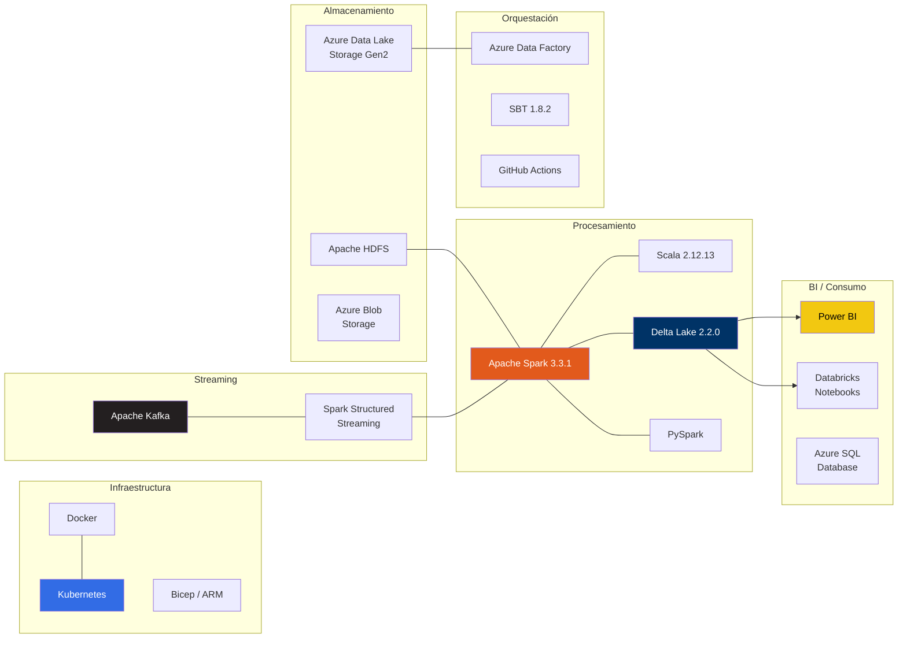

| Componente | Tecnología | Versión |
|------------|-----------|---------|
| Motor de Procesamiento | Apache Spark | 3.3.1 (local) / 3.5 (AE Serverless) |
| Lenguaje | Scala | 2.12.13 |
| Formato Gold | Delta Lake | 2.2.0 |
| Build Tool | SBT | 1.8.2 |
| Runtime | Java (Microsoft) | 11 |
| Formato Bronze/Silver | Apache Parquet | — |
| **Storage Distribuido** | **Apache HDFS** | **3.3.4** |
| **Metastore** | **Apache Hive** | **3.1.3** |
| **Hive Backend** | **MySQL** | **5.7** |
| Orquestación Cloud | Azure Data Factory | — |
| Streaming | Apache Kafka | — |
| Container Orchestration | Kubernetes | — |
| IaC | Docker Compose / Bicep / Terraform | — |
| **BI Charts** | **JFreeChart** | **1.5.4** |
| **Serverless Spark** | **IBM Analytics Engine** | **Spark 3.5** |
| Cloud Storage | IBM Cloud Object Storage (S3A) | — |
| Cloud Database | IBM Db2 on Cloud | — |
| CI/CD | Tekton Pipelines | — |

---

## Pipeline Medallion — Código Fuente

El pipeline está modularizado bajo el paquete `medallion.*` con 7 sub-paquetes de responsabilidad única. La arquitectura sigue principios de **alta cohesión / bajo acoplamiento**, con ejecución paralela, retry y checkpoint:

```
src/main/scala/medallion/
├── Pipeline.scala                       # Entry point v3.0 — parallel + retry + checkpoint
├── config/
│   ├── DatalakeConfig.scala             # Modelo de configuración inmutable
│   └── SparkFactory.scala               # SparkSession singleton + Delta + Kryo
├── infra/
│   ├── DataLakeIO.scala                 # I/O: readCsv, writeParquet, writeDelta
│   └── HdfsManager.scala               # HDFS: upload, validate, datalake structure
├── schema/
│   └── CsvSchemas.scala                 # StructType explícitos (7 tablas)
├── layer/
│   ├── BronzeLayer.scala                # RAW → Bronze (schema + dedup + audit cols)
│   ├── SilverLayer.scala                # Bronze → Silver (joins + business logic)
│   └── GoldLayer.scala                  # Silver → Gold (Star Schema + Delta Lake)
├── analytics/
│   └── BIChartGenerator.scala           # 10 gráficos PNG (JFreeChart headless)
├── engine/
│   ├── DagTask.scala                    # Modelo declarativo de task + dependencias
│   └── DagExecutor.scala               # Motor DAG: paralelismo, retry, checkpoint, cycle detection
└── workflow/
    ├── EtlWorkflow.scala                # WF1: Pipeline ETL completo
    ├── AnalyticsWorkflow.scala          # WF2: Generación de charts BI
    ├── HiveWorkflow.scala               # WF3: Auditoría Hive + Schema Display
    ├── DataQualityWorkflow.scala        # WF4: Validación de calidad por capa
    ├── LineageWorkflow.scala            # WF5: Trazabilidad source→target
    └── MetricsWorkflow.scala            # WF6: Métricas de ejecución + export JSON
```

| Paquete | Archivo | Responsabilidad |
|---------|---------|-----------------|
| `medallion` | `Pipeline.scala` | Entry point v3.0: parallel workflows, retry con backoff, checkpoint, thread pool |
| `medallion.config` | `DatalakeConfig.scala` | Case class inmutable con paths de todas las capas + lineage + metrics |
| `medallion.config` | `IbmCloudConfig.scala` | Detección de modo (AE/HDFS/Local), config COS S3A, IAM token, CLI fallback |
| `medallion.config` | `SparkFactory.scala` | SparkSession singleton con 3 modos: AE (S3A), HDFS (Hive), Local |
| `medallion.infra` | `DataLakeIO.scala` | readCsv con schema, writeParquet coalesce(1), writeDelta, pathExists |
| `medallion.infra` | `HdfsManager.scala` | buildHadoopConfiguration, createDatalakeStructure, uploadToRaw, validateDatalake |
| `medallion.schema` | `CsvSchemas.scala` | StructType explícitos para las 7 tablas CSV fuente |
| `medallion.layer` | `BronzeLayer.scala` | Schema enforcement, deduplicación por claves, filtro de nulos, columnas de auditoría |
| `medallion.layer` | `SilverLayer.scala` | Joins, cálculos financieros, RFM, eficiencia minera, segmentación |
| `medallion.layer` | `GoldLayer.scala` | Star Schema: dim_producto, dim_cliente, dim_operador, fact_ventas, fact_produccion_minera, KPIs |
| `medallion.analytics` | `BIChartGenerator.scala` | Generación headless de 10 gráficos PNG con JFreeChart 1.5.4 |
| `medallion.engine` | `DagTask.scala` | Modelo declarativo: task ID, dependencias, bloque de ejecución, retry count |
| `medallion.engine` | `DagExecutor.scala` | Motor DAG: paralelismo por thread pool, cycle detection, retry con backoff, checkpoint |
| `medallion.workflow` | `EtlWorkflow.scala` | WF1: Setup → Ingest → Bronze(7) → Silver(8) → Gold(7) → Hive Catalog |
| `medallion.workflow` | `AnalyticsWorkflow.scala` | WF2: Lee Gold/Silver → genera 10 visualizaciones PNG |
| `medallion.workflow` | `HiveWorkflow.scala` | WF3: Auditoría completa — schema, preview, conteo por capa |
| `medallion.workflow` | `DataQualityWorkflow.scala` | WF4: Validación de nulls, duplicados, schema conformance, quality score A+/A/B/C/D |
| `medallion.workflow` | `LineageWorkflow.scala` | WF5: Captura source→target por tabla, exporta manifest JSON a `datalake/lineage/` |
| `medallion.workflow` | `MetricsWorkflow.scala` | WF6: Thread-safe (ConcurrentHashMap). Timing, throughput, JVM, parallel detection, JSON export |

---

## Pipeline Medallion — Notebooks IBM Cloud (PySpark)

Implementación alternativa del pipeline Medallion usando **PySpark notebooks** sobre **IBM Cloud Object Storage (COS)** con persistencia opcional en **IBM Db2 on Cloud**. Cada notebook corresponde a una capa de la arquitectura medallón y puede ejecutarse de forma independiente o encadenada mediante el orquestador CLI.

### Arquitectura IBM Cloud

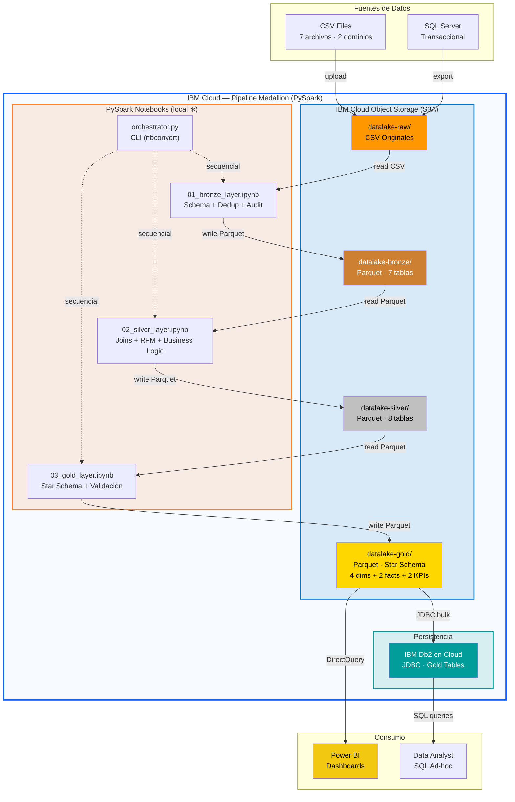

### Notebooks

| # | Notebook | Capa | Tablas | Visualizaciones | Descripción |
|---|----------|------|--------|-----------------|-------------|
| 1 | [`01_bronze_layer.ipynb`](transformation/notebooks/ibm-cloud/01_bronze_layer.ipynb) | Bronze | 7 | 2 | Ingesta CSV → Parquet con schema enforcement, deduplicación y auditoría |
| 2 | [`02_silver_layer.ipynb`](transformation/notebooks/ibm-cloud/02_silver_layer.ipynb) | Silver | 8 | 4 | Business logic: joins, cálculos financieros, RFM, eficiencia minera |
| 3 | [`03_gold_layer.ipynb`](transformation/notebooks/ibm-cloud/03_gold_layer.ipynb) | Gold | 8 | 5 | Star Schema dimensional: dimensiones, facts, KPIs con validación de integridad |

### Tablas Gold generadas (PySpark)

| Tabla | Tipo | Fuentes Silver | Descripción |
|-------|------|----------------|-------------|
| `dim_producto` | Dimensión | catalogo_productos + rentabilidad_producto | Clasificación de rentabilidad y rotación |
| `dim_cliente` | Dimensión | segmentacion_clientes | Segmentación RFM, LTV anualizado, rangos por cuartil |
| `dim_tiempo` | Dimensión | ventas_enriquecidas (generada) | Calendario: Year, Month, Quarter, DayOfWeek, IsWeekend |
| `dim_operador` | Dimensión | produccion_operador | Niveles de eficiencia y categoría de productividad |
| `fact_ventas` | Fact | ventas_enriquecidas + dims | FKs dimensionales + métricas financieras y logísticas |
| `fact_produccion_minera` | Fact | eficiencia_minera | Clasificación de eficiencia por camión/proyecto |
| `kpi_ventas_mensuales` | KPI | resumen_ventas_mensuales | Crecimiento MoM (%) de revenue y órdenes |
| `kpi_mineria` | KPI | produccion_por_pais | Producción global, waste ratio, timestamp de generación |

### Configuración y Orquestación

| Archivo | Descripción |
|---------|-------------|
| [`config.py`](transformation/notebooks/ibm-cloud/config.py) | Credenciales COS (S3A) + Db2 JDBC + builder de SparkSession con Delta Lake |
| [`orchestrator.py`](transformation/notebooks/ibm-cloud/orchestrator.py) | CLI que ejecuta notebooks en secuencia via `nbconvert` |
| [`Makefile`](transformation/notebooks/ibm-cloud/Makefile) | Atajos: `make all`, `make bronze`, `make silver`, `make gold`, `make dry-run` |
| [`README.md`](transformation/notebooks/ibm-cloud/README.md) | Documentación detallada del pipeline IBM Cloud |

---

## Infraestructura IBM Cloud — CI/CD y Terraform

Infraestructura como código para desplegar el pipeline Medallion en IBM Cloud, incluyendo aprovisionamiento de recursos con Terraform y CI/CD con Tekton Pipelines.

### Arquitectura de Infraestructura — IBM Cloud

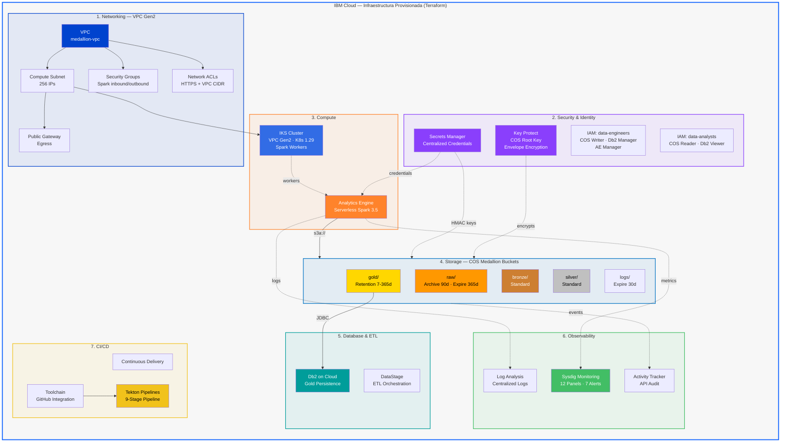

### CI/CD Pipeline — Tekton 9-Stage Architecture

```mermaid
flowchart LR
    subgraph TRIGGER["Trigger Layer"]
        GH_PUSH["GitHub Push<br/>→ main"]
        GH_PR["GitHub PR<br/>→ any branch"]
        WEBHOOK["EventListener<br/>+ TriggerBinding"]
    end

    subgraph PIPELINE["Tekton Pipeline — medallion-data-pipeline"]
        direction LR

        subgraph STAGE_1["Stage 1"]
            CLONE["clone-repo<br/>Git Checkout"]
        end

        subgraph PARALLEL_A["Parallel Gate A"]
            direction TB
            TEST["run-tests<br/>pytest + ScalaTest"]
            SCAN["security-scan<br/>pip-audit · detect-secrets<br/>Trivy Container"]
        end

        subgraph STAGE_4["Stage 4"]
            BUILD_JAR["build-jar<br/>sbt assembly<br/>Fat JAR"]
        end

        subgraph SERVERLESS_PATH["Serverless Path (AE)"]
            direction TB
            UPLOAD["upload-to-cos<br/>JAR → COS s3a://"]
            SUBMIT["submit-to-ae<br/>Spark App Submit<br/>AE Serverless 3.5"]
            UPLOAD --> SUBMIT
        end

        subgraph CONTAINER_PATH["Container Path (IKS)"]
            direction TB
            BUILD_IMG["build-image<br/>Kaniko Build<br/>+ Registry Push"]
            DEPLOY["deploy-to-iks<br/>kubectl apply<br/>IKS Cluster"]
            BUILD_IMG --> DEPLOY
        end
    end

    subgraph FINALLY["Finally Block"]
        NOTIFY["notify<br/>Slack / Webhook<br/>Status Report"]
    end

    GH_PUSH -->|"full deploy"| WEBHOOK
    GH_PR -->|"test only"| WEBHOOK
    WEBHOOK --> CLONE

    CLONE --> TEST
    CLONE --> SCAN

    TEST --> BUILD_JAR
    SCAN --> BUILD_JAR

    BUILD_JAR --> UPLOAD
    TEST --> BUILD_IMG
    SCAN --> BUILD_IMG

    SUBMIT -.->|"always"| NOTIFY
    DEPLOY -.->|"always"| NOTIFY

    style TRIGGER fill:#16161615,stroke:#161616,stroke-width:2px
    style PIPELINE fill:#0f62fe08,stroke:#0f62fe,stroke-width:3px
    style FINALLY fill:#da1e2815,stroke:#da1e28,stroke-width:2px
    style SERVERLESS_PATH fill:#ff832b10,stroke:#ff832b,stroke-width:2px
    style CONTAINER_PATH fill:#326ce510,stroke:#326ce5,stroke-width:2px
    style PARALLEL_A fill:#42be6510,stroke:#42be65,stroke-width:2px
    style CLONE fill:#393939,color:#fff
    style TEST fill:#42be65,color:#fff
    style SCAN fill:#da1e28,color:#fff
    style BUILD_JAR fill:#f1c21b,color:#000
    style UPLOAD fill:#0072c3,color:#fff
    style SUBMIT fill:#ff832b,color:#fff
    style BUILD_IMG fill:#0072c3,color:#fff
    style DEPLOY fill:#326ce5,color:#fff
    style NOTIFY fill:#a56eff,color:#fff
    style GH_PUSH fill:#24292e,color:#fff
    style GH_PR fill:#24292e,color:#fff
```

### DevOps Lifecycle — Procesos Operativos

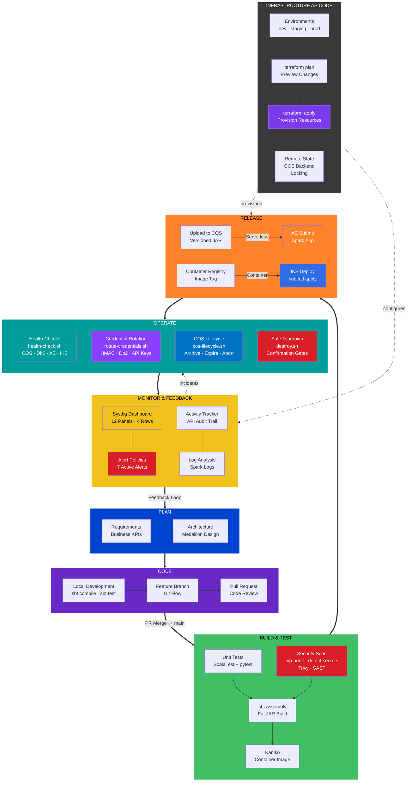

### Terraform — Aprovisionamiento

| Archivo | Descripción |
|---------|-------------|
| [`main.tf`](infrastructure/ibm-cloud/terraform/main.tf) | Recursos principales: COS buckets, Db2, Spark environment |
| [`variables.tf`](infrastructure/ibm-cloud/terraform/variables.tf) | Variables de configuración (región, plan, nombres) |
| [`outputs.tf`](infrastructure/ibm-cloud/terraform/outputs.tf) | Outputs: endpoints, IDs de recursos |
| [`terraform.tfvars.example`](infrastructure/ibm-cloud/terraform/terraform.tfvars.example) | Ejemplo de valores para variables |

### Tekton — CI/CD Pipelines

| Archivo | Descripción |
|---------|-------------|
| [`pipeline.yaml`](infrastructure/ibm-cloud/tekton/pipeline.yaml) | Pipeline de deploy: build → test → deploy |
| [`tasks.yaml`](infrastructure/ibm-cloud/tekton/tasks.yaml) | Definición de tasks individuales |
| [`triggers.yaml`](infrastructure/ibm-cloud/tekton/triggers.yaml) | Triggers para ejecución automática (push/PR) |

### Scripts de Deploy

| Archivo | Descripción |
|---------|-------------|
| [`setup.sh`](infrastructure/ibm-cloud/scripts/setup.sh) | Setup inicial del entorno IBM Cloud |
| [`deploy-spark.sh`](infrastructure/ibm-cloud/scripts/deploy-spark.sh) | Deploy del cluster Spark |
| [`setup-cicd.sh`](infrastructure/ibm-cloud/scripts/setup-cicd.sh) | Configuración del pipeline CI/CD |
| [`submit-to-ae.sh`](infrastructure/ibm-cloud/scripts/submit-to-ae.sh) | **Build → Upload COS → Submit a Analytics Engine Serverless** |

---

## Ejecución

### Modo 1 — Local (sin infraestructura)

```bash
cd transformation/spark-jobs/pipelines/batch-etl-scala

# Compilar
sbt compile

# Construir fat JAR
sbt assembly

# Ejecutar pipeline completo (6 workflows — 3 paralelos)
sbt "runMain medallion.Pipeline"
```

### Modo 2 — Lakehouse completo (HDFS + Hive)

```bash
# 1. Levantar infraestructura
cd infrastructure/hadoop
docker-compose up -d

# 2. Ejecutar ETL
cd ../../transformation/spark-jobs/pipelines/batch-etl-scala
export HDFS_URI="hdfs://localhost:9000"
export HIVE_METASTORE_URI="thrift://localhost:9083"
sbt "runMain medallion.Pipeline"

```
```SQL

-- Consultas en hive
-- 1. Verificar que existe la base de datos
SHOW DATABASES;

-- 2. Seleccionar la base de datos del lakehouse
USE lakehouse;

-- 3. Listar todas las tablas registradas
SHOW TABLES;

-- 4. Verificar estructura de tablas Gold (Delta)
DESCRIBE FORMATTED dim_producto;
DESCRIBE FORMATTED dim_cliente;
DESCRIBE FORMATTED fact_ventas;
DESCRIBE FORMATTED kpi_ventas_mensuales;
DESCRIBE FORMATTED dim_operador;
DESCRIBE FORMATTED fact_produccion_minera;
DESCRIBE FORMATTED kpi_mineria;

-- 5. Verificar estructura de tablas Silver (Parquet)
DESCRIBE FORMATTED silver_catalogo_productos;
DESCRIBE FORMATTED silver_ventas_enriquecidas;
DESCRIBE FORMATTED silver_resumen_ventas_mensuales;
DESCRIBE FORMATTED silver_rentabilidad_producto;
DESCRIBE FORMATTED silver_segmentacion_clientes;
DESCRIBE FORMATTED silver_produccion_operador;
DESCRIBE FORMATTED silver_eficiencia_minera;
DESCRIBE FORMATTED silver_produccion_por_pais;

-- 6. Validar ubicaciones en HDFS
SHOW TABLE EXTENDED IN lakehouse LIKE '*';

-- 7. Consulta rápida para confirmar datos en cada capa
SELECT COUNT(*) AS total_filas FROM fact_ventas;
SELECT COUNT(*) AS total_filas FROM dim_producto;
SELECT COUNT(*) AS total_filas FROM kpi_ventas_mensuales;
SELECT COUNT(*) AS total_filas FROM silver_ventas_enriquecidas;

```

```bash
# 3. Consultar con Beeline
docker exec -it hiveserver2 beeline -u jdbc:hive2://localhost:10000
# > USE lakehouse; SHOW TABLES; SELECT * FROM kpi_ventas_mensuales LIMIT 10;
```

### Modo 3 — Script E2E automatizado

```bash
cd infrastructure/hadoop
bash lakehouse-start.sh
```

### Modo 4 — IBM Analytics Engine Serverless

Ejecución del pipeline Medallion v5.0 sobre **IBM Analytics Engine Serverless (Spark 3.5)** con datos almacenados en **IBM Cloud Object Storage (COS)** via protocolo **S3A**.

#### Arquitectura de Ejecución en AE

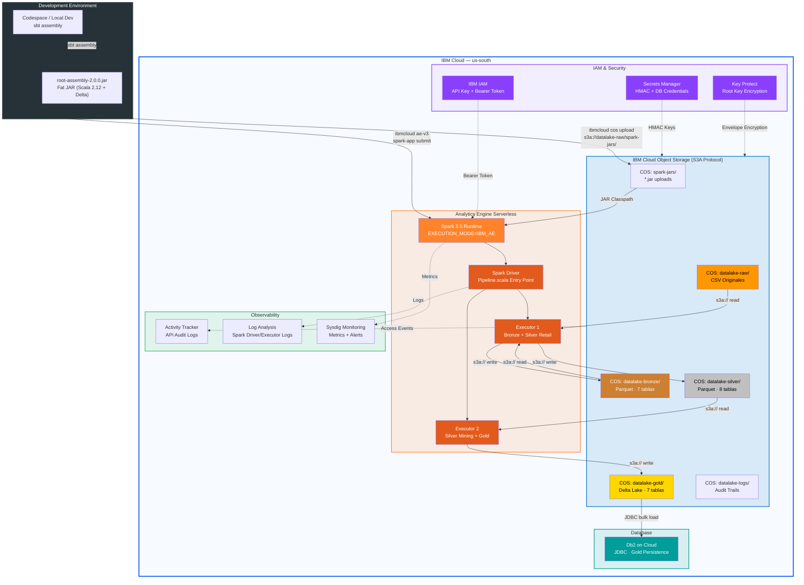

#### Requisitos

```bash
# Instalar IBM Cloud CLI + plugins
curl -fsSL https://clis.cloud.ibm.com/install/linux | sh
ibmcloud plugin install cloud-object-storage -f
ibmcloud plugin install analytics-engine-v3 -f

# Autenticarse
ibmcloud login --sso
ibmcloud target -r us-south -g Default
```

#### Ejecución Completa (Build + Upload + Submit)

```bash
# Pipeline completo: compilar JAR → subir a COS → ejecutar en AE
./infrastructure/ibm-cloud/scripts/submit-to-ae.sh

# Solo submit (JAR previamente compilado)
./infrastructure/ibm-cloud/scripts/submit-to-ae.sh --skip-build
```

#### Monitoreo

```bash
# Estado de la aplicación
./infrastructure/ibm-cloud/scripts/submit-to-ae.sh --status <app_id>

# Logs del driver
./infrastructure/ibm-cloud/scripts/submit-to-ae.sh --logs <app_id>

# Listar todas las aplicaciones
./infrastructure/ibm-cloud/scripts/submit-to-ae.sh --list
```

#### Detección Automática de Modo

El pipeline v5.0 auto-detecta el entorno de ejecución con esta prioridad:

```
1. EXECUTION_MODE env var (IBM_AE | HDFS | LOCAL)
      ↓ no definido
2. IBM AE API (IAM token + HTTP)
      ↓ 403 / no disponible
3. ibmcloud CLI plugin (ae-v3 instance show --id)
      ↓ CLI no instalado
4. COS_ACCESS_KEY presente → asumir AE
      ↓ sin COS
5. HDFS disponible → HdfsCluster
      ↓ sin HDFS
6. LocalMode (filesystem local)
```

#### Resultado Exitoso

```
╔══════════════════════════════════════════════════════════════╗
║  IBM Analytics Engine — Spark Application Submitter         ║
║  Pipeline Medallion v5.0 (Serverless Spark 3.5)             ║
╚══════════════════════════════════════════════════════════════╝

[INFO] Analytics Engine: ACTIVE (Spark 3.5) ✔
[INFO] JAR subido a COS ✔
[INFO] Aplicación enviada ✔
[INFO] Application ID: ad4c2f25-3bbd-46d7-b02e-2ffa99ca1b6a

State:        finished
Start time:   2026-04-13T23:11:31Z
End time:     2026-04-13T23:13:54Z
Duration:     ~2 min 23 seg
```

### spark-submit (fat JAR)

```bash
spark-submit \
  --class medallion.Pipeline \
  --master "local[*]" \
  --packages io.delta:delta-core_2.12:2.2.0 \
  target/scala-2.12/root-assembly-1.0.0.jar
```

El pipeline detecta automáticamente el entorno de ejecución: IBM Analytics Engine Serverless (via `EXECUTION_MODE` o detección automática), HDFS + Hive, o modo local. Consultar [Modo 4](#modo-4--ibm-analytics-engine-serverless) para detalles de la detección.

### Variables de Entorno

| Variable | Default | Descripción |
|----------|---------|-------------|
| `HDFS_URI` | `hdfs://namenode:9000` | URI del NameNode HDFS |
| `HIVE_METASTORE_URI` | `thrift://localhost:9083` | URI del Hive Metastore |
| `CSV_PATH` | `./src/main/resources/csv` | Ruta a los archivos CSV fuente |
| `EXECUTION_MODE` | *(auto-detect)* | Forzar modo: `IBM_AE`, `HDFS` o `LOCAL` |
| `AE_INSTANCE_ID` | — | ID de instancia Analytics Engine |
| `AE_API_KEY` | — | API key de IBM Cloud para AE |
| `COS_ACCESS_KEY` | — | HMAC access key de IBM COS |
| `COS_SECRET_KEY` | — | HMAC secret key de IBM COS |
| `COS_ENDPOINT` | `s3.us-south.cloud-object-storage.appdomain.cloud` | Endpoint S3A de IBM COS |

### Interfaces Web

| Servicio | URL | Descripción |
|----------|-----|-------------|
| NameNode | http://localhost:9870 | HDFS health, browsing |
| YARN | http://localhost:8088 | Resource manager, jobs |
| HiveServer2 | http://localhost:10002 | HiveServer2 Web UI |
| DataNode | http://localhost:9864 | DataNode metrics |

---

## Output del Pipeline

```
DATALAKE PIPELINE v3.0 — 6 Workflows (3 paralelos)

  ── SEQUENTIAL PHASE ──────────────────────────────────

  WF1: ETL PIPELINE  [with retry · max 3 attempts · exponential backoff]
    STAGE 0: HIVE — Metastore Registration   (solo modo HDFS)
    STAGE 1: BRONZE — Data Cleansing         → 7 tablas  (Parquet)
    STAGE 2: SILVER — Business Logic         → 8 tablas  (Parquet)
    STAGE 3: GOLD — BI & Analytics Models    → 7 tablas  (Delta Lake)
    STAGE 4: HIVE — Catalog Registration     (solo modo HDFS)
    ✔ Checkpoint: .checkpoints/.checkpoint_ETL

  ── PARALLEL PHASE (Future + ExecutionContext) ────────
  │
  ├─ WF4: DATA QUALITY                              ┐
  │    Bronze Quality: 7/7 tablas | Score: 100.0 ✔   │
  │    Silver Quality: 8/8 tablas | Score: 100.0 ✔   ├─ Ejecutados en
  │    Gold Quality:   7/7 tablas | Score: 100.0 ✔   │  paralelo con
  │    Global Score: 100.0 / 100 — Grade: A+         │  thread pool (2)
  │    ✔ Checkpoint: .checkpoint_QUALITY              │
  │                                                   │
  ├─ WF5: LINEAGE                                    │
  │    Total: 22/22 tablas con lineage                │
  │    Manifest: lineage/lineage_<ts>.json            │
  │    ✔ Checkpoint: .checkpoint_LINEAGE              │
  │                                                   │
  ├─ WF2: BI ANALYTICS                               │
  │    Chart Generation → 10 gráficos PNG             │
  │    ✔ Checkpoint: .checkpoint_ANALYTICS            │
  │                                                   ┘
  └─ ⏳ Await.result(Future.sequence, 10.minutes) ── BARRIER

  ── POST-PARALLEL ─────────────────────────────────────

  WF3: HIVE AUDIT — Schema & Data Display → 22 tablas  (solo modo HDFS)

  WF6: EXECUTION METRICS  [thread-safe · ConcurrentHashMap]
    ETL:       114.36s | 22 tablas | ████████████████████░░  71.9%
    Quality:    30.89s | 22 tablas | ████░░░░░░░░░░░░░░░░░  19.4%
    Lineage:     5.82s | 22 tablas | █░░░░░░░░░░░░░░░░░░░░   3.7%
    Analytics:  28.41s | 10 charts | ████░░░░░░░░░░░░░░░░░  17.9%
    ── Parallel workflows: QUALITY‖LINEAGE, QUALITY‖ANALYTICS
    JVM Memory: 113 MB / 1024 MB (11.0%)
    Metrics exportados: datalake/metrics/metrics_<timestamp>.json
    Total pipeline: 158.94s

DATALAKE SUMMARY
  BRONZE (7 tablas — parquet)
  SILVER (8 tablas — parquet)
  GOLD   (7 tablas — delta)
    ├── dim_producto              319 filas
    ├── dim_cliente            17,555 filas
    ├── dim_operador            9,132 filas
    ├── fact_ventas            47,263 filas  (partitioned by anio)
    ├── fact_produccion_minera     42 filas
    ├── kpi_ventas_mensuales       65 filas
    ├── kpi_mineria                 6 filas

AUDIT REPORT
  🟤 ═══ BRONZE LAYER (parquet) ═══
  ┌── BRONZE/categoria ──────────────────────
  │  Registros: 4 | Columnas: 4
  │  Schema:
  │    ├── Cod_Categoria: integer (nullable=true)
  │    ├── Categoria: string (nullable=true)
  │    ├── _bronze_ingested_at: timestamp (nullable=false)
  │    ├── _bronze_source_file: string (nullable=false)
  │  Preview (5 filas):
  │  +---------------+----------+--------------------+-------------------+
  │  |Cod_Categoria  |Categoria |_bronze_ingested_at |_bronze_source_file|
  │  +---------------+----------+--------------------+-------------------+
  │  |1              |Bicicletas|2026-04-11 19:51:...|Categoria.csv      |
  │  ...
  └────────────────────────────────────────────
  ...
  ─── Resumen BRONZE ───
  Tablas OK: 7 / 7  |  Errores: 0  |  Total filas: 62,888

  ⚪ ═══ SILVER LAYER (parquet) ═══
  ...
  ─── Resumen SILVER ───
  Tablas OK: 8 / 8  |  Errores: 0  |  Total filas: 74,494

  🟡 ═══ GOLD LAYER (delta) ═══
  ...
  ─── Resumen GOLD ───
  Tablas OK: 7 / 7  |  Errores: 0  |  Total filas: 74,382
```

---

## Workflows de Trazabilidad — WF4, WF5, WF6

El pipeline incluye 3 workflows de trazabilidad que se ejecutan automáticamente después del ETL para garantizar calidad, linaje y observabilidad completa.

### WF4: Data Quality — `DataQualityWorkflow`

Valida cada tabla escrita en las 3 capas de la arquitectura medallón. Se ejecuta automáticamente después del ETL.

| Verificación | Descripción |
|---|---|
| **Existencia** | Confirma que cada tabla esperada existe en el path (HDFS o local) |
| **Schema Conformance** | Valida que el schema tiene columnas y tipos esperados |
| **Null Rate** | Muestrea 100 filas y calcula el porcentaje de nulls por columna |
| **Duplicate Rate** | Muestrea filas y detecta duplicados |
| **Quality Score** | Score compuesto 0-100 con grado: A+ (≥95), A (≥85), B (≥70), C (≥50), D (<50) |

Resultado esperado:
```
═══ DATA QUALITY REPORT ═══
  BRONZE (7 tablas): Score 100.0/100 — All tables validated ✔
  SILVER (8 tablas): Score 100.0/100 — All tables validated ✔
  GOLD   (7 tablas): Score 100.0/100 — All tables validated ✔
  Global Quality Score: 100.0 / 100 — Grade: A+
```

### WF5: Lineage — `LineageWorkflow`

Captura el linaje de datos de cada tabla: qué fuentes alimentaron cada destino, cuándo se procesó, y cuántas columnas tiene.

| Campo | Descripción |
|---|---|
| `layer` | Capa donde reside la tabla (Bronze/Silver/Gold) |
| `table` | Nombre de la tabla |
| `sources` | Lista de tablas/archivos fuente |
| `columns` | Cantidad de columnas del schema |
| `timestamp` | Momento de captura |

Exporta un manifest JSON a `datalake/lineage/lineage_<timestamp>.json` con el grafo completo:
```
═══ DATA LINEAGE GRAPH ═══
  CSV files ──→ bronze/categoria (4 cols)
  CSV files ──→ bronze/subcategoria (4 cols)
  ...
  bronze/producto + bronze/subcategoria + bronze/categoria ──→ silver/catalogo_productos (8 cols)
  ...
  silver/catalogo_productos + silver/rentabilidad_producto ──→ gold/dim_producto (12 cols)
  ...
  Total: 22 tablas con lineage capturado
```

### WF6: Metrics — `MetricsWorkflow`

Captura métricas de ejecución en tiempo real: duración por stage, throughput, uso de memoria JVM.

| Métrica | Descripción |
|---|---|
| **Stage Duration** | Tiempo de ejecución de cada workflow (ms) |
| **Tables Processed** | Tablas procesadas por stage |
| **Throughput** | Tablas/segundo por stage |
| **JVM Memory** | Heap usado vs máximo al finalizar |
| **Bottleneck** | Identifica el stage más lento |

Exporta JSON a `datalake/metrics/metrics_<timestamp>.json`:
```json
{
  "pipeline_start": "2025-07-09T...",
  "total_duration_sec": 138.28,
  "stages": [
    {"name": "ETL", "duration_sec": 99.37, "tables_processed": 22},
    {"name": "QUALITY", "duration_sec": 11.05, "tables_processed": 22},
    {"name": "LINEAGE", "duration_sec": 2.32, "tables_processed": 22},
    {"name": "ANALYTICS", "duration_sec": 15.20, "tables_processed": 10}
  ],
  "jvm_memory_mb": 113, "jvm_max_mb": 1024
}
```

### Directorios de Salida de Trazabilidad

| Directorio | Workflow | Contenido |
|------------|----------|-----------|
| `datalake/lineage/` | WF5 | Manifests JSON con grafo de linaje |
| `datalake/metrics/` | WF6 | Reports JSON con métricas de ejecución |
| `docs/analytics/` | WF2 | 10 gráficos PNG generados por JFreeChart |

---

## Auditoría del Pipeline — WF3: Hive Audit

El **WF3: HIVE AUDIT** (`HiveWorkflow`) genera un reporte de auditoría completo recorriendo cada tabla escrita en las tres capas de la arquitectura medallón. Se ejecuta automáticamente al finalizar la escritura y antes de cerrar el SparkContext.

### Qué valida

| Verificación | Descripción |
|---|---|
| **Existencia** | Confirma que cada tabla esperada existe en el path (HDFS o local) con `_SUCCESS` marker |
| **Schema** | Imprime el esquema completo: nombre de columna, tipo de dato (`integer`, `string`, `double`, `timestamp`) y nullable |
| **Conteo de registros** | Total de filas por tabla y acumulado por capa |
| **Preview de datos** | Muestra las primeras 5 filas de cada tabla para validación visual |
| **Integridad por capa** | Resumen de tablas OK vs errores por cada capa (Bronze / Silver / Gold) |

### Función: `HiveWorkflow.run(spark, config)`

```
Pipeline.main(args)
  ├── WF1: EtlWorkflow.run()
  │     ├── STAGE 0: Hive Setup
  │     ├── STAGE 1: Bronze (7 tablas)
  │     ├── STAGE 2: Silver (8 tablas)
  │     ├── STAGE 3: Gold (7 tablas Delta)
  │     └── STAGE 4: Hive Catalog
  ├── WF4: DataQualityWorkflow.run()
  │     ├── validateLayer("BRONZE", 7 tablas, "parquet")
  │     ├── validateLayer("SILVER", 8 tablas, "parquet")
  │     └── validateLayer("GOLD", 7 tablas, "delta")
  ├── WF5: LineageWorkflow.run()
  │     ├── captureLayerLineage("BRONZE", 7 tablas)
  │     ├── captureLayerLineage("SILVER", 8 tablas)
  │     ├── captureLayerLineage("GOLD", 7 tablas)
  │     └── exportManifest() → datalake/lineage/*.json
  ├── WF2: AnalyticsWorkflow.run()
  │     └── BIChartGenerator.generate() → 10 PNG
  ├── WF3: HiveWorkflow.run() ← Auditoría
  │     ├── auditLayer("BRONZE", bronzePath, 7 tablas, "parquet")
  │     ├── auditLayer("SILVER", silverPath, 8 tablas, "parquet")
  │     └── auditLayer("GOLD", goldPath, 7 tablas, "delta")
  └── WF6: MetricsWorkflow.generateReport()
        └── exportMetrics() → datalake/metrics/*.json
```

### Campos auditados por capa

#### Bronze — Columnas de auditoría automáticas
Cada tabla Bronze incluye dos columnas de metadatos inyectadas durante el procesamiento:

| Columna | Tipo | Descripción |
|---|---|---|
| `_bronze_ingested_at` | `timestamp` | Momento exacto de ingesta a Bronze |
| `_bronze_source_file` | `string` | Archivo CSV fuente (ej: `Categoria.csv`) |

#### Silver — Transformaciones verificadas
El audit confirma que los joins y cálculos de negocio produjeron el schema esperado. Ejemplo de campos calculados auditados:

| Tabla | Campos calculados |
|---|---|
| `ventas_enriquecidas` | `Ingreso_Bruto`, `Margen_Bruto`, `Pct_Margen`, `Ganancia_Neta`, `Dias_Envio`, `Tipo_Envio` |
| `segmentacion_clientes` | `Frecuencia`, `Monetary`, `Ticket_Promedio`, `Segmento` (VIP/Premium/Regular/Ocasional) |
| `eficiencia_minera` | `Produccion_Neta`, `Pct_Desperdicio`, `StdDev_Mineral`, `Eficiencia` (Alta/Media/Baja) |

#### Gold — Modelos Delta Lake verificados
El audit lee cada tabla Gold en formato Delta, validando que el `_delta_log` sea consistente:

| Tabla | Tipo | Campos clave auditados |
|---|---|---|
| `dim_producto` | Dimensión | `clasificacion_rentabilidad`, `clasificacion_rotacion`, `_gold_updated_at` |
| `dim_cliente` | Dimensión | `segmento`, `ltv_anualizado`, `score_frecuencia`, `score_monetario` |
| `fact_ventas` | Fact (particionada) | `anio` (partición), `ganancia_neta`, `segmento_cliente` |
| `kpi_ventas_mensuales` | KPI | `variacion_mom_pct`, `ingreso_ytd`, `margen_ytd` |
| `dim_operador` | Dimensión | `clasificacion_eficiencia`, `ranking_produccion`, `ranking_eficiencia` |
| `fact_produccion_minera` | Fact | `coef_variacion_pct`, `pct_contribucion_global` |
| `kpi_mineria` | KPI | `mineral_por_operador`, `tasa_desperdicio_pct`, `evaluacion_operativa` |

### Resultado esperado del audit

El reporte finaliza con un resumen de integridad por capa:

```
─── Resumen BRONZE ───
Tablas OK: 7 / 7  |  Errores: 0  |  Total filas: 62,888

─── Resumen SILVER ───
Tablas OK: 8 / 8  |  Errores: 0  |  Total filas: 74,494

─── Resumen GOLD ───
Tablas OK: 7 / 7  |  Errores: 0  |  Total filas: 74,382
```

Si alguna tabla falla, el reporte indicará:
```
✗ GOLD/dim_producto — ERROR: Unable to infer schema for Delta
```
