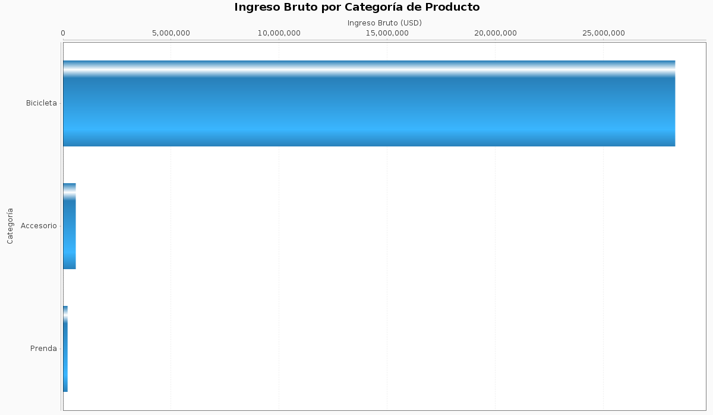
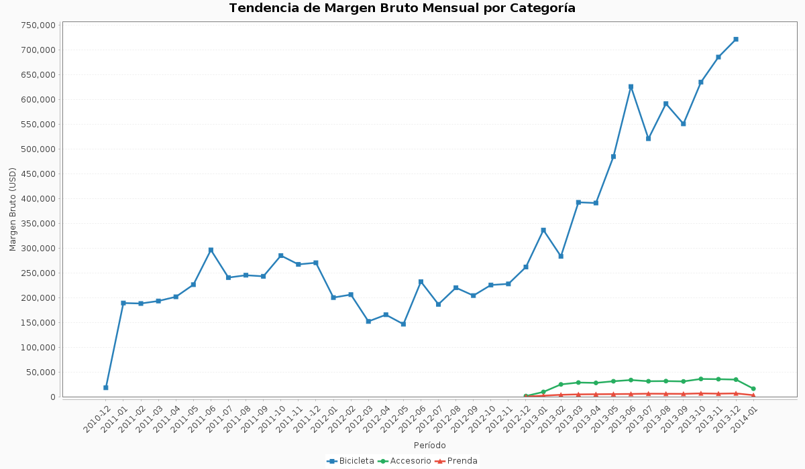
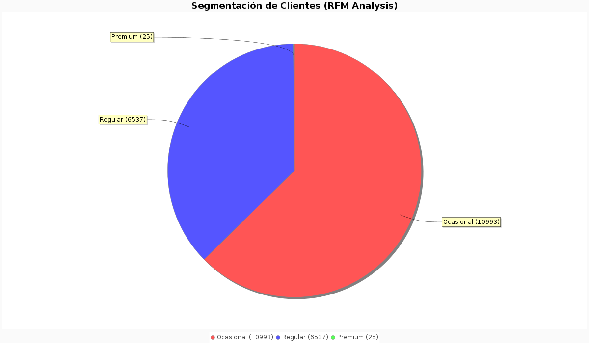
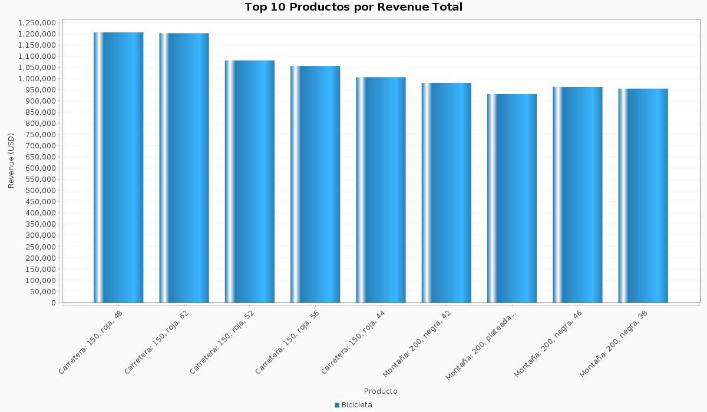
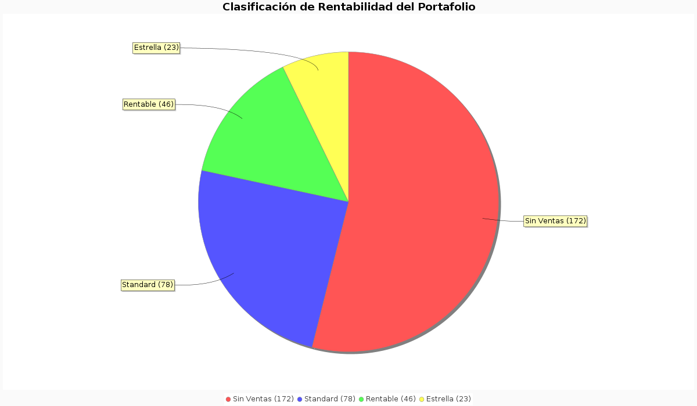
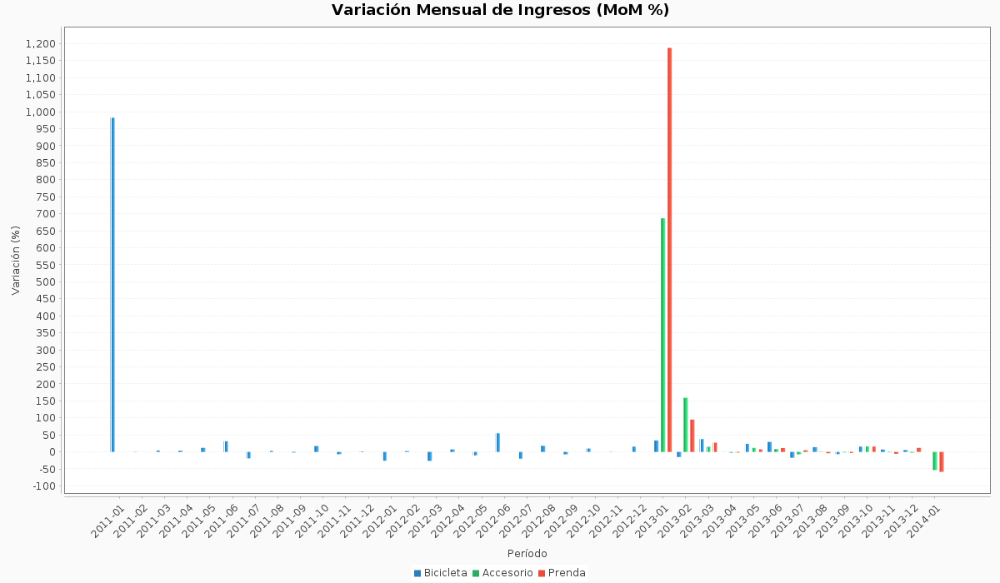
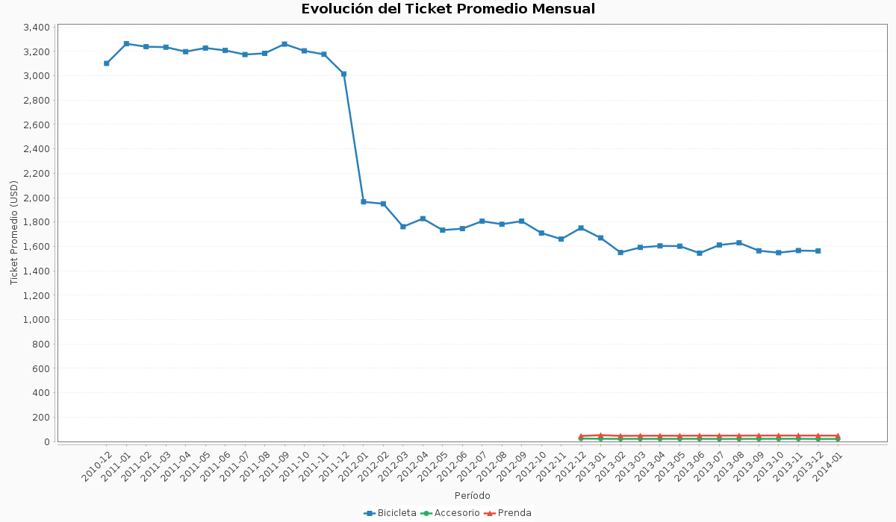
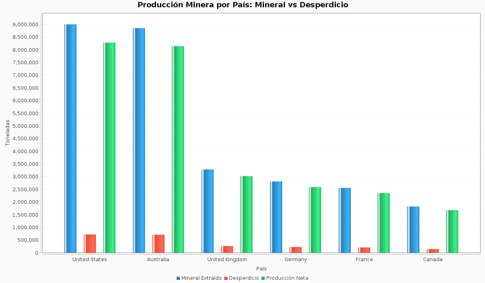
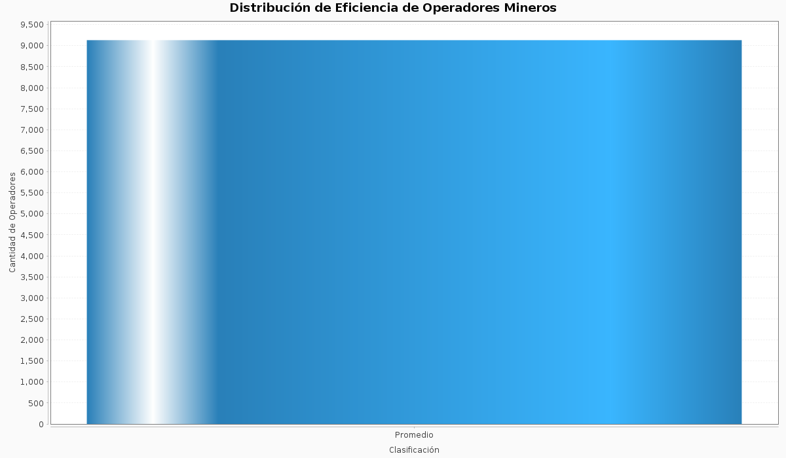
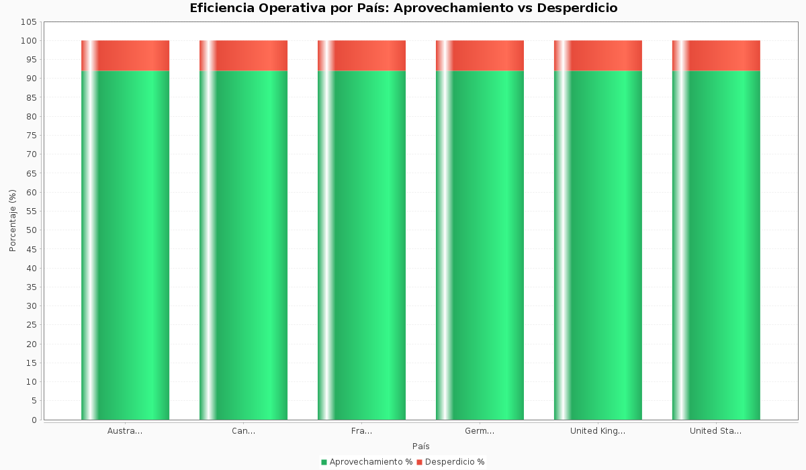

# BI Analytics — Análisis Visual del Data Lakehouse

## Descripción

Este módulo genera **10 gráficos analíticos** a partir de las tablas Delta Lake de la capa **Gold** del Lakehouse. Los gráficos materializan insights de Business Intelligence sobre los dos dominios del negocio: **Retail** (venta de bicicletas y componentes) y **Mining** (extracción mineral industrial).

Cada visualización responde a una pregunta de negocio específica y está diseñada para integrarse en reportes ejecutivos, dashboards Power BI o documentación técnica.

---

## Ejecución

```bash
# Opción 1: Dentro del pipeline completo (STAGE 6)
cd transformation/spark-jobs/pipelines/batch-etl-scala
sbt "runMain main.MainETL"

# Opción 2: Standalone (requiere Gold layer existente)
export HDFS_URI="hdfs://localhost:9000"   # o vacío para modo local
sbt "runMain main.AnalyticsRunner"
```

**Output:** `docs/analytics/images/*.png`

---

## Dominio Retail — Venta de Bicicletas y Componentes

### 01 — Ingreso Bruto por Categoría de Producto



**Tabla Gold:** `kpi_ventas_mensuales` | **Tipo:** Barras horizontales

**Análisis:** Este gráfico presenta la distribución del ingreso bruto acumulado por cada categoría de producto (Bicicletas, Componentes, Accesorios, Vestimenta). Permite identificar rápidamente cuál es la línea de producto que más contribuye al revenue total del negocio.

**Insight BI:** La categoría **Bicicletas** domina el ingreso bruto, concentrando la mayor proporción del revenue. Esto es esperado dado el alto precio unitario de los productos, pero implica un riesgo de concentración: una caída en la demanda de bicicletas impactaría significativamente el P&L. La recomendación es diversificar la estrategia comercial hacia **Componentes** y **Accesorios** como categorías complementarias de alta recurrencia y menor ticket pero mayor frecuencia.

---

### 02 — Tendencia de Margen Bruto Mensual por Categoría



**Tabla Gold:** `kpi_ventas_mensuales` | **Tipo:** Líneas temporales

**Análisis:** Serie temporal que muestra la evolución del margen bruto (ingresos menos costos directos) mes a mes, desglosado por categoría de producto. Cada línea representa una categoría, permitiendo comparar tendencias de rentabilidad.

**Insight BI:** Las categorías con mayor volumen (Bicicletas) muestran mayor volatilidad en el margen mensual — picos estacionales relacionados con temporadas de compra. Las categorías de menor ticket (Accesorios) mantienen un margen más estable pero de menor magnitud. Un patrón de margen decreciente sostenido en cualquier categoría debería activar una revisión de la estructura de costos o política de precios.

---

### 03 — Segmentación de Clientes (Análisis RFM)



**Tabla Gold:** `dim_cliente` | **Tipo:** Gráfico de torta

**Análisis:** Distribución de la base total de clientes según su segmento RFM (Recency, Frequency, Monetary): **VIP**, **Premium**, **Regular** y **Ocasional**. La segmentación se calcula a partir de la frecuencia de compras, el valor monetario acumulado, el ticket promedio y la antigüedad como cliente.

**Insight BI:** La distribución piramidal es la esperada en un modelo B2C: una proporción reducida de clientes **VIP** que concentran un alto porcentaje del revenue (Principio de Pareto), una base amplia de clientes **Ocasionales** con potencial de conversión, y segmentos intermedios (**Premium** y **Regular**) donde las estrategias de retención y upselling tienen mayor ROI. La métrica clave es la tasa de migración entre segmentos: ¿cuántos Ocasionales se convierten en Regulares trimestre a trimestre?

---

### 04 — Top 10 Productos por Revenue Total



**Tabla Gold:** `dim_producto` | **Tipo:** Barras verticales con categoría

**Análisis:** Ranking de los 10 productos individuales que generan mayor revenue acumulado. Cada barra está coloreada según la categoría a la que pertenece el producto, permitiendo ver si el top revenue está concentrado en una sola categoría o diversificado.

**Insight BI:** El análisis de concentración de revenue por SKU es fundamental para la gestión de inventario y la estrategia de pricing. Si los top 10 productos representan más del 30% del revenue total, existe un riesgo de dependencia que debe mitigarse. Además, los productos con alto revenue pero bajo margen (verificable cruzando con `pct_margen` en `dim_producto`) son candidatos a revisión de pricing o negociación con proveedores.

---

### 05 — Clasificación de Rentabilidad del Portafolio



**Tabla Gold:** `dim_producto` | **Tipo:** Gráfico de torta

**Análisis:** Distribución de los 319 productos del catálogo según su clasificación de rentabilidad: **Estrella** (margen ≥60%), **Rentable** (40-60%), **Standard** (20-40%), **Bajo Margen** (0-20%) y **Sin Ventas** (sin movimiento registrado).

**Insight BI:** Un portafolio saludable debería tener al menos un 20% de productos clasificados como "Estrella" o "Rentable". Los productos **Sin Ventas** representan capital inmovilizado en inventario (costo de oportunidad) y son candidatos a liquidación, discontinuación o reposicionamiento. Los productos **Bajo Margen** con alta rotación pueden justificarse como traffic builders (productos gancho), pero los de baja rotación y bajo margen deben evaluarse para discontinuación.

---

### 06 — Variación Month-over-Month de Ingresos (%)



**Tabla Gold:** `kpi_ventas_mensuales` | **Tipo:** Barras agrupadas por categoría

**Análisis:** Porcentaje de variación del ingreso bruto respecto al mes anterior (MoM%), desglosado por categoría. Las barras positivas indican crecimiento, las negativas contracción. Este indicador es el más sensible para detectar cambios en la tendencia de ventas.

**Insight BI:** La variación MoM es el indicador adelantado por excelencia en retail. Dos meses consecutivos de variación negativa en una categoría (@trend) deben activar un análisis de causa raíz: ¿es estacionalidad esperada? ¿hay un competidor nuevo? ¿se agotó el inventario de un producto clave? Las categorías con alta volatilidad MoM (picos y valles pronunciados) requieren una gestión de inventario más sofisticada (safety stock dinámico).

---

### 10 — Evolución del Ticket Promedio Mensual



**Tabla Gold:** `kpi_ventas_mensuales` | **Tipo:** Líneas temporales por categoría

**Análisis:** Evolución del valor promedio por transacción (ticket promedio) a lo largo del tiempo, segregado por categoría de producto. Un proxy de la mezcla de productos que compra el cliente promedio.

**Insight BI:** El ticket promedio es un indicador de la **calidad de la venta**: un ticket creciente puede indicar éxito en estrategias de upselling/cross-selling, mientras que un ticket decreciente puede reflejar migración hacia productos de menor valor (downtrading) o efectos de descuentos agresivos. Cuando el ticket sube pero el número de órdenes baja, el crecimiento es insostenible. La métrica óptima es ticket creciente + órdenes estables o crecientes.

---

## Dominio Mining — Extracción Mineral Industrial

### 07 — Producción Minera por País: Mineral vs Desperdicio



**Tabla Gold:** `kpi_mineria` | **Tipo:** Barras agrupadas (mineral, desperdicio, neto)

**Análisis:** Comparativa por país de las tres métricas fundamentales de la operación minera: mineral total extraído, desperdicio generado y producción neta (mineral - desperdicio). Permite evaluar qué operaciones geográficas son más eficientes.

**Insight BI:** La relación mineral/desperdicio varía significativamente según la geología y la madurez operativa de cada sitio. Los países con alta producción bruta pero alto desperdicio tienen oportunidad de mejora operativa (revisión de procesos de extracción, calibración de equipos). Los países con baja producción neta pero bajo desperdicio pueden estar operando en condiciones geológicas desfavorables o con equipo subóptimo. El benchmark objetivo es mantener la tasa de desperdicio por debajo del 5% (clasificación "Óptima").

---

### 08 — Distribución de Eficiencia de Operadores Mineros



**Tabla Gold:** `dim_operador` | **Tipo:** Barras de distribución

**Análisis:** Distribución de los operadores mineros según su clasificación de eficiencia: **Elite** (desperdicio <3%), **Eficiente** (3-5%), **Promedio** (5-10%) y **Bajo Rendimiento** (>10%). Refleja la calidad del capital humano operativo.

**Insight BI:** La distribución de eficiencia de operadores sigue típicamente una curva normal. Si la distribución está sesgada hacia "Bajo Rendimiento", indica un problema sistémico (capacitación, equipamiento, condiciones geológicas) más que individual. Los operadores **Elite** deben analizarse para identificar best practices replicables: ¿operan ciertos trucks específicos? ¿están asignados a proyectos con mejor geología? El objetivo estratégico es migrar operadores de "Promedio" a "Eficiente" mediante programas de capacitación focalizados (ROI más alto que convertir "Bajo Rendimiento").

---

### 09 — Eficiencia Operativa: Aprovechamiento vs Desperdicio por País



**Tabla Gold:** `kpi_mineria` | **Tipo:** Barras apiladas al 100%

**Análisis:** Descomposición porcentual de la producción de cada país entre tasa de aprovechamiento y tasa de desperdicio. Cada barra incluye la evaluación operativa del país (Óptima / Aceptable / Requiere Mejora) como etiqueta auxiliar.

**Insight BI:** Este gráfico es el KPI operativo más importante para la dirección de operaciones mineras. Un país con evaluación "Requiere Mejora" (desperdicio >10%) necesita intervención inmediata: auditoría de equipos, revisión de procedimientos, posible reentrenamiento masivo de operadores. La diferencia entre "Óptima" (<5%) y "Aceptable" (5-10%) puede representar millones en valor de mineral recuperado. El target corporativo recomendado es alcanzar "Aceptable" en todos los países en el próximo trimestre y "Óptima" en los dos países de mayor producción.

---

## Resumen de Gráficos

| # | Gráfico | Tabla Gold | Dominio | Pregunta de Negocio |
|---|---------|------------|---------|---------------------|
| 01 | Ingreso por Categoría | `kpi_ventas_mensuales` | Retail | ¿Qué categoría genera más revenue? |
| 02 | Margen Mensual Tendencia | `kpi_ventas_mensuales` | Retail | ¿Cómo evoluciona la rentabilidad? |
| 03 | Segmentación Clientes | `dim_cliente` | Retail | ¿Cómo se distribuyen los clientes por valor? |
| 04 | Top 10 Productos | `dim_producto` | Retail | ¿Cuáles son los productos estrella? |
| 05 | Clasificación Rentabilidad | `dim_producto` | Retail | ¿Qué salud tiene el portafolio? |
| 06 | Variación MoM | `kpi_ventas_mensuales` | Retail | ¿Hay crecimiento o contracción? |
| 07 | Producción por País | `kpi_mineria` | Mining | ¿Qué país lidera la producción? |
| 08 | Eficiencia Operadores | `dim_operador` | Mining | ¿Cuántos operadores son eficientes? |
| 09 | Desperdicio vs Producción | `kpi_mineria` | Mining | ¿Qué tan eficiente es cada país? |
| 10 | Ticket Promedio Mensual | `kpi_ventas_mensuales` | Retail | ¿Cómo evoluciona el valor por compra? |

---

## Stack Técnico

| Componente | Tecnología | Uso |
|------------|-----------|------|
| Charting Engine | JFreeChart 1.5.4 | Generación de gráficos PNG headless |
| Data Source | Delta Lake 2.2.0 | Lectura de tablas Gold en HDFS/local |
| Processing | Apache Spark 3.3.1 | Agregaciones y transformaciones |
| Output | PNG 1200x700px | Imágenes de alta resolución |

---

## Arquitectura del Módulo

```
transformation/spark-jobs/pipelines/batch-etl-scala/
└── src/main/scala/
    ├── analytics/
    │   └── BIAnalytics.scala      ← Motor de generación de gráficos
    └── main/
        └── AnalyticsRunner.scala   ← Runner standalone

docs/
└── analytics/
    └── images/                     ← Output de gráficos PNG
        ├── 01_ingresos_por_categoria.png
        ├── 02_margen_mensual_tendencia.png
        ├── 03_segmentacion_clientes.png
        ├── 04_top10_productos_revenue.png
        ├── 05_clasificacion_rentabilidad.png
        ├── 06_ventas_mom_variacion.png
        ├── 07_produccion_minera_por_pais.png
        ├── 08_eficiencia_operadores.png
        ├── 09_desperdicio_vs_produccion.png
        └── 10_ticket_promedio_mensual.png
```
