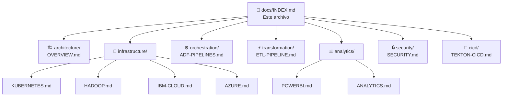

# Documentación Técnica — Medallion Data Platform

## Índice General

Documentación modularizada de todos los componentes de la plataforma de datos Medallion. Cada módulo incluye diagramas Mermaid para arquitectura, flujos y relaciones.

---

### Arquitectura

| Documento | Descripción |
|-----------|-------------|
| [Arquitectura General](architecture/OVERVIEW.md) | Visión de alto nivel, topología de componentes, stack tecnológico, modos de ejecución |

### Infraestructura

| Documento | Descripción |
|-----------|-------------|
| [Kubernetes & Spark on K8s](infrastructure/KUBERNETES.md) | CronJob, RBAC, NetworkPolicy, monitoring, Docker image, recursos |
| [Hadoop Lakehouse](infrastructure/HADOOP.md) | HDFS, Hive Metastore, Docker Compose, configuración XML |
| [IBM Cloud](infrastructure/IBM-CLOUD.md) | Terraform, VPC, IKS, Analytics Engine, COS, Db2, scripts |
| [Azure](infrastructure/AZURE.md) | SQL Server, Blob Storage, Data Lake Gen2, Databricks, Pipelines |

### Orquestación

| Documento | Descripción |
|-----------|-------------|
| [ADF Pipelines](orchestration/ADF-PIPELINES.md) | 7 pipelines Azure Data Factory, linked services, flujo de datos |

### Transformación

| Documento | Descripción |
|-----------|-------------|
| [ETL Pipeline (Scala)](transformation/ETL-PIPELINE.md) | Módulos Scala, DAG engine, circuit breaker, capas Medallion, 6 workflows |
| [ETL Detalle (original)](README.md) | Documentación detallada del pipeline Spark (archivo existente) |

### Analytics

| Documento | Descripción |
|-----------|-------------|
| [Power BI](analytics/POWERBI.md) | Star schema, 57 medidas DAX, 6 dashboards, relaciones del modelo |
| [BI Charts](analytics/ANALYTICS.md) | 10 charts JFreeChart generados, especificaciones visuales |

### Seguridad

| Documento | Descripción |
|-----------|-------------|
| [Seguridad](security/SECURITY.md) | Secretos, encryption, RBAC, NetworkPolicy, container security, auditoría |

### CI/CD

| Documento | Descripción |
|-----------|-------------|
| [Tekton CI/CD](cicd/TEKTON-CICD.md) | Pipeline 9 etapas, triggers GitHub, security scan, deploy |

---

## Mapa de Documentación



---

## Estructura de Archivos

```
docs/
├── INDEX.md                          ← Este archivo (índice principal)
├── README.md                         ← Documentación detallada ETL Scala
├── architecture/
│   └── OVERVIEW.md                   ← Arquitectura general + Mermaid
├── infrastructure/
│   ├── KUBERNETES.md                 ← Spark on K8s, CronJob, RBAC
│   ├── HADOOP.md                     ← HDFS, Hive, Docker Compose
│   ├── IBM-CLOUD.md                  ← Terraform, VPC, COS, IKS
│   └── AZURE.md                      ← ADF, SQL Server, ADLS, Databricks
├── orchestration/
│   └── ADF-PIPELINES.md              ← Azure Data Factory pipelines
├── transformation/
│   └── ETL-PIPELINE.md               ← Spark Medallion ETL (Scala)
├── analytics/
│   ├── POWERBI.md                    ← Modelo dimensional + DAX
│   ├── ANALYTICS.md                  ← (existente) Charts BI
│   └── images/                       ← 10 charts PNG generados
├── security/
│   └── SECURITY.md                   ← Seguridad multi-capa
└── cicd/
    └── TEKTON-CICD.md                ← Pipeline Tekton 9 etapas
```

---

## Resumen de Componentes

| Categoría | Componentes | Diagramas Mermaid |
|-----------|-------------|-------------------|
| **Arquitectura** | Topología, Medallion flow, modos de ejecución | 4 diagramas |
| **Kubernetes** | CronJob, RBAC, NetworkPolicy, monitoring, Docker | 8 diagramas |
| **Hadoop** | HDFS, Hive, Docker Compose, estructura datos | 5 diagramas |
| **IBM Cloud** | Terraform, scripts, Analytics Engine, monitoreo | 5 diagramas |
| **Azure** | ADF, SQL Server, provisionamiento, linked services | 4 diagramas |
| **Orquestación** | 7 pipelines ADF, actividades, flujo completo | 8 diagramas |
| **ETL Pipeline** | DAG engine, circuit breaker, capas, workflows | 9 diagramas |
| **Power BI** | Star schema, 57 medidas, relaciones, dashboards | 6 diagramas |
| **Seguridad** | Secrets, RBAC, NetworkPolicy, encryption, CI scan | 7 diagramas |
| **CI/CD** | 9 stages Tekton, triggers, flujo completo | 6 diagramas |
| **Total** | ~100+ componentes documentados | **~62 diagramas Mermaid** |
