# Batch ETL Scala — Lakehouse Medallion Pipeline

Motor de procesamiento de datos empresarial implementado en **Scala 2.12 + Apache Spark 3.3.1 + Delta Lake 2.2.0**. Ejecuta un pipeline ETL completo con arquitectura Medallion (RAW → Bronze → Silver → Gold), workflows paralelos de calidad/lineage/analytics, auditoría Hive y generación de gráficos BI.

---

## Índice

1. [Estructura del Proyecto](#estructura-del-proyecto)
2. [Arquitectura General](#arquitectura-general)
3. [Stack Tecnológico](#stack-tecnológico)
4. [Ejecución](#ejecución)
5. [Componentes](#componentes)
   - [Pipeline — Orquestador Principal](#pipeline--orquestador-principal)
   - [config/ — Configuración](#config--configuración)
   - [schema/ — Esquemas CSV](#schema--esquemas-csv)
   - [infra/ — Infraestructura I/O](#infra--infraestructura-io)
   - [engine/ — Motor DAG](#engine--motor-dag)
   - [layer/ — Capas Medallion](#layer--capas-medallion)
   - [workflow/ — Workflows](#workflow--workflows)
   - [analytics/ — Generación BI](#analytics--generación-bi)
6. [Flujo de Datos por Capa](#flujo-de-datos-por-capa)
7. [Modelos de Datos](#modelos-de-datos)

---

## Estructura del Proyecto

```
batch-etl-scala/
├── build.sbt                          ← Dependencias y configuración SBT
├── datalake/                          ← Output local (bronze/silver/gold/checkpoints)
├── src/main/
│   ├── resources/
│   │   ├── csv/                       ← Archivos CSV fuente (7 archivos)
│   │   ├── analytics/                 ← Output PNG de gráficos BI (10 charts)
│   │   ├── hdfs/                      ← Configuraciones HDFS
│   │   └── log4j.properties           ← Configuración de logging
│   └── scala/medallion/
│       ├── Pipeline.scala             ← Orquestador principal v3.0
│       ├── config/
│       │   ├── DatalakeConfig.scala   ← Modelo de configuración inmutable
│       │   └── SparkFactory.scala     ← Fábrica singleton de SparkSession
│       ├── schema/
│       │   └── CsvSchemas.scala       ← Esquemas StructType para ingesta
│       ├── infra/
│       │   ├── DataLakeIO.scala       ← Lectura/escritura Parquet, Delta, CSV
│       │   └── HdfsManager.scala      ← Gestión HDFS y estructura datalake
│       ├── engine/
│       │   ├── DagTask.scala          ← Modelo de nodo del DAG
│       │   └── DagExecutor.scala      ← Motor de ejecución paralela con DAG
│       ├── layer/
│       │   ├── BronzeLayer.scala      ← Ingesta y limpieza (RAW → Bronze)
│       │   ├── SilverLayer.scala      ← Lógica de negocio (Bronze → Silver)
│       │   └── GoldLayer.scala        ← Star Schema y KPIs (Silver → Gold)
│       ├── workflow/
│       │   ├── EtlWorkflow.scala      ← WF1: Orquestación ETL completa
│       │   ├── AnalyticsWorkflow.scala← WF2: Generación de gráficos BI
│       │   ├── HiveWorkflow.scala     ← WF3: Auditoría Hive catalog
│       │   ├── DataQualityWorkflow.scala ← WF4: Validación de calidad
│       │   ├── LineageWorkflow.scala  ← WF5: Trazabilidad de linaje
│       │   └── MetricsWorkflow.scala  ← WF6: Métricas de ejecución
│       └── analytics/
│           └── BIChartGenerator.scala ← Motor JFreeChart (10 gráficos)
```

---

## Arquitectura General

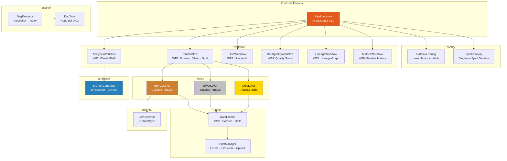

---

## Stack Tecnológico

| Componente | Versión | Función |
|------------|---------|---------|
| **Scala** | 2.12.13 | Lenguaje de programación |
| **Apache Spark** | 3.3.1 | Motor de procesamiento distribuido |
| **Delta Lake** | 2.2.0 | ACID transactions, time travel (Gold) |
| **Hadoop HDFS** | 3.3.4 | Sistema de archivos distribuido |
| **Apache Hive** | 3.1.3 | Metastore y catálogo de tablas |
| **JFreeChart** | 1.5.4 | Generación headless de gráficos PNG |
| **SBT** | — | Build tool + Assembly plugin |

---

## Ejecución

```bash
# Pipeline completo (auto-detecta HDFS o modo local)
sbt "runMain medallion.Pipeline"

# Solo analytics (requiere Gold layer existente)
sbt "runMain medallion.workflow.AnalyticsWorkflow"

# Solo Hive audit (requiere HDFS + Hive activos)
sbt "runMain medallion.workflow.HiveWorkflow"

# Variables de entorno opcionales
export HDFS_URI="hdfs://namenode:9000"       # Default
export CSV_PATH="./src/main/resources/csv"   # Default
export ANALYTICS_OUT="./src/main/resources/analytics"
```

---

## Componentes

### Pipeline — Orquestador Principal

> [`src/main/scala/medallion/Pipeline.scala`](src/main/scala/medallion/Pipeline.scala)

Punto de entrada del sistema. Orquesta 6 workflows en 4 fases con retry, checkpoint y paralelismo controlado.

**Funciones clave:**

| Función | Tipo | Descripción |
|---------|------|-------------|
| `main(args)` | Entry point | Detecta entorno, inicializa Spark, ejecuta fases |
| `withRetry(name, critical, maxRetries)(body)` | Resiliencia | Retry con backoff exponencial (2s, 4s, 6s) |
| `isCheckpointed(path, stage)` | Checkpoint | Verifica si un stage ya fue completado |
| `writeCheckpoint(path, stage)` | Checkpoint | Persiste `.checkpoint_<STAGE>` al filesystem |

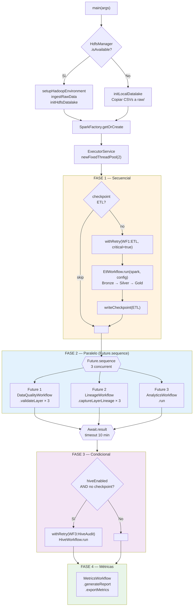

---

### config/ — Configuración

#### DatalakeConfig

> [`src/main/scala/medallion/config/DatalakeConfig.scala`](src/main/scala/medallion/config/DatalakeConfig.scala)

Case class inmutable con las rutas de cada capa y configuración del entorno.

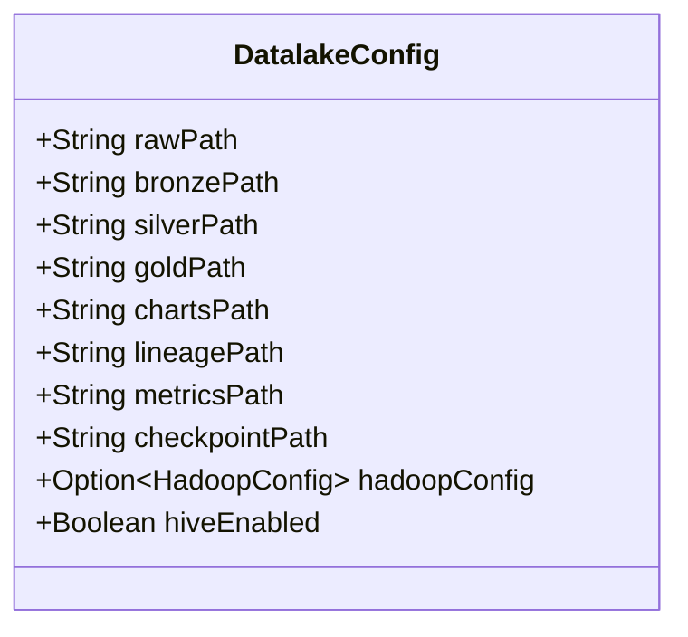

| Campo | Descripción |
|-------|-------------|
| `rawPath` | Directorio de CSVs originales |
| `bronzePath` | Output de BronzeLayer (Parquet) |
| `silverPath` | Output de SilverLayer (Parquet) |
| `goldPath` | Output de GoldLayer (Delta Lake) |
| `chartsPath` | Directorio de salida para gráficos PNG |
| `lineagePath` | Directorio para manifiestos JSON de linaje |
| `metricsPath` | Directorio para métricas JSON |
| `checkpointPath` | Directorio de archivos `.checkpoint_*` |
| `hadoopConfig` | Configuración Hadoop (None en modo local) |
| `hiveEnabled` | Activa registro en catálogo Hive |

#### SparkFactory

> [`src/main/scala/medallion/config/SparkFactory.scala`](src/main/scala/medallion/config/SparkFactory.scala)

Fábrica singleton thread-safe con double-checked locking.

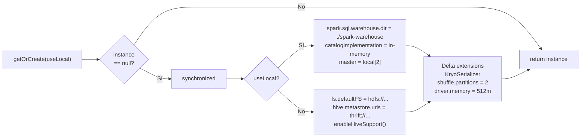

**Configuraciones Spark aplicadas:**

| Configuración | Valor | Motivo |
|---------------|-------|--------|
| `spark.serializer` | KryoSerializer | Serialización más eficiente |
| `spark.sql.shuffle.partitions` | 2 | Pipeline low-volume |
| `spark.driver.memory` | 512m | Optimizado para contenedor |
| `spark.sql.extensions` | DeltaSparkSessionExtension | Habilita Delta Lake |
| `spark.sql.catalog.spark_catalog` | DeltaCatalog | Catálogo Delta |

---

### schema/ — Esquemas CSV

> [`src/main/scala/medallion/schema/CsvSchemas.scala`](src/main/scala/medallion/schema/CsvSchemas.scala)

Define `StructType` explícitos para los 7 archivos CSV de ingesta, divididos en dos dominios:

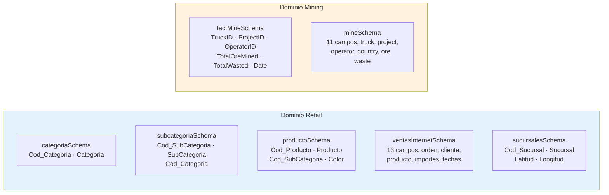

| Schema | Archivo CSV | Columnas | Dominio |
|--------|------------|----------|---------|
| `categoriaSchema` | Categoria.csv | 2 | Retail |
| `subcategoriaSchema` | Subcategoria.csv | 3 | Retail |
| `productoSchema` | Producto.csv | 4 | Retail |
| `ventasInternetSchema` | VentasInternet.csv | 13 | Retail |
| `sucursalesSchema` | Sucursales.csv | 5 | Retail |
| `factMineSchema` | FactMine.csv | 6 | Mining |
| `mineSchema` | Mine.csv | 11 | Mining |

---

### infra/ — Infraestructura I/O

#### DataLakeIO

> [`src/main/scala/medallion/infra/DataLakeIO.scala`](src/main/scala/medallion/infra/DataLakeIO.scala)

Utilidades de lectura/escritura que abstraen el formato de almacenamiento. Soporta CSV, Parquet y Delta Lake, con detección automática de rutas locales vs HDFS.

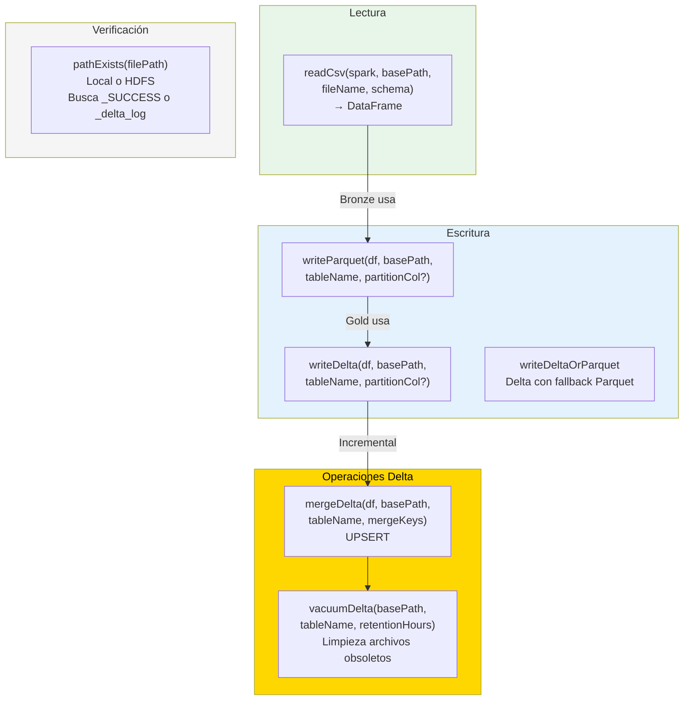

| Función | Formatos | Descripción |
|---------|----------|-------------|
| `readCsv` | CSV → DataFrame | Lee con schema enforcement y dateFormat ISO |
| `writeParquet` | DataFrame → Parquet | Escritura con partición opcional (Bronze/Silver) |
| `writeDelta` | DataFrame → Delta | Escritura Delta Lake con ACID (Gold) |
| `writeDeltaOrParquet` | Delta / Parquet | Delta con fallback automático a Parquet |
| `mergeDelta` | Delta UPSERT | Merge por claves con `whenMatched.updateAll()` |
| `vacuumDelta` | Delta cleanup | VACUUM con retención configurable (default 7 días) |
| `pathExists` | Local / HDFS | Detecta `_SUCCESS` (Parquet) o `_delta_log` (Delta) |

#### HdfsManager

> [`src/main/scala/medallion/infra/HdfsManager.scala`](src/main/scala/medallion/infra/HdfsManager.scala)

Gestión centralizada de operaciones HDFS: verificación de disponibilidad, configuración Hadoop, creación de estructura y carga de archivos.

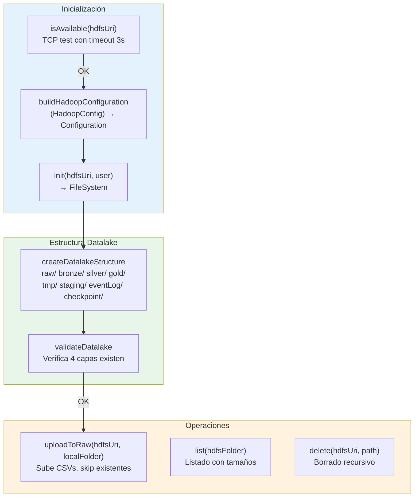

**HadoopConfig — case class:**

| Campo | Default | Descripción |
|-------|---------|-------------|
| `hdfsUri` | — | URI del namenode HDFS |
| `user` | `"fede"` | Usuario Hadoop |
| `replication` | 1 | Factor de replicación HDFS |
| `blockSize` | 128MB | Tamaño de bloque HDFS |
| `hiveWarehouse` | `/hive/warehouse` | Directorio warehouse Hive |
| `hiveMetastoreUris` | `thrift://localhost:9083` | URI del Hive Metastore |

---

### engine/ — Motor DAG

#### DagTask

> [`src/main/scala/medallion/engine/DagTask.scala`](src/main/scala/medallion/engine/DagTask.scala)

Nodo del grafo dirigido acíclico (DAG) de ejecución.

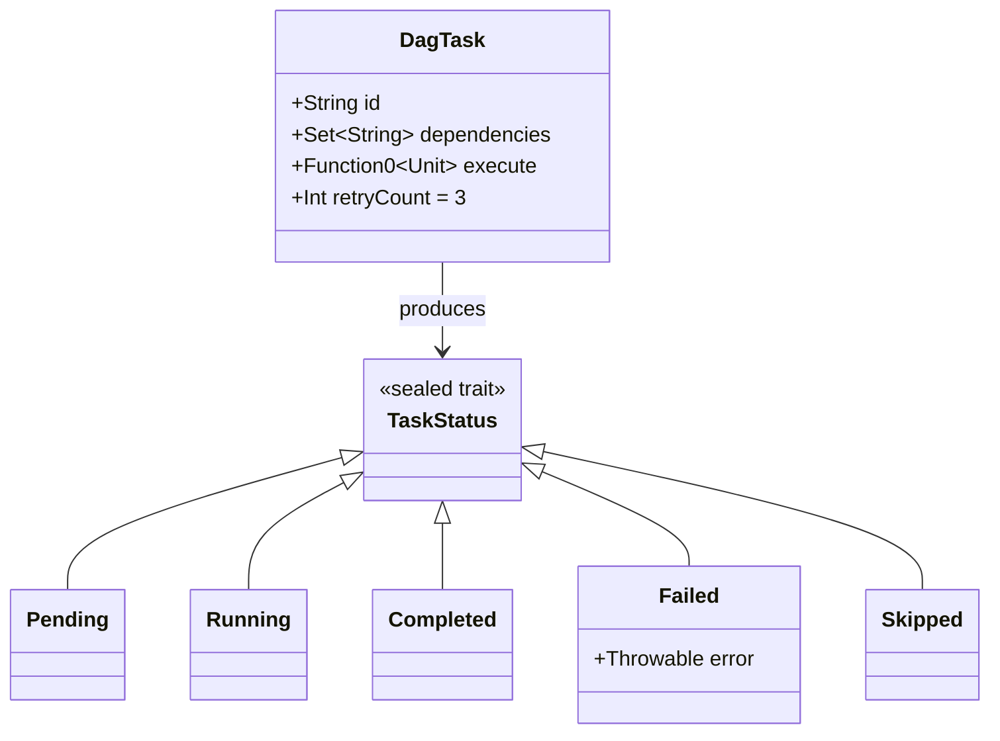

#### DagExecutor

> [`src/main/scala/medallion/engine/DagExecutor.scala`](src/main/scala/medallion/engine/DagExecutor.scala)

Motor de ejecución paralela que resuelve dependencias del DAG, ejecuta tasks concurrentes con un thread pool controlado, y soporta retry con backoff.

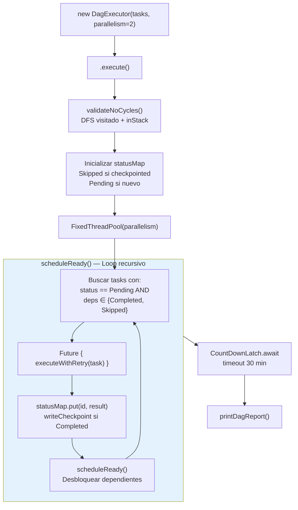

**Algoritmo:**

1. Valida que no haya ciclos (DFS con detección de back-edge)
2. Inicializa estado: `Skipped` si checkpointed, `Pending` si no
3. `scheduleReady()`: busca tasks cuyas dependencias son `Completed`/`Skipped`
4. Lanza cada task en un `Future` con `executeWithRetry`
5. Al completar una task, re-invoca `scheduleReady()` para desbloquear dependientes
6. `CountDownLatch` espera a que todas completen (timeout 30 min)

---

### layer/ — Capas Medallion

#### BronzeLayer

> [`src/main/scala/medallion/layer/BronzeLayer.scala`](src/main/scala/medallion/layer/BronzeLayer.scala)

Ingesta y limpieza: lee CSVs con schema enforcement, deduplica por claves naturales, filtra nulos y agrega columnas de auditoría.

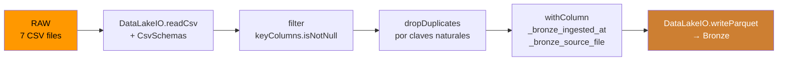

| Tabla Bronze | CSV Fuente | Claves de Deduplicación |
|-------------|------------|------------------------|
| `categoria` | Categoria.csv | `Cod_Categoria` |
| `subcategoria` | Subcategoria.csv | `Cod_SubCategoria` |
| `producto` | Producto.csv | `Cod_Producto` |
| `ventasinternet` | VentasInternet.csv | `NumeroOrden`, `Cod_Producto` |
| `sucursales` | Sucursales.csv | `Cod_Sucursal` |
| `factmine` | FactMine.csv | `TruckID`, `ProjectID`, `Date` |
| `mine` | Mine.csv | `TruckID`, `ProjectID`, `OperatorID`, `Date` |

#### SilverLayer

> [`src/main/scala/medallion/layer/SilverLayer.scala`](src/main/scala/medallion/layer/SilverLayer.scala)

Lógica de negocio: registra vistas temporales de Bronze y construye 8 tablas analíticas con Spark SQL.

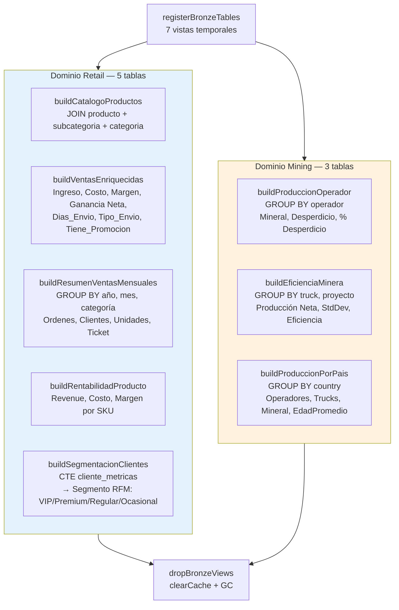

**Detalle de tablas Silver:**

| Tabla Silver | Fuentes Bronze | SQL Principal |
|-------------|---------------|---------------|
| `catalogo_productos` | producto, subcategoria, categoria | 3-way INNER JOIN |
| `ventas_enriquecidas` | ventasinternet, producto, subcategoria, categoria | JOINs + cálculos financieros (Ingreso, Margen, Ganancia Neta) |
| `resumen_ventas_mensuales` | ventasinternet, producto, subcategoria, categoria | GROUP BY Anio, Mes, Categoría + agregaciones |
| `rentabilidad_producto` | ventasinternet, producto, subcategoria, categoria | GROUP BY producto + Revenue, Margen, Precio promedio |
| `segmentacion_clientes` | ventasinternet | CTE con frecuencia, monetary → segmento RFM |
| `produccion_operador` | mine | GROUP BY operador + mineral, desperdicio |
| `eficiencia_minera` | factmine | GROUP BY truck, proyecto + StdDev, eficiencia |
| `produccion_por_pais` | mine | GROUP BY country + producción neta |

#### GoldLayer

> [`src/main/scala/medallion/layer/GoldLayer.scala`](src/main/scala/medallion/layer/GoldLayer.scala)

Modelos dimensionales Star Schema escritos en Delta Lake. Implementa carga incremental: registra solo las vistas Silver necesarias para cada tabla Gold, luego las libera.

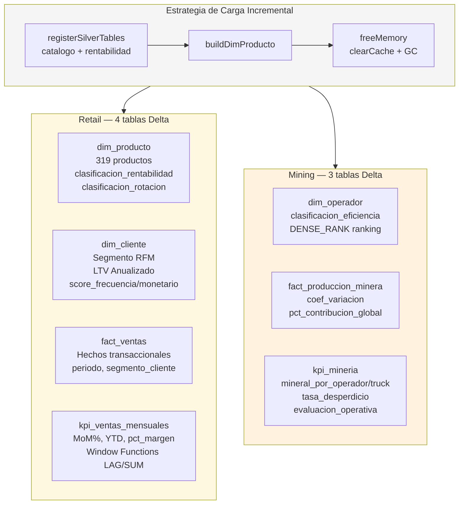

**Patrón de escritura Gold:**

```
registerSilverTables(solo las necesarias)
  → buildDimXxx / buildFactXxx / buildKpiXxx (Spark SQL)
    → DataLakeIO.writeDelta(df.coalesce(1))
      → freeMemory (clearCache + System.gc)
        → dropSilverViews (cuando se terminan todas)
```

---

### workflow/ — Workflows

#### WF1: EtlWorkflow

> [`src/main/scala/medallion/workflow/EtlWorkflow.scala`](src/main/scala/medallion/workflow/EtlWorkflow.scala)

Orquesta el pipeline ETL completo. Soporta dos modos de inicialización y registra tablas en Hive cuando hay HDFS.

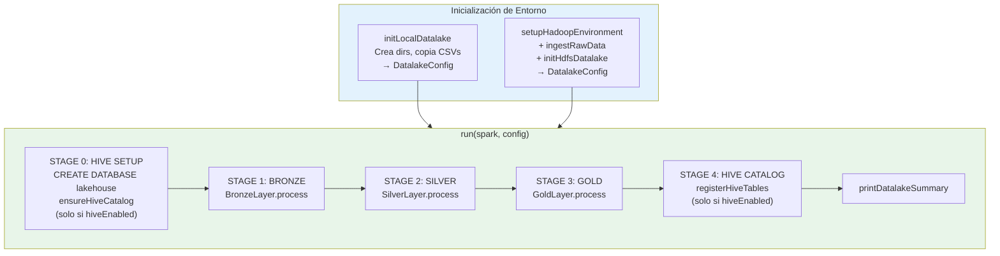

| Función | Descripción |
|---------|-------------|
| `setupHadoopEnvironment` | Configura Hadoop, crea estructura HDFS, valida datalake |
| `ingestRawData` | Sube CSVs locales a HDFS `/hive/warehouse/datalake/raw` |
| `initLocalDatalake` | Crea directorios locales `./datalake/{raw,bronze,silver,gold}` |
| `initHdfsDatalake` | Construye `DatalakeConfig` con rutas HDFS |
| `run` | Ejecuta STAGE 0→4 secuencialmente |
| `registerHiveTables` | Registra 7 tablas Gold (DELTA) + 8 Silver (PARQUET) en Hive |

#### WF2: AnalyticsWorkflow

> [`src/main/scala/medallion/workflow/AnalyticsWorkflow.scala`](src/main/scala/medallion/workflow/AnalyticsWorkflow.scala)

Wrapper que invoca `BIChartGenerator.generate()` para producir 10 gráficos PNG desde las tablas Gold. Tiene `main()` propio para ejecución standalone.

#### WF3: HiveWorkflow

> [`src/main/scala/medallion/workflow/HiveWorkflow.scala`](src/main/scala/medallion/workflow/HiveWorkflow.scala)

Auditoría cruzada entre catálogo Hive y datos físicos en HDFS. Para cada tabla verifica: registrada en Hive? + datos Delta/Parquet existen en HDFS?

| Estado | Significado |
|--------|-------------|
| `✔ OK` | Registrada en Hive + datos existen en HDFS |
| `⚠ REGISTRADA pero sin datos` | En catálogo pero sin archivos |
| `✗ DATOS EXISTEN pero NO registrada` | Archivos presentes, falta registro Hive |
| `✗ NO EXISTE` | Ni registro ni datos |

#### WF4: DataQualityWorkflow

> [`src/main/scala/medallion/workflow/DataQualityWorkflow.scala`](src/main/scala/medallion/workflow/DataQualityWorkflow.scala)

Validación de calidad por capa con muestreo ligero (100 rows) para evitar impacto en memoria.

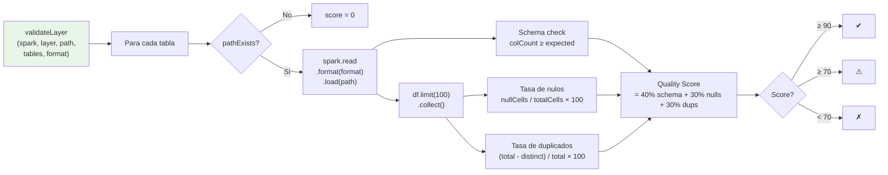

**Score compuesto:**
- **40%** → Existencia + conformidad de schema
- **30%** → Tasa de nulos (penaliza × 2)
- **30%** → Tasa de duplicados (penaliza × 2)

#### WF5: LineageWorkflow

> [`src/main/scala/medallion/workflow/LineageWorkflow.scala`](src/main/scala/medallion/workflow/LineageWorkflow.scala)

Captura y genera un grafo de linaje completo del pipeline. Conoce el mapeo de dependencias entre tablas (hardcoded):

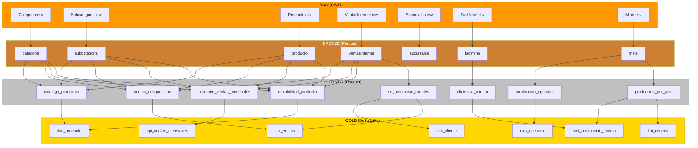

Exporta un manifiesto JSON con columnas, tipos, fuentes y timestamps: `lineage_YYYYMMDD_HHmmss.json`.

#### WF6: MetricsWorkflow

> [`src/main/scala/medallion/workflow/MetricsWorkflow.scala`](src/main/scala/medallion/workflow/MetricsWorkflow.scala)

Captura thread-safe de métricas de ejecución usando `ConcurrentHashMap` y `ConcurrentLinkedQueue`.

| Función | Descripción |
|---------|-------------|
| `startPipeline()` | Marca t₀ global del pipeline |
| `startStage(name)` | Registra inicio de un stage |
| `endStage(name, tables)` | Calcula duración y registra `StageMetric` |
| `generateReport()` | Timeline visual con barras, throughput, bottleneck, JVM memory |
| `exportMetrics(path)` | Exporta `metrics_YYYYMMDD_HHmmss.json` |

**Métricas calculadas:**
- Duración por stage con timeline visual (`█░`)
- Throughput: tablas/segundo del ETL
- Detección de workflows paralelos (overlap de timestamps)
- Identificación del bottleneck (stage más lento)
- Snapshot de memoria JVM (used/max MB)

---

### analytics/ — Generación BI

#### BIChartGenerator

> [`src/main/scala/medallion/analytics/BIChartGenerator.scala`](src/main/scala/medallion/analytics/BIChartGenerator.scala)

Motor de generación de gráficos PNG headless con JFreeChart. Produce 10 visualizaciones (1200×700px) desde tablas Gold Delta Lake.

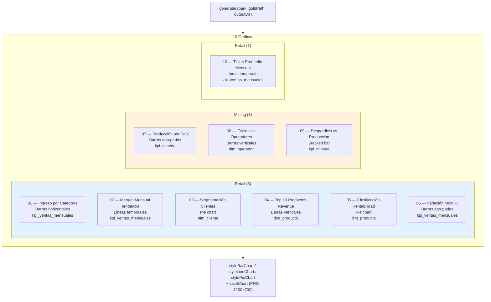

**Configuración visual:**

| Propiedad | Valor |
|-----------|-------|
| Resolución | 1200 × 700 px |
| Background | `#FAFAFA` |
| Título font | SansSerif Bold 18pt |
| Label font | SansSerif Plain 12pt |
| Paleta | 10 colores Material Design |

---

## Flujo de Datos por Capa

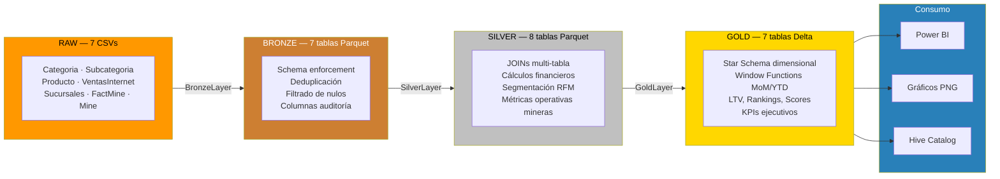

---

## Modelos de Datos

### Gold — Star Schema Retail

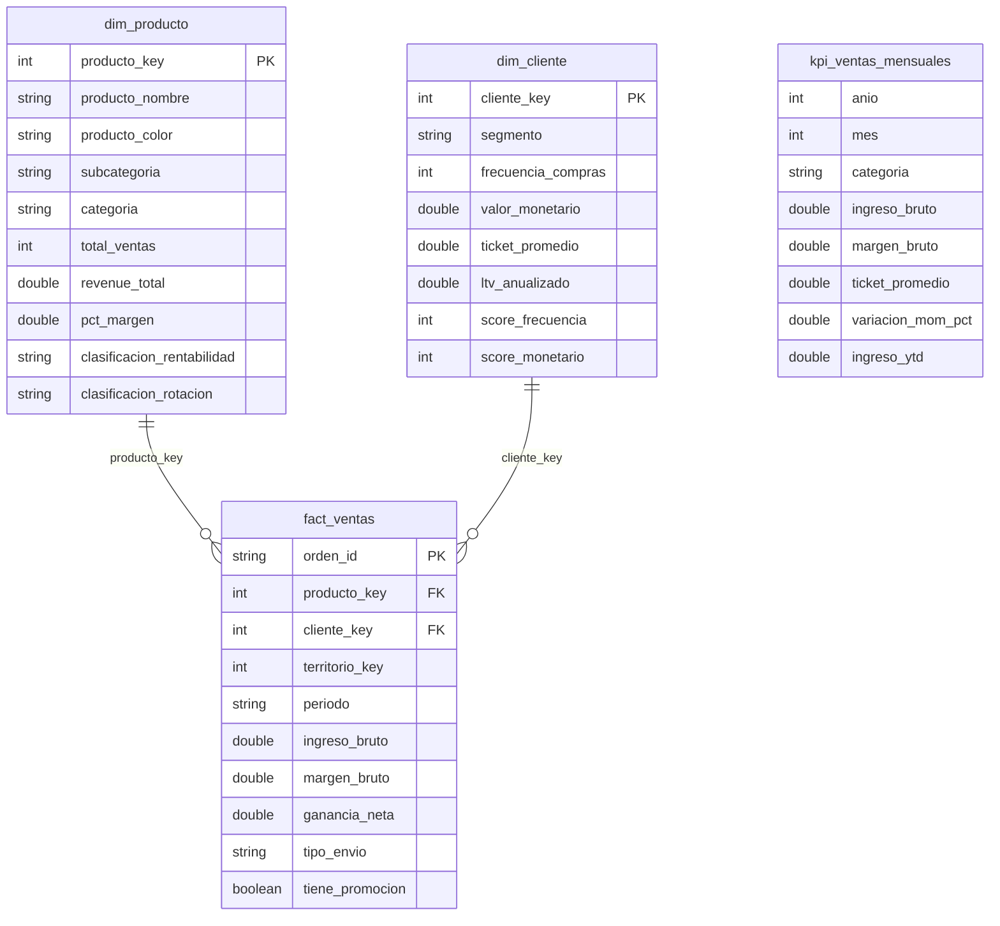

### Gold — Star Schema Mining

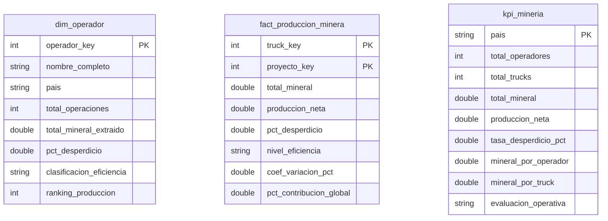
