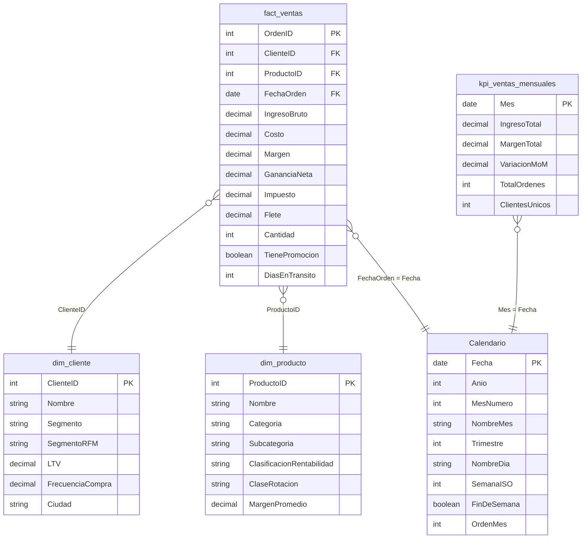
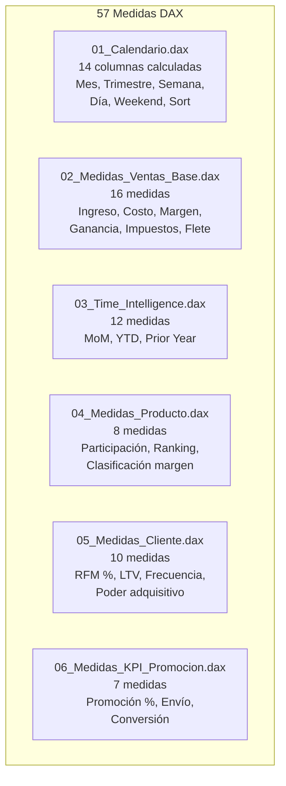
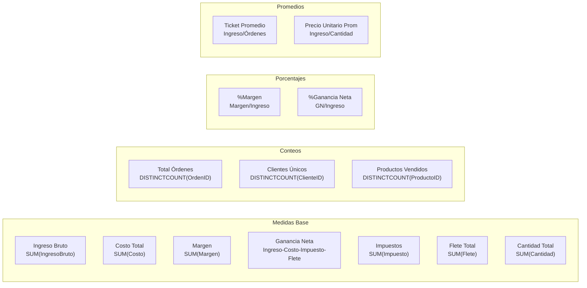
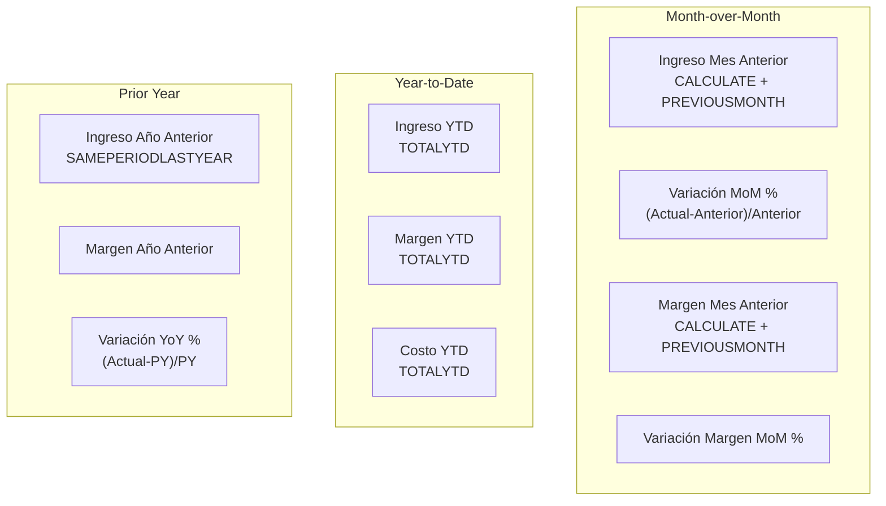
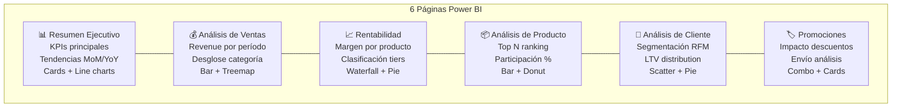
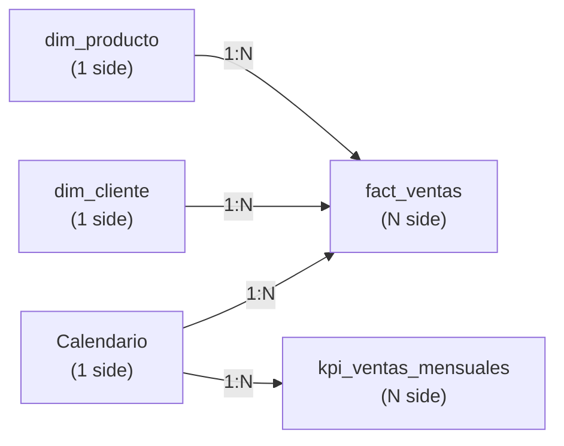
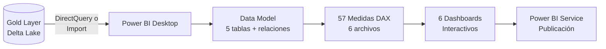

# Power BI — Modelo de Datos y Medidas DAX

## Resumen

Modelo dimensional en estrella cargado desde la capa GOLD (Delta Lake) con 5 tablas, 57 medidas DAX distribuidas en 6 archivos temáticos, y 6 páginas de dashboard. Soporta análisis de ventas retail (bicicletas y componentes) con segmentación de clientes RFM y time intelligence completa.

---

## Star Schema — Modelo Dimensional

---

## Tablas del Modelo

| Tabla | Tipo | Rows | Origen | Rol |
|-------|------|------|--------|-----|
| `fact_ventas` | Fact | 48,895 | Gold Delta Lake | Transacciones de ventas |
| `dim_cliente` | Dimension | 18,484 | Gold Delta Lake | Atributos de cliente + RFM |
| `dim_producto` | Dimension | 319 | Gold Delta Lake | Jerarquía de producto |
| `kpi_ventas_mensuales` | Aggregate Fact | 37 | Gold Delta Lake | KPIs mensuales pre-calculados |
| `Calendario` | Calculated | 1,184 | DAX ADDCOLUMNS | Dimensión tiempo (2010-2014) |

---

## Medidas DAX — 57 Totales en 6 Archivos

### 01 — Calendario (14 columnas)

| Columna | Fórmula DAX | Ejemplo |
|---------|-------------|---------|
| Año | `YEAR([Fecha])` | 2013 |
| MesNumero | `MONTH([Fecha])` | 6 |
| NombreMes | `FORMAT([Fecha], "MMMM")` | Junio |
| Trimestre | `QUARTER([Fecha])` | Q2 |
| NombreDia | `FORMAT([Fecha], "dddd")` | Lunes |
| SemanaISO | `WEEKNUM([Fecha], 21)` | 24 |
| FinDeSemana | `IF(WEEKDAY(...)>5, TRUE)` | TRUE/FALSE |
| OrdenMes | `MONTH([Fecha])` | 6 (para sort) |

Rango: `2010-12-01` a `2014-01-31` (1,184 días)

### 02 — Medidas Ventas Base (16 medidas)

### 03 — Time Intelligence (12 medidas)

### 04 — Medidas Producto (8 medidas)

| Medida | Fórmula | Descripción |
|--------|---------|-------------|
| Participación por Categoría | `DIVIDE(Ingreso_Cat, Ingreso_Total)` | % share por categoría |
| Participación por Subcategoría | `DIVIDE(Ingreso_Sub, Ingreso_Total)` | % share por subcategoría |
| Ranking Producto | `RANKX(ALL, Ingreso, , DESC, Dense)` | Top N productos |
| % Estrella | `DIVIDE(COUNT IF margen>30%)` | Productos alta rentabilidad |
| % Rentable | `DIVIDE(COUNT IF margen 15-30%)` | Productos rentables |
| % Standard | `DIVIDE(COUNT IF margen 5-15%)` | Productos estándar |
| % Bajo Margen | `DIVIDE(COUNT IF margen<5%)` | Productos bajo margen |
| % Sin Ventas | `DIVIDE(COUNT IF ventas=0)` | Productos inactivos |

### 05 — Medidas Cliente (10 medidas)

| Medida | Descripción |
|--------|-------------|
| % Clientes Premium | Proporción segmento Premium |
| Ingreso por Segmento % | Distribución revenue por segmento RFM |
| LTV Anualizado | Lifetime Value proyectado anual |
| Frecuencia Promedio | Compras promedio por cliente |
| Ticket por Segmento | Ticket promedio por segmento |
| Clientes Nuevos | Primer compra en período |
| Clientes Recurrentes | Más de 1 compra |
| Tasa Retención | Recurrentes / Total |
| Power Score | Índice compuesto de poder adquisitivo |
| Concentración Top 20% | % ingreso del top 20% clientes |

### 06 — KPI Promoción (7 medidas)

| Medida | Descripción |
|--------|-------------|
| % Órdenes con Promoción | Proporción con descuento |
| Revenue con Promoción | Ingreso de órdenes promovidas |
| Revenue sin Promoción | Ingreso de órdenes regulares |
| Días en Tránsito Promedio | AVG(DiasEnTransito) |
| % Envío Gratuito | Proporción flete = 0 |
| Tasa de Entrega | Órdenes entregadas / Total |
| Funnel de Conversión | Steps del embudo |

---

## Páginas del Dashboard

---

## Relaciones del Modelo

Todas las relaciones son **single direction** (de dimensión a hecho) para optimizar performance de DAX filter context.

---

## Flujo de Datos al Dashboard

