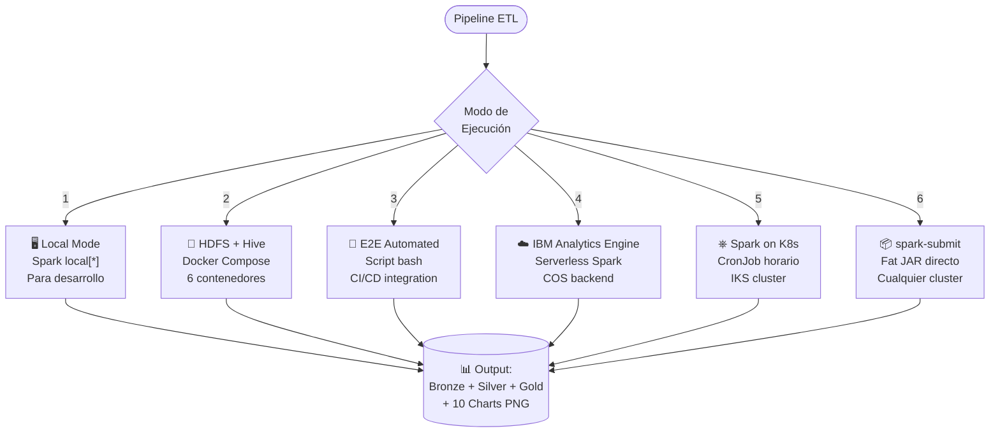
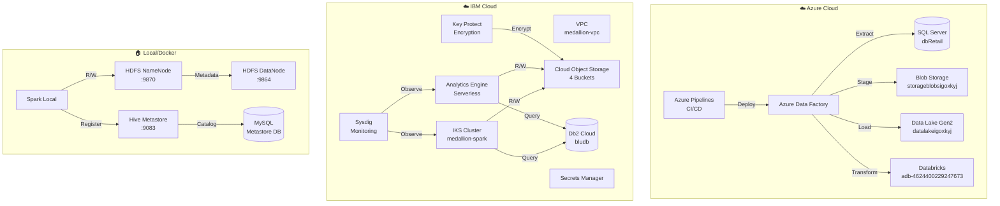

# Arquitectura General — Medallion Data Platform v6.0

## Visión General

Plataforma de datos empresarial que soporta dos unidades de negocio:

| Dominio | Descripción | Fuentes |
|---------|-------------|---------|
| **Retail** | E-commerce de bicicletas y componentes | SQL Server (`dbRetail`), CSV batch |
| **Minería** | Operaciones de extracción mineral | CSV batch, sensores operacionales |

La arquitectura sigue el patrón **Medallion (RAW → BRONZE → SILVER → GOLD)** con soporte multi-cloud (Azure + IBM Cloud) y ejecución local (HDFS/Docker).

---

## Diagrama de Arquitectura de Alto Nivel

```mermaid
graph TB
    subgraph Sources["🔌 Fuentes de Datos"]
        SQL[(SQL Server<br/>dbRetail)]
        BLOB[Azure Blob<br/>Landing Zone]
        CSV[CSV Batch<br/>7 tablas]
    end

    subgraph Orchestration["⚙️ Orquestación"]
        ADF[Azure Data Factory<br/>7 Pipelines]
        TEKTON[Tekton CI/CD<br/>9 Stages]
        CRON[K8s CronJob<br/>Hourly]
    end

    subgraph Ingestion["📥 Ingestion Layer"]
        COS_RAW[COS RAW Bucket<br/>s3a://datalake-raw]
        HDFS_RAW[HDFS RAW<br/>/datalake/raw]
        ADLS[Azure Data Lake<br/>Gen2]
    end

    subgraph Processing["⚡ Spark ETL Pipeline"]
        direction TB
        BRONZE["🥉 BRONZE<br/>Parquet — 1:1 CSV"]
        SILVER["🥈 SILVER<br/>Parquet — Agregaciones"]
        GOLD["🥇 GOLD<br/>Delta Lake — Star Schema"]
    end

    subgraph Compute["🖥️ Motores de Cómputo"]
        LOCAL[Spark Local<br/>Dev/Test]
        HDFS_SPARK[Spark on HDFS<br/>Docker Compose]
        AE[IBM Analytics Engine<br/>Serverless]
        IKS[Spark on K8s<br/>IKS Cluster]
        DBX[Azure Databricks<br/>Notebooks]
    end

    subgraph Consumption["📊 Capa de Consumo"]
        PBI[Power BI<br/>6 Dashboards<br/>57 Medidas DAX]
        CHARTS[BI Charts<br/>10 PNG JFreeChart]
        HIVE[Hive Catalog<br/>Auditoría]
    end

    Sources --> Orchestration
    Orchestration --> Ingestion
    Ingestion --> Compute
    Compute --> BRONZE
    BRONZE --> SILVER
    SILVER --> GOLD
    GOLD --> Consumption
```

---

## Flujo Medallion — Detalle por Capa

```mermaid
graph LR
    subgraph RAW["RAW Layer"]
        R1[Categoria.csv]
        R2[Subcategoria.csv]
        R3[Producto.csv]
        R4[Cliente.csv]
        R5[Orden.csv]
        R6[OrdenDetalle.csv]
        R7[FactMine.csv]
    end

    subgraph BRONZE["BRONZE Layer — Parquet"]
        B1[Categoria/]
        B2[Subcategoria/]
        B3[Producto/]
        B4[Cliente/]
        B5[Orden/]
        B6[OrdenDetalle/]
        B7[FactMine/]
    end

    subgraph SILVER["SILVER Layer — Parquet Agregado"]
        S1[dim_categoria]
        S2[dim_producto]
        S3[dim_cliente]
        S4[fact_ordenes]
        S5[kpi_ventas_mensuales]
        S6[dim_operador_mineria]
    end

    subgraph GOLD["GOLD Layer — Delta Lake"]
        G1[fact_ventas<br/>48,895 rows]
        G2[dim_cliente<br/>18,484 rows]
        G3[dim_producto<br/>319 rows]
        G4[kpi_ventas_mensuales<br/>37 rows]
        G5[Calendario<br/>1,184 rows]
    end

    RAW -->|"Schema Validation<br/>Dead Letter Queue"| BRONZE
    BRONZE -->|"Business Logic<br/>Temp Views"| SILVER
    SILVER -->|"Star Schema<br/>ACID Transactions"| GOLD
```

---

## Modos de Ejecución

---

## Topología de Componentes

---

## Stack Tecnológico

| Capa | Tecnología | Versión |
|------|-----------|---------|
| **Procesamiento** | Apache Spark | 3.3.1 |
| **Lenguaje** | Scala | 2.12 |
| **Storage Format** | Delta Lake | 2.2.0 |
| **Serialización** | Kryo | 256MB buffer |
| **Container Runtime** | Docker | Multi-stage build |
| **Orquestación K8s** | Kubernetes (IKS) | CronJob batch/v1 |
| **CI/CD** | Tekton Pipelines | 9 stages |
| **Cloud IaC** | Terraform (IBM) | Provider ibm |
| **Orquestación Datos** | Azure Data Factory | 7 pipelines |
| **BI** | Power BI | 57 medidas DAX |
| **Monitoreo** | Prometheus + Sysdig | ServiceMonitor |
| **HDFS** | Apache Hadoop | 3.3.4 |
| **Metastore** | Apache Hive | Thrift 9083 |
| **Base de Datos** | SQL Server / Db2 | Cloud managed |
| **Visualización Code** | JFreeChart | 10 charts PNG |

---

## Índice de Documentación

| Documento | Ubicación | Contenido |
|-----------|-----------|-----------|
| [Arquitectura General](OVERVIEW.md) | `docs/architecture/` | Este documento |
| [Kubernetes & Spark](../infrastructure/KUBERNETES.md) | `docs/infrastructure/` | CronJob, RBAC, networking, monitoring |
| [Hadoop Lakehouse](../infrastructure/HADOOP.md) | `docs/infrastructure/` | HDFS, Hive, Docker Compose |
| [IBM Cloud](../infrastructure/IBM-CLOUD.md) | `docs/infrastructure/` | Terraform, VPC, COS, IKS, AE |
| [Azure](../infrastructure/AZURE.md) | `docs/infrastructure/` | Pipelines, Storage, Databricks |
| [ADF Pipelines](../orchestration/ADF-PIPELINES.md) | `docs/orchestration/` | 7 pipelines, linked services |
| [ETL Pipeline](../transformation/ETL-PIPELINE.md) | `docs/transformation/` | Scala modules, workflows, DAG |
| [Power BI](../analytics/POWERBI.md) | `docs/analytics/` | Data model, 57 medidas DAX |
| [Seguridad](../security/SECURITY.md) | `docs/security/` | Secrets, encryption, network policies |
| [CI/CD](../cicd/TEKTON-CICD.md) | `docs/cicd/` | Tekton pipeline, triggers, tasks |
