# CI/CD — Tekton Pipelines

## Resumen

Pipeline CI/CD de 9 etapas implementado en Tekton para IBM Cloud. Integra testing (Python + Scala), security scanning, build de artefactos (JAR + Docker image), deploy a Analytics Engine e IKS, y notificaciones automáticas. Triggers configurados para push a main (producción) y pull requests (validación).

---

## Pipeline de 9 Etapas

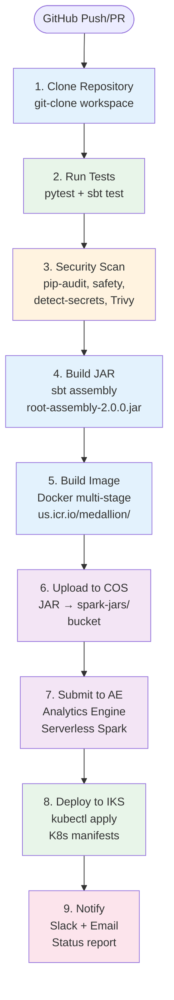

---

## Parámetros del Pipeline

| Parámetro | Tipo | Descripción |
|-----------|------|-------------|
| `git-url` | string | URL del repositorio |
| `git-branch` | string | Branch a construir |
| `cos-endpoint` | string | Endpoint COS para upload |
| `ae-instance-id` | string | ID Analytics Engine |
| `deploy-target` | string | Target de deploy (iks/ae) |
| `notify-webhook` | string | Webhook Slack/Teams |

**Workspaces:**

| Workspace | Tamaño | Uso |
|-----------|--------|-----|
| `source` | 2Gi PVC | Código fuente clonado |
| `credentials` | Secret | Credenciales de acceso |

---

## Task 1: Clone Repository

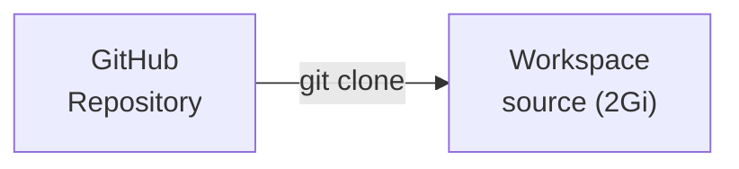

## Task 2: Run Tests

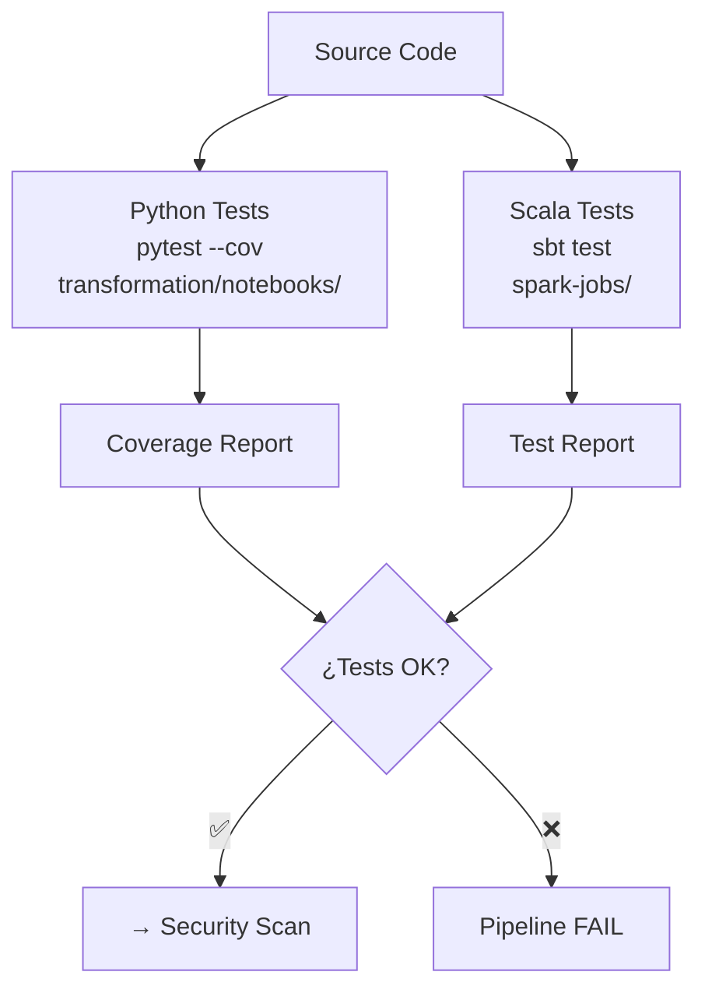

**Recursos:**

| Componente | CPU | Memory |
|------------|-----|--------|
| Test runner | 250m - 500m | 512Mi - 1Gi |

## Task 3: Security Scan

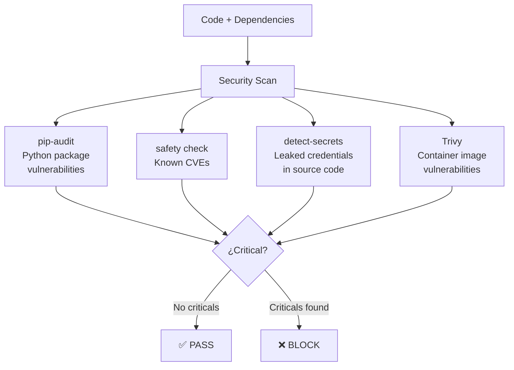

## Task 4: Build JAR

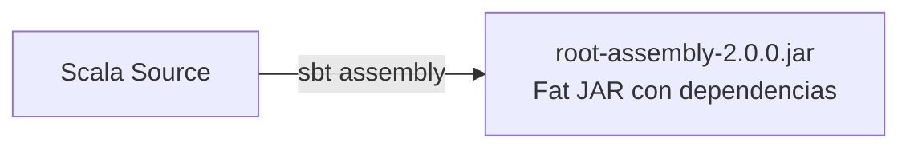

## Task 5: Build Docker Image

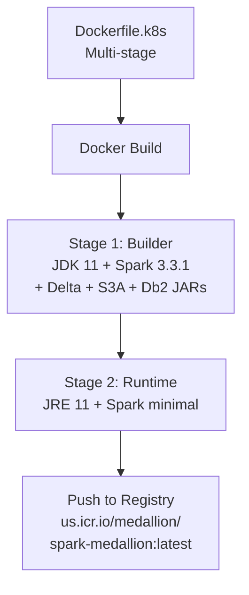

## Task 6: Upload JAR to COS

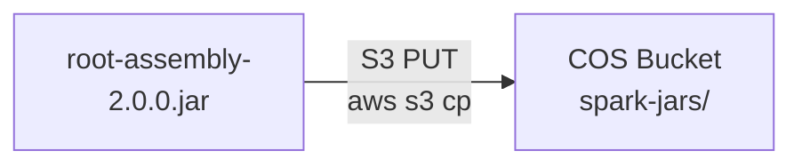

## Task 7: Submit to Analytics Engine

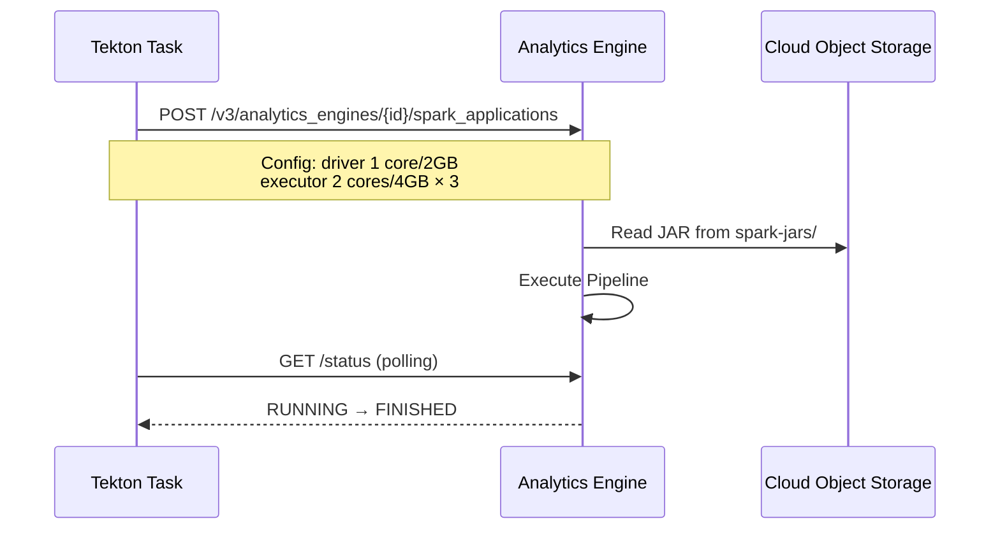

## Task 8: Deploy to IKS

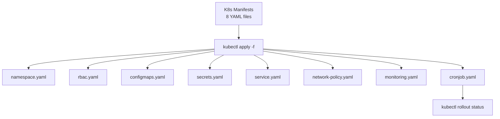

## Task 9: Notify

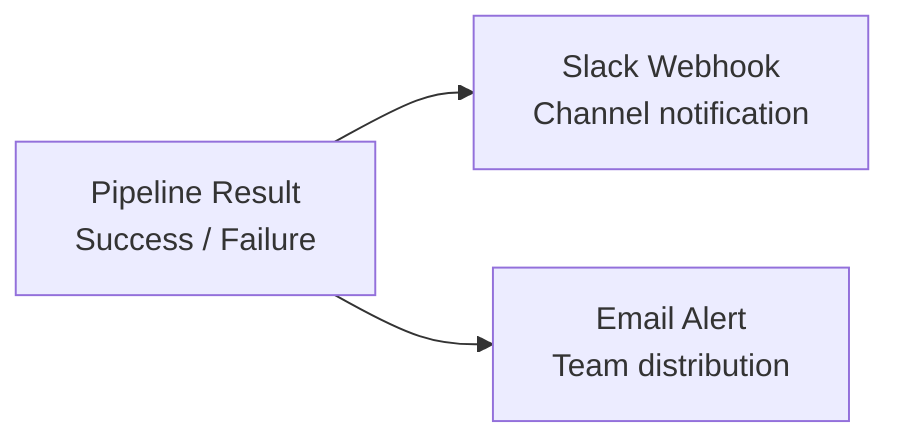

---

## Triggers — GitHub Webhooks

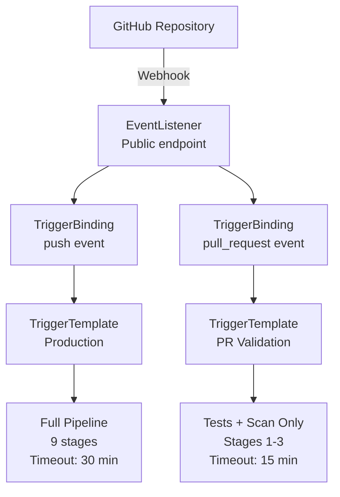

### Trigger de Producción (Push to main)

| Config | Valor |
|--------|-------|
| Evento | `push` to `main` |
| Pipeline | Completo (9 stages) |
| Timeout | 30 min |
| Deploy target | IKS + Analytics Engine |

### Trigger de PR (Pull Request)

| Config | Valor |
|--------|-------|
| Evento | `pull_request` (open/sync) |
| Pipeline | Parcial (stages 1-3) |
| Timeout | 15 min |
| Deploy target | Ninguno (solo validación) |

---

## Flujo Completo CI/CD

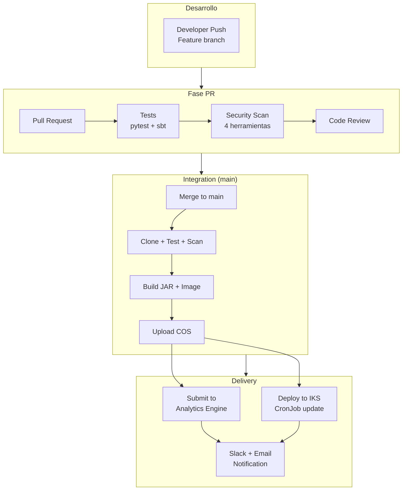

---

## Recursos del Pipeline

| Task | CPU Request | CPU Limit | Mem Request | Mem Limit |
|------|-------------|-----------|-------------|-----------|
| Tests | 250m | 500m | 512Mi | 1Gi |
| Security Scan | 250m | 500m | 512Mi | 1Gi |
| Build JAR | 500m | 1 | 1Gi | 2Gi |
| Build Image | 500m | 1 | 1Gi | 2Gi |
| Deploy | 100m | 250m | 256Mi | 512Mi |
