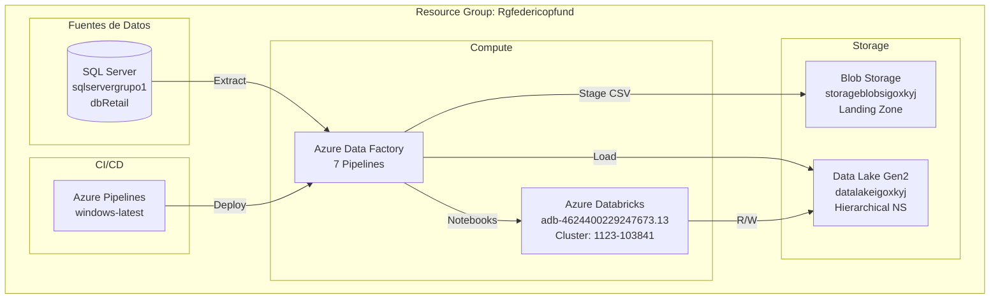
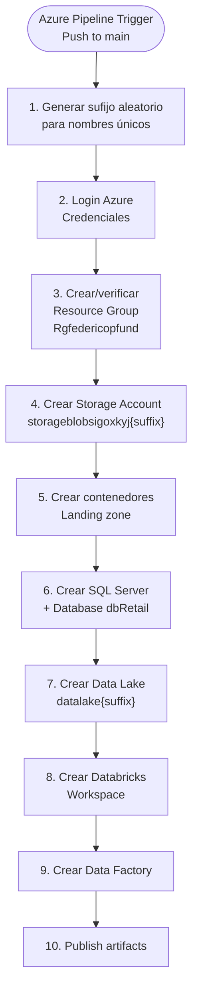
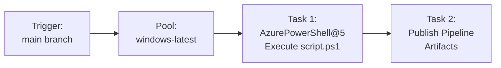
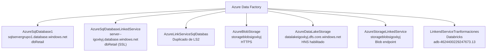
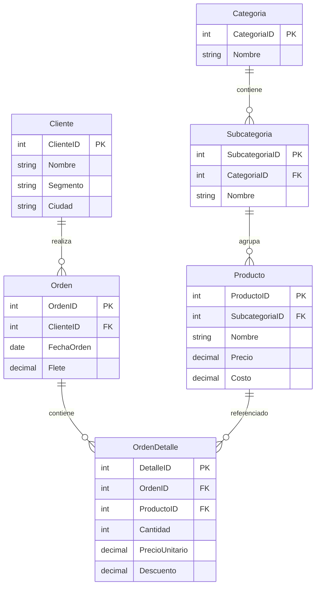

# Azure Infrastructure — Documentación Técnica

## Resumen

Infraestructura en Azure que incluye Azure Data Factory para orquestación ETL, SQL Server como fuente de datos, Blob Storage como landing zone, Data Lake Gen2 para almacenamiento analítico, y Databricks para transformaciones interactivas. Provisionada via PowerShell y Azure Pipelines.

---

## Topología Azure

---

## Provisionamiento — PowerShell (`script.ps1`)

---

## Azure Pipelines (`azure-pipeline_deploy.yml`)

| Campo | Valor |
|-------|-------|
| Trigger | `main` branch |
| Agent Pool | `windows-latest` |
| PowerShell Version | Az Module (latest) |

---

## Linked Services — Conexiones Configuradas

| Linked Service | Tipo | Endpoint |
|---------------|------|----------|
| `AzureSqlDatabase1` | Azure SQL DB | `sqlservergrupo1.database.windows.net/dbRetail` |
| `AzureSqlDatabaseLinkedService` | Azure SQL DB | `server--igoxkyj.database.windows.net/dbRetail` |
| `AzureBlobStorage` | Azure Blob | `storageblobsigoxkyj` |
| `AzureDataLakeStorage` | ADLS Gen2 | `datalakeigoxkyj.dfs.core.windows.net` |
| `AzureStorageLinkedService` | Azure Blob | `storageblobsigoxkyj` |
| `LinkendServiceTranformaciones` | Databricks | `adb-4624400229247673.13.azuredatabricks.net` |

---

## SQL Server — dbRetail

---

## Databricks Workspace

| Config | Valor |
|--------|-------|
| URL | `adb-4624400229247673.13.azuredatabricks.net` |
| Cluster ID | `1123-103841-9c1ictdn` |
| Linked Service | `LinkendServiceTranformaciones` |
| Uso | Notebooks de transformación (ETL pipeline + exploratory) |

---

## Archivos de Infraestructura

| Archivo | Contenido |
|---------|-----------|
| `azure-pipeline_deploy.yml` | Pipeline YAML de Azure DevOps |
| `script.ps1` | PowerShell para provisionar recursos Azure |
| `scripts.ps1` | Script secundario (setup adicional) |
| `dbRetail.bacpac` | Backup de la base de datos SQL Server |
| `keys.txt` | Referencias de keys (no credenciales en texto claro) |
