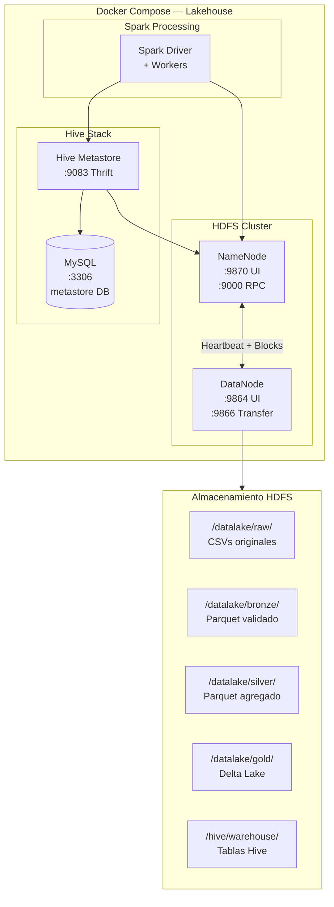
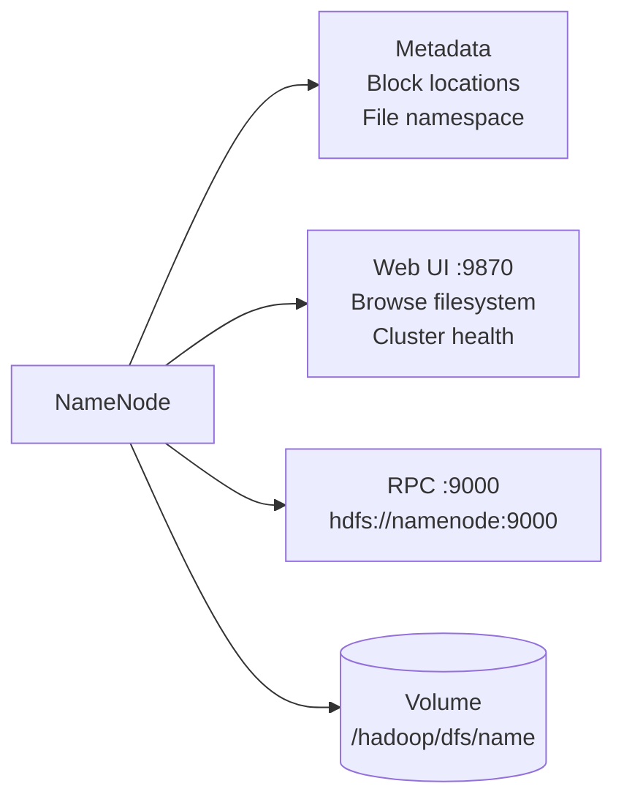
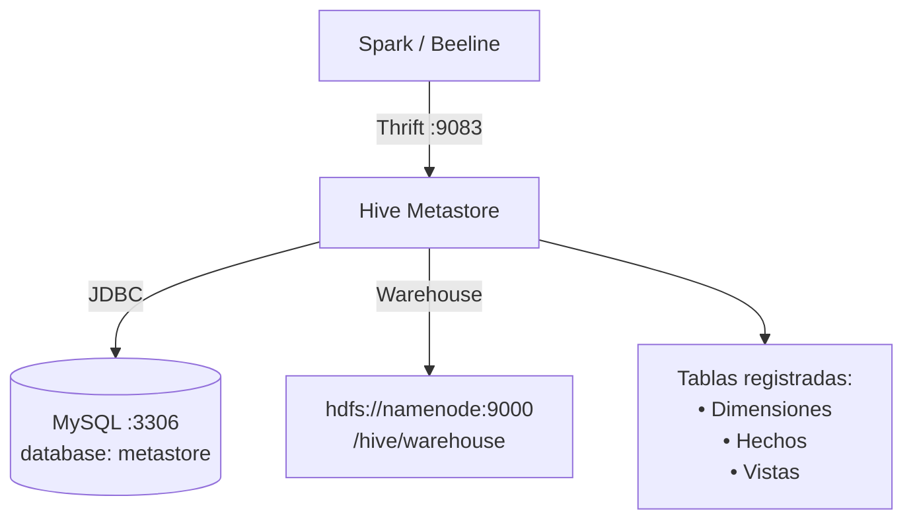
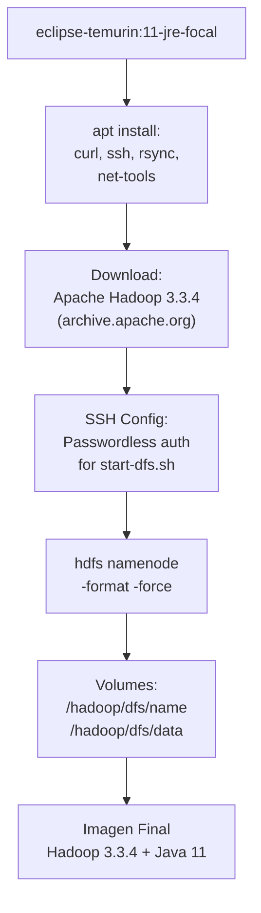
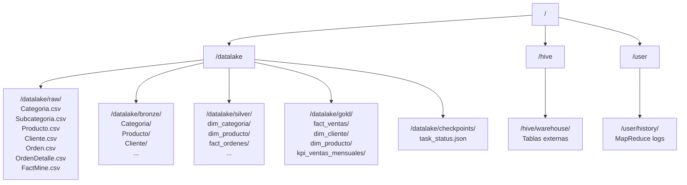

# Hadoop Lakehouse — Documentación Técnica

## Resumen

Entorno local de lakehouse basado en Docker Compose que despliega HDFS (NameNode + DataNode), Hive Metastore con MySQL como backend, y Spark para procesamiento. Diseñado para desarrollo, testing y staging del pipeline Medallion.

---

## Arquitectura Docker Compose



---

## Componentes

### NameNode



| Config | Valor |
|--------|-------|
| `fs.defaultFS` | `hdfs://namenode:9000` |
| Replicación | 1 (desarrollo) |
| WebHDFS | Habilitado |
| Superuser group | `hadoop` |
| Umask | `022` |
| Proxy users | `hive`, `root` (para todos los hosts) |

### DataNode

| Config | Valor |
|--------|-------|
| Directorio | `/hadoop/dfs/data` |
| Puerto UI | 9864 |
| Puerto transfer | 9866 |
| Volumen | `/hadoop/dfs/data` (persistent) |

### Hive Metastore



| Config | Valor |
|--------|-------|
| URI Metastore | `thrift://hive-metastore:9083` |
| Warehouse | `hdfs://namenode:9000/hive/warehouse` |
| Backend DB | `mysql://hive-metastore-db:3306/metastore` |
| Driver | `com.mysql.cj.jdbc.Driver` |

### YARN / MapReduce

| Config | Valor |
|--------|-------|
| Framework | YARN |
| ResourceManager | `localhost:8088` |
| Job History | `localhost:10020` |
| NodeManager recovery | 10 apps |

---

## Dockerfile — Imagen Hadoop



---

## Archivos de Configuración

### `conf/core-site.xml`

```xml
<!-- Filesystem default -->
fs.defaultFS = hdfs://namenode:9000
<!-- Umask -->
fs.permissions.umask-mode = 022
<!-- Proxy users para Hive -->
hadoop.proxyuser.hive.hosts = *
hadoop.proxyuser.hive.groups = *
```

### `conf/hdfs-site.xml`

```xml
dfs.replication = 1
dfs.namenode.name.dir = file:///hadoop/dfs/name
dfs.datanode.data.dir = file:///hadoop/dfs/data
dfs.webhdfs.enabled = true
dfs.permissions.superusergroup = hadoop
```

### `conf/hive-site.xml`

```xml
hive.metastore.uris = thrift://hive-metastore:9083
hive.metastore.warehouse.dir = hdfs://namenode:9000/hive/warehouse
javax.jdo.option.ConnectionURL = jdbc:mysql://hive-metastore-db:3306/metastore
javax.jdo.option.ConnectionDriverName = com.mysql.cj.jdbc.Driver
```

---

## Estructura de Datos en HDFS



---

## Scripts Auxiliares

| Script | Propósito |
|--------|-----------|
| `comandos.sh` | Comandos HDFS frecuentes (ls, mkdir, put, get) |
| `dashboard.sh` | Verificar estado del cluster |
| `entrypoint.sh` | Entrypoint Docker para NameNode/DataNode |
| `hive-entrypoint.sh` | Inicializar schema de Hive Metastore |
| `lakehouse-start.sh` | Levantar stack completo y crear estructura de directorios |

---

## Puertos Expuestos

| Servicio | Puerto | Protocolo | Uso |
|----------|--------|-----------|-----|
| NameNode UI | 9870 | HTTP | Browse filesystem, cluster health |
| NameNode RPC | 9000 | TCP | HDFS client connections |
| DataNode UI | 9864 | HTTP | Block reports |
| DataNode Transfer | 9866 | TCP | Data transfer |
| Hive Metastore | 9083 | Thrift | Metadata queries |
| MySQL | 3306 | TCP | Metastore backend |
| YARN RM | 8088 | HTTP | ResourceManager UI |
| Job History | 10020 | TCP | MapReduce history |
