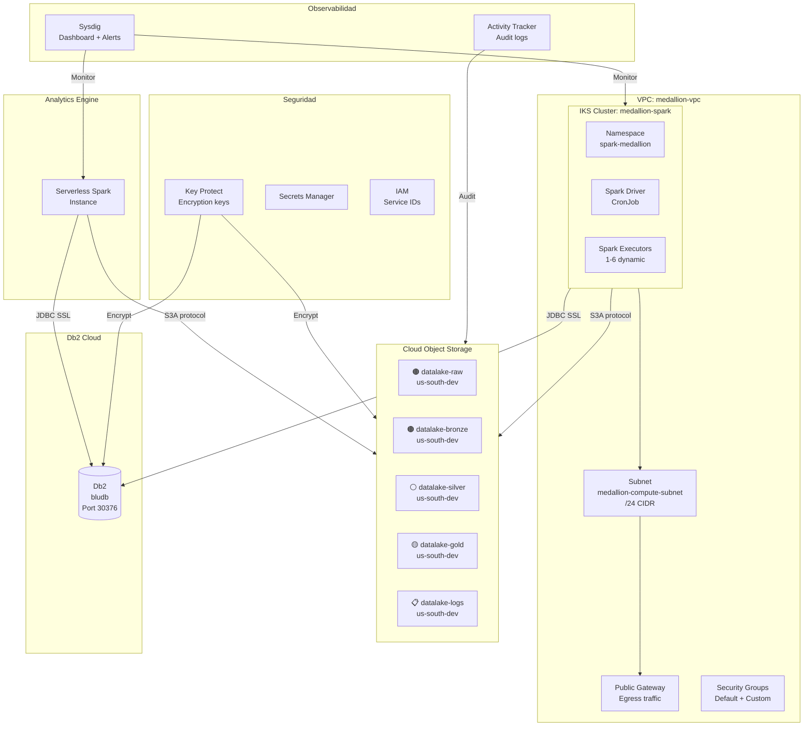
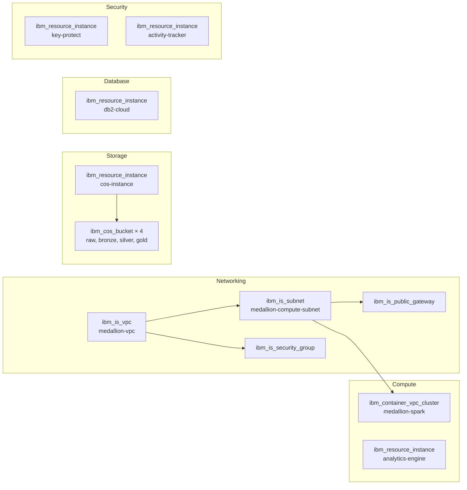
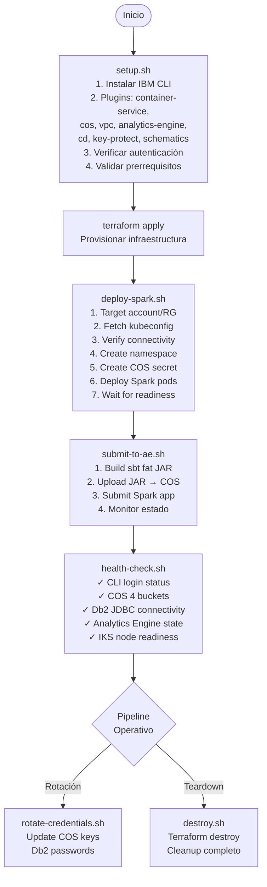
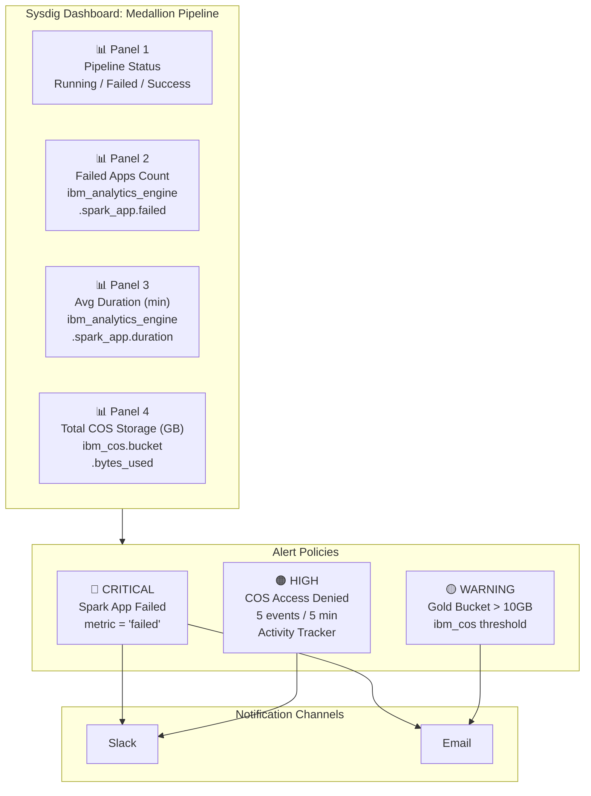
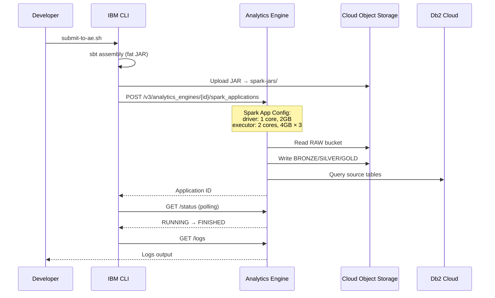

# IBM Cloud Infrastructure — Documentación Técnica

## Resumen

Infraestructura multi-servicio en IBM Cloud provisionada con Terraform. Incluye VPC, IKS (Kubernetes), Analytics Engine (Serverless Spark), Cloud Object Storage (4 buckets Medallion), Db2 Cloud, Key Protect y monitoreo con Sysdig.

---

## Topología de Servicios



---

## Terraform — Recursos Provisionados



### Variables de Entrada

| Variable | Tipo | Default | Descripción |
|----------|------|---------|-------------|
| `ibmcloud_api_key` | string (sensitive) | — | API key de IBM Cloud |
| `project_name` | string | `medallion` | Prefijo para nombres |
| `environment` | string | `dev` | dev / staging / prod |
| `cost_center` | string | `data-engineering` | Centro de costos |
| `region` | string | `us-south` | Región IBM Cloud |
| `resource_group` | string | `Default` | Resource Group |
| `cluster_zone` | string | — | Zona de disponibilidad |

### Convención de Nombres (locals.tf)

```
Patrón: ${project_name}-${environment}
Ejemplo: medallion-dev

Buckets: datalake-{layer}-${region}-${environment}
Ejemplo: datalake-raw-us-south-dev
```

### Outputs

| Output | Contenido |
|--------|-----------|
| `vpc_id`, `vpc_crn` | Identificadores de VPC |
| `subnet_id` | Subnet de cómputo |
| `cluster_id`, `cluster_name` | IKS cluster |
| `cos_writer_access_key` | HMAC key (Writer) |
| `cos_writer_secret_key` | HMAC secret (Writer) |
| `cos_reader_access_key` | HMAC key (Reader) |

---

## Scripts de Despliegue



### Detalle de Scripts

| Script | Propósito | Opciones |
|--------|-----------|----------|
| `setup.sh` | Setup inicial (CLI + plugins + auth) | — |
| `deploy-spark.sh` | Deploy manifiestos K8s a IKS | — |
| `submit-to-ae.sh` | Submit JAR a Analytics Engine | `--skip-build`, `--status`, `--logs`, `--list` |
| `health-check.sh` | Validación de infraestructura | Output: JSON o human-readable |
| `setup-cicd.sh` | Deploy Tekton pipelines + triggers | — |
| `rotate-credentials.sh` | Rotar secrets COS/Db2 | — |
| `cos-lifecycle.sh` | Políticas de retención COS | — |
| `destroy.sh` | Destruir toda la infraestructura | Confirma antes de ejecutar |

---

## Monitoreo — Sysdig Dashboard



---

## Analytics Engine — Serverless Spark



---

## Makefile — Comandos Principales

| Comando | Acción |
|---------|--------|
| `make setup` | Ejecutar setup.sh (CLI + plugins) |
| `make plan` | Terraform plan |
| `make apply` | Terraform apply |
| `make deploy` | Deploy K8s manifests |
| `make submit` | Submit job a Analytics Engine |
| `make status` | Health check completo |
| `make destroy` | Teardown infraestructura |
| `make rotate` | Rotar credenciales |
