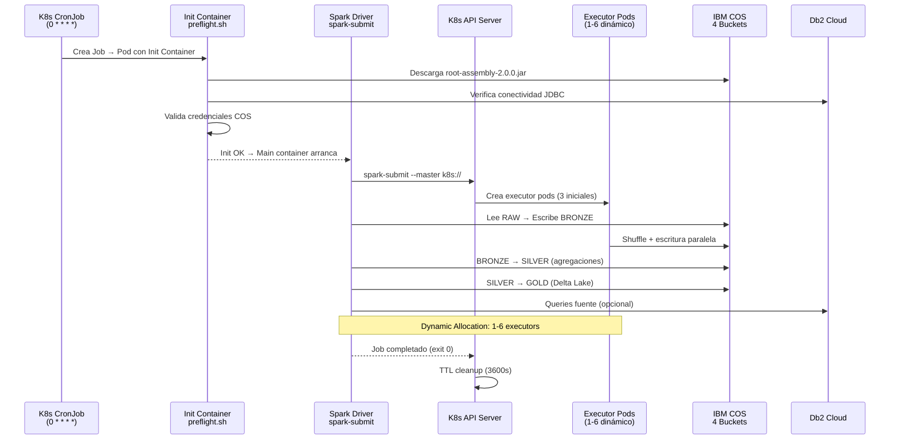
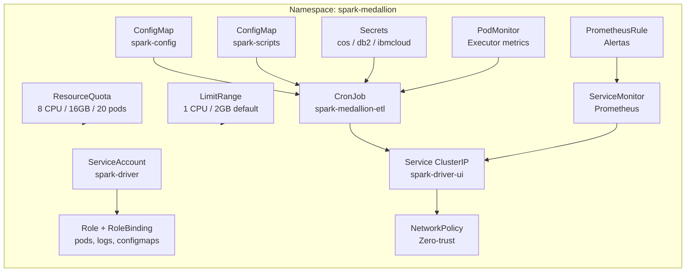
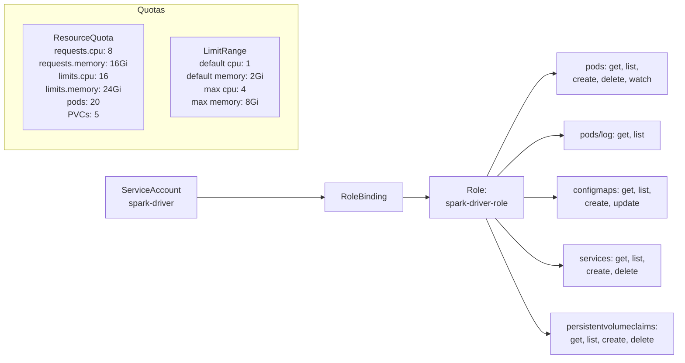
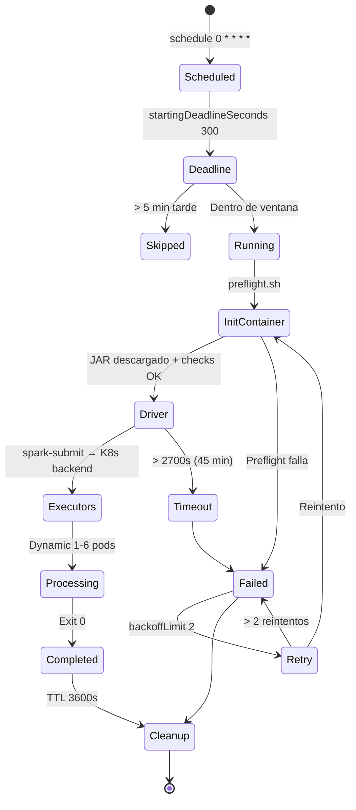
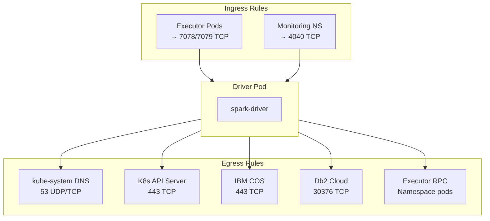
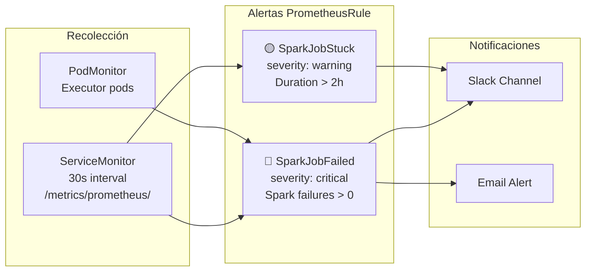
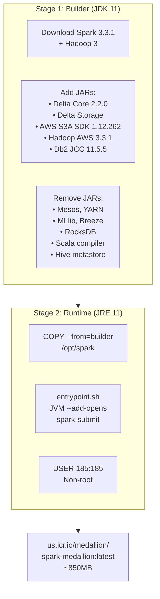

# Kubernetes & Spark on K8s — Documentación Técnica

## Resumen

Despliegue de Spark en Kubernetes (IKS) usando un CronJob que ejecuta el pipeline Medallion ETL v6.0 de forma horaria. El driver pod descarga el fat JAR desde COS y los executor pods se crean dinámicamente via Spark K8s backend.

---

## Arquitectura del CronJob

---

## Manifiestos Kubernetes — 8 Componentes

---

## Detalle de Manifiestos

### 1. Namespace (`namespace.yaml`)

| Campo | Valor |
|-------|-------|
| Nombre | `spark-medallion` |
| Labels | `app.kubernetes.io/part-of: medallion-pipeline` |
| Ambiente | `environment: production` |

### 2. ConfigMaps (`configmaps.yaml`)

**spark-config:**

| Parámetro | Valor |
|-----------|-------|
| `spark.driver.memory` | 2g |
| `spark.executor.memory` | 4g |
| `spark.executor.cores` | 2 |
| `spark.executor.instances` | 3 |
| `spark.dynamicAllocation.minExecutors` | 1 |
| `spark.dynamicAllocation.maxExecutors` | 6 |
| `spark.sql.shuffle.partitions` | 200 |
| `spark.serializer` | KryoSerializer |
| `spark.sql.extensions` | DeltaSparkSessionExtension |
| `spark.sql.catalog.spark_catalog` | DeltaCatalog |

**COS Buckets:**

| Bucket | Uso |
|--------|-----|
| `datalake-raw-us-south-dev` | CSV fuente |
| `datalake-bronze-us-south-dev` | Parquet validado |
| `datalake-silver-us-south-dev` | Parquet agregado |
| `datalake-gold-us-south-dev` | Delta Lake Star Schema |

### 3. RBAC (`rbac.yaml`)

### 4. Secrets (`secrets.yaml`)

| Secret Name | Keys | Descripción |
|-------------|------|-------------|
| `cos-credentials` | `access-key`, `secret-key`, `endpoint` | IBM COS (S3-compatible) |
| `db2-credentials` | `hostname`, `port`, `database`, `username`, `password`, `jdbc-url` | Db2 Cloud (SSL, puerto 30376) |
| `ibmcloud-api` | `api-key` | IBM Cloud IAM API key |

> ⚠️ Los secrets usan template `envsubst` — requieren variables de entorno al aplicar.

### 5. CronJob (`cronjob.yaml`)

**Configuración del CronJob:**

| Parámetro | Valor | Descripción |
|-----------|-------|-------------|
| `schedule` | `0 * * * *` | Cada hora en punto |
| `concurrencyPolicy` | `Forbid` | Sin overlap entre ejecuciones |
| `startingDeadlineSeconds` | `300` | No iniciar si pasaron > 5 min |
| `backoffLimit` | `2` | Máximo 2 reintentos |
| `activeDeadlineSeconds` | `2700` | Timeout 45 min |
| `ttlSecondsAfterFinished` | `3600` | Limpieza 1h post-ejecución |
| `successfulJobsHistoryLimit` | `5` | Mantener últimos 5 exitosos |
| `failedJobsHistoryLimit` | `3` | Mantener últimos 3 fallidos |

**Scheduling del Pod:**

| Concepto | Configuración |
|----------|---------------|
| **Tolerations** | `spark-workload=etl` (NoSchedule) |
| **Node Affinity** | Preferir `workload-type: spark\|compute` (weight 80) |
| **Pod Anti-Affinity** | No 2 drivers en mismo nodo (`kubernetes.io/hostname`) |
| **Grace Period** | 60s para cleanup de Spark |

### 6. Service (`service.yaml`)

| Puerto | Nombre | Uso |
|--------|--------|-----|
| 4040 | `spark-ui` | Spark Web UI |
| 7078 | `driver-rpc` | Driver RPC Port |
| 7079 | `block-manager` | Block Manager |

### 7. Network Policy (`network-policy.yaml`)

### 8. Monitoring (`monitoring.yaml`)

---

## Docker Image — Multi-stage Build

---

## Recursos por Pod

| Componente | CPU Request | CPU Limit | Mem Request | Mem Limit |
|------------|-------------|-----------|-------------|-----------|
| **Init (preflight)** | 100m | 500m | 256Mi | 512Mi |
| **Driver** | 1 | 2 | 2Gi | 4Gi |
| **Executor** (×3-6) | 2 cores | — | 4g | — |

**Security Context del Driver:**

| Campo | Valor |
|-------|-------|
| `runAsNonRoot` | `true` |
| `runAsUser` | `185` |
| `runAsGroup` | `185` |
| `allowPrivilegeEscalation` | `false` |
| `capabilities.drop` | `ALL` |

---

## Volúmenes

| Nombre | Tipo | Mount | Tamaño |
|--------|------|-------|--------|
| `spark-work` | emptyDir | `/opt/spark/work` | 2Gi |
| `spark-conf` | ConfigMap | `/opt/spark/conf/spark-defaults.conf` | — |
| `scripts` | ConfigMap | `/opt/spark/scripts` | mode 0755 |
| `tmp` | emptyDir | `/tmp` | 1Gi |
