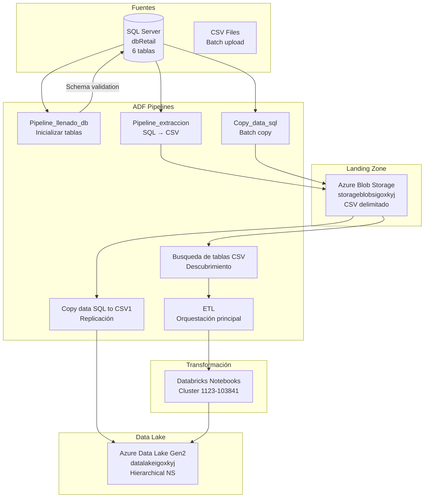
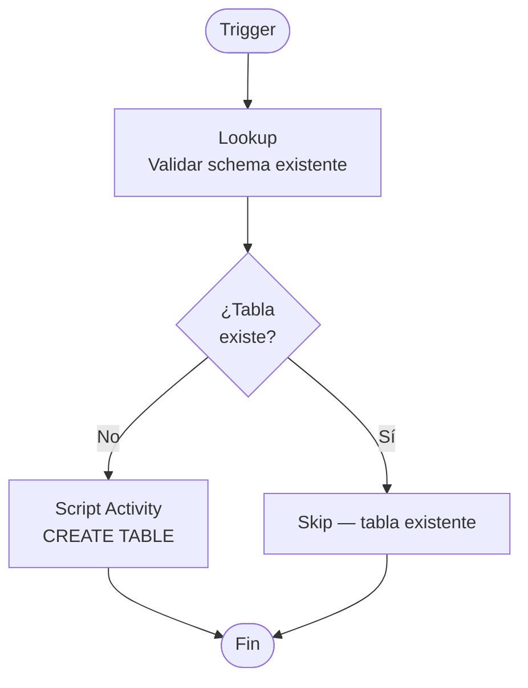
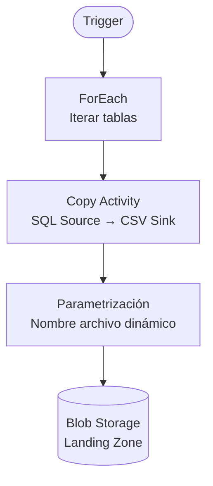
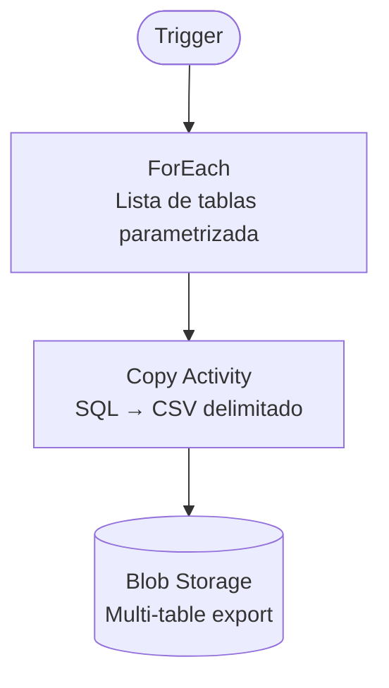
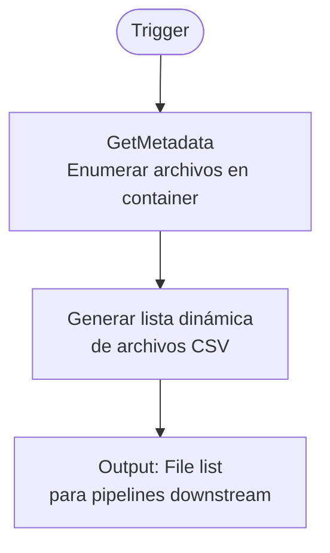
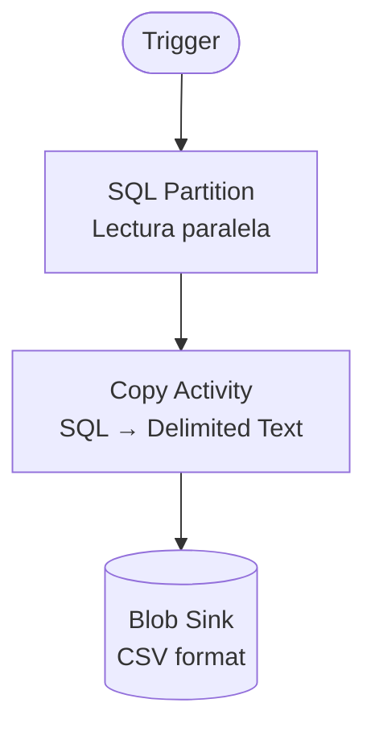
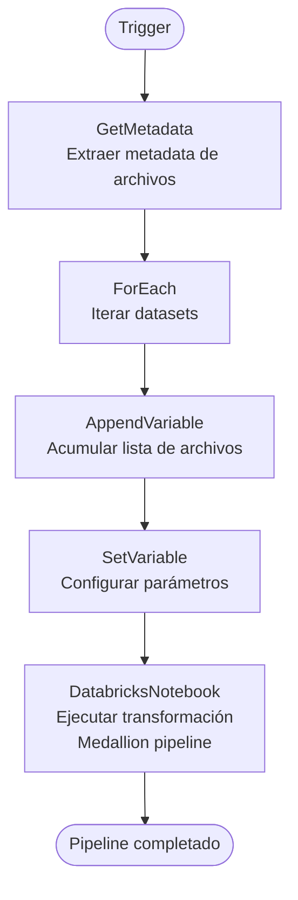
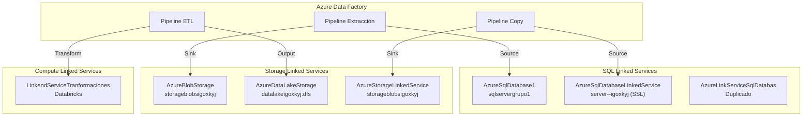
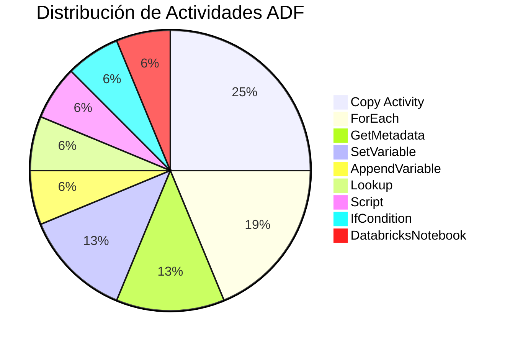
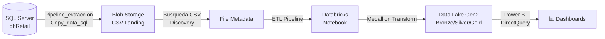

# Azure Data Factory — Pipelines y Orquestación

## Resumen

Capa de orquestación basada en Azure Data Factory (ADF) con 7 pipelines que gestionan la extracción, carga y transformación de datos desde SQL Server hacia Azure Data Lake, pasando por Blob Storage como landing zone y Databricks para transformaciones.

---

## Flujo General de Orquestación

---

## Pipeline 1: `Pipeline_llenado_db`

**Propósito:** Inicialización de la base de datos — validación de schema y creación de tablas.

| Actividad | Tipo | Descripción |
|-----------|------|-------------|
| Lookup | Validation | Verifica existencia del schema |
| Script | DDL | `CREATE TABLE` para tablas faltantes |
| IfCondition | Control | Branching condicional |

---

## Pipeline 2: `Pipeline_extraccion`

**Propósito:** Extracción de datos desde SQL Server hacia CSV en Blob Storage.

---

## Pipeline 3: `Copy_data_sql`

**Propósito:** Copia batch de múltiples tablas SQL Server a Azure Storage.

---

## Pipeline 4: `Busqueda de tablas CSV`

**Propósito:** Descubrimiento dinámico de archivos CSV en el landing zone.

---

## Pipeline 5: `Copy data SQL to CSV1`

**Propósito:** Replicación de tablas fuente al landing zone con particionamiento.

---

## Pipeline 6: `ETL` (Principal)

**Propósito:** Orquestación principal del pipeline Medallion — metadata extraction, variable management, y ejecución de notebooks Databricks.

| Actividad | Tipo | Detalles |
|-----------|------|----------|
| GetMetadata | Discovery | Enumera archivos en landing zone |
| ForEach | Iterator | Procesa cada dataset encontrado |
| AppendVariable | Array | Construye lista de archivos a procesar |
| SetVariable | Config | Parámetros para notebook |
| DatabricksNotebook | Transform | Ejecuta notebook en cluster `1123-103841` |

---

## Linked Services — Mapa de Conexiones

---

## Actividades ADF — Tipos Utilizados

---

## Data Factory Configurations

| Archivo | Descripción |
|---------|-------------|
| `adfactory-igoxkyj.json` | Config factory principal |
| `adfactory-xk1rme4.json` | Config factory secundaria |
| `adfactoryqymrutj.json` | Config factory terciaria |
| `publish_config.json` | Configuración de publicación ADF |

---

## Flujo de Datos Completo

