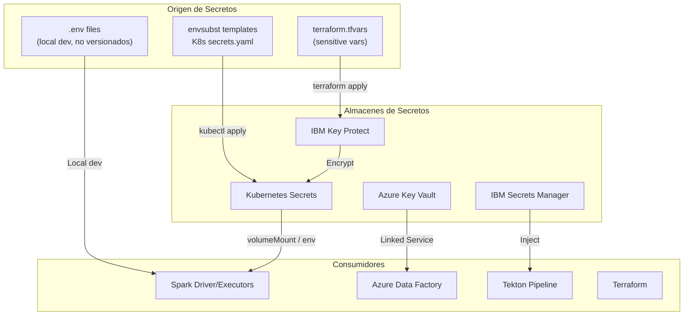
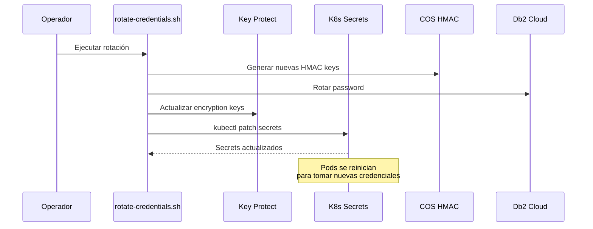
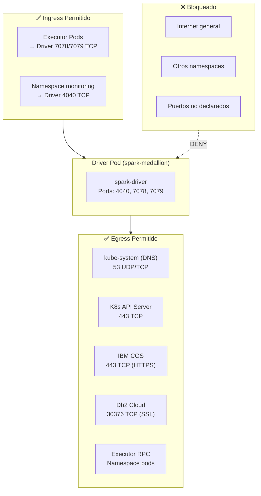
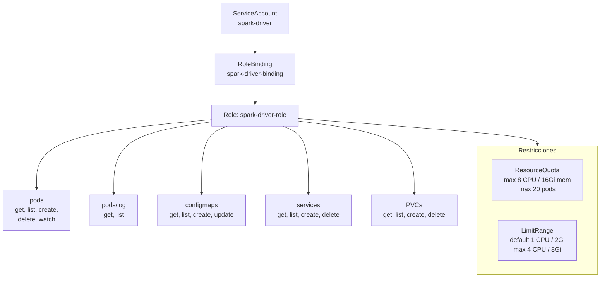
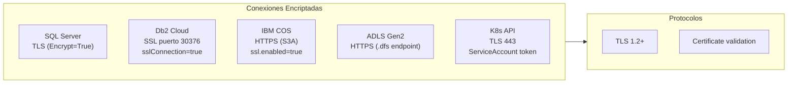
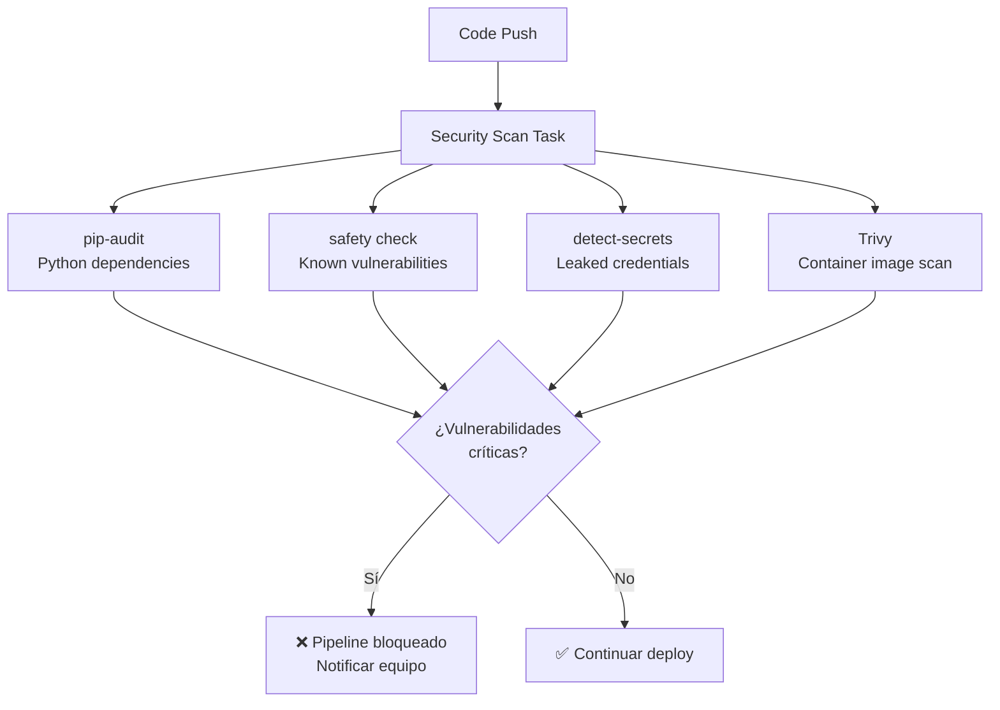

# Seguridad — Documentación Técnica

## Resumen

Estrategia de seguridad multi-capa que abarca gestión de secretos, encriptación en tránsito, network policies zero-trust en Kubernetes, RBAC granular, y controles de acceso en ambos clouds (Azure + IBM Cloud).

---

## Modelo de Seguridad — Capas

```mermaid
graph TB
    subgraph L1["Capa 1 — Identidad & Acceso"]
        IAM["IBM Cloud IAM<br/>Service IDs + API Keys"]
        AAD["Azure AD<br/>Service Principals"]
        SA["K8s ServiceAccount<br/>spark-driver"]
    end

    subgraph L2["Capa 2 — Secretos"]
        KP["IBM Key Protect<br/>Encryption Keys"]
        SM["Secrets Manager"]
        K8S_SEC["K8s Secrets<br/>cos / db2 / ibmcloud"]
        AKV["Azure Key Vault<br/>ADF Credentials"]
    end

    subgraph L3["Capa 3 — Red"]
        NP["K8s NetworkPolicy<br/>Zero-trust ingress/egress"]
        SG["IBM VPC Security Groups"]
        NSG["Azure NSG<br/>Storage firewall"]
    end

    subgraph L4["Capa 4 — Encriptación"]
        TLS["TLS/SSL en tránsito<br/>SQL, Db2, COS, HTTPS"]
        ENC["Encriptación at-rest<br/>Key Protect managed"]
    end

    subgraph L5["Capa 5 — Contenedor"]
        SEC_CTX["SecurityContext<br/>Non-root, drop ALL caps"]
        IMG["Image from private registry<br/>us.icr.io/medallion/"]
        SCAN["Trivy + pip-audit<br/>Vulnerability scan"]
    end

    subgraph L6["Capa 6 — Auditoría"]
        AT["Activity Tracker<br/>IBM Cloud events"]
        PROM["PrometheusRule<br/>Failure alerts"]
        SYSDIG["Sysdig Alerts<br/>Access denied events"]
    end

    L1 --> L2 --> L3 --> L4 --> L5 --> L6
```

---

## Gestión de Secretos

### Kubernetes Secrets — 3 Objetos

| Secret | Keys | Uso |
|--------|------|-----|
| `cos-credentials` | `access-key`, `secret-key`, `endpoint` | IBM COS S3A protocol |
| `db2-credentials` | `hostname`, `port`, `database`, `username`, `password`, `jdbc-url` | Db2 Cloud JDBC SSL |
| `ibmcloud-api` | `api-key` | IBM Cloud API (IAM) |

### Rotación de Credenciales

---

## Network Policies — Zero Trust

---

## RBAC — Kubernetes

---

## Security Context — Container

| Campo | Valor | Propósito |
|-------|-------|-----------|
| `runAsNonRoot` | `true` | Prohibir ejecución como root |
| `runAsUser` | `185` | UID de spark user |
| `runAsGroup` | `185` | GID de spark group |
| `allowPrivilegeEscalation` | `false` | Sin escalamiento de privilegios |
| `readOnlyRootFilesystem` | `false` | Spark necesita escribir en work dir |
| `capabilities.drop` | `ALL` | Eliminar todas las capacidades Linux |

---

## Encriptación en Tránsito

---

## Seguridad CI/CD — Tekton

---

## Alertas de Seguridad — Sysdig

| Alerta | Trigger | Severidad | Acción |
|--------|---------|-----------|--------|
| COS Access Denied | 5 eventos en 5 min (Activity Tracker) | HIGH | Slack + Email |
| Spark App Failed | metric = "failed" | CRITICAL | Slack + Email |
| Gold Bucket > 10GB | `ibm_cos.bucket.bytes_used` threshold | WARNING | Email |

---

## Checklist de Seguridad

| Control | Estado | Ubicación |
|---------|--------|-----------|
| Non-root containers | ✅ | `cronjob.yaml` securityContext |
| Drop ALL capabilities | ✅ | `cronjob.yaml` securityContext |
| Network Policies | ✅ | `network-policy.yaml` |
| Secret rotation script | ✅ | `rotate-credentials.sh` |
| Container image scan | ✅ | Tekton security-scan task |
| Dependency audit | ✅ | pip-audit + safety |
| Credential detection | ✅ | detect-secrets |
| ResourceQuota | ✅ | `rbac.yaml` |
| LimitRange | ✅ | `rbac.yaml` |
| SSL/TLS connections | ✅ | Todos los linked services |
| Key management | ✅ | IBM Key Protect |
| Activity tracking | ✅ | IBM Activity Tracker |
| Pod Anti-Affinity | ✅ | `cronjob.yaml` |
| Private container registry | ✅ | `us.icr.io` con `icr-secret` |
