# ETL Pipeline — Spark Medallion (Scala)

## Resumen

Pipeline ETL batch implementado en Scala sobre Apache Spark 3.5 que sigue el patrón Medallion (RAW → BRONZE → SILVER → GOLD). Incluye un motor de ejecución DAG con typed errors, detección de deadlock, sanitización de dependencias por feature flags, circuit breaker, checkpoints JSON, escritura **adaptativa overwrite/MERGE** en Gold con auditoría Delta, y 6 workflows especializados.

**Versión actual:** v5 — Force-refresh + adaptive Gold writes + audit metrics.

---

## Arquitectura del Pipeline

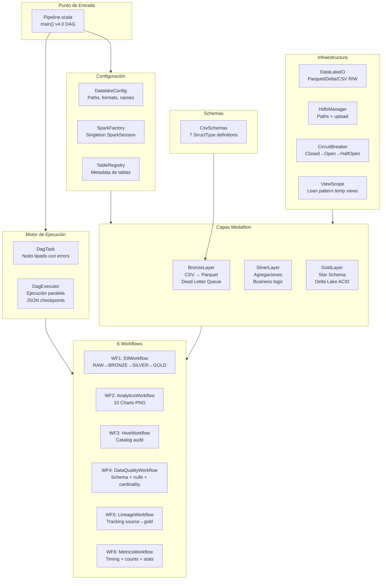

---

## Módulos del Pipeline

### Módulo de Configuración

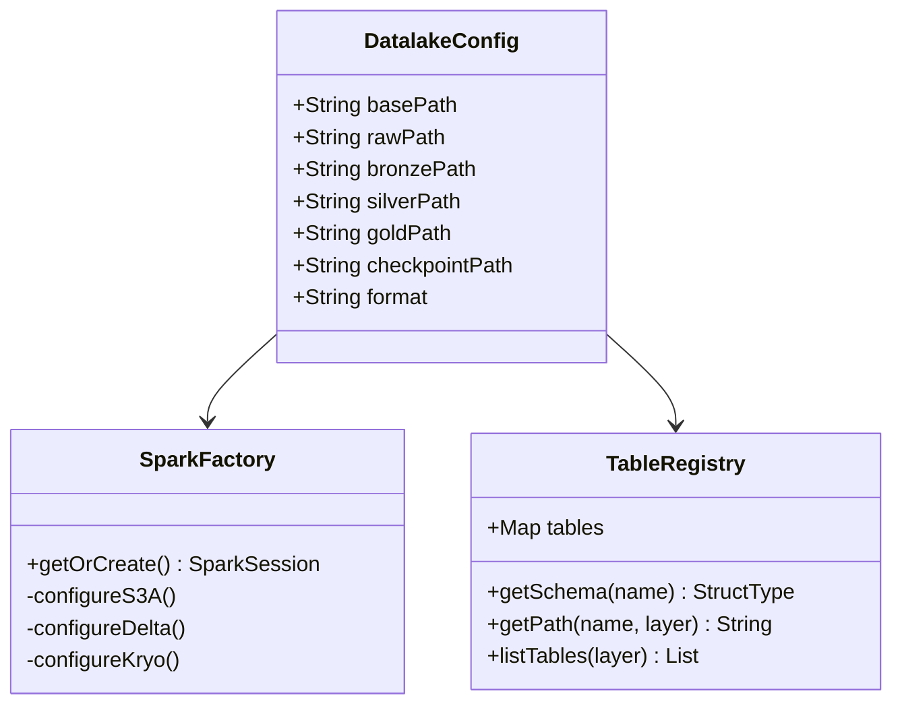

### Módulo de Schemas — 7 CSV

| Schema | Campos Clave | Rows Estimados |
|--------|-------------|----------------|
| `Categoria` | CategoriaID, Nombre | ~4 |
| `Subcategoria` | SubcategoriaID, CategoriaID, Nombre | ~37 |
| `Producto` | ProductoID, SubcategoriaID, Nombre, Precio, Costo | ~319 |
| `Cliente` | ClienteID, Nombre, Segmento, Ciudad | ~18,484 |
| `Orden` | OrdenID, ClienteID, FechaOrden, Flete | ~48,895 |
| `OrdenDetalle` | DetalleID, OrdenID, ProductoID, Cantidad, PrecioUnitario | ~48,895 |
| `FactMine` | Operador, Producción, Desperdicio, Turno | Variable |

---

## Motor DAG — Ejecución con Checkpoints

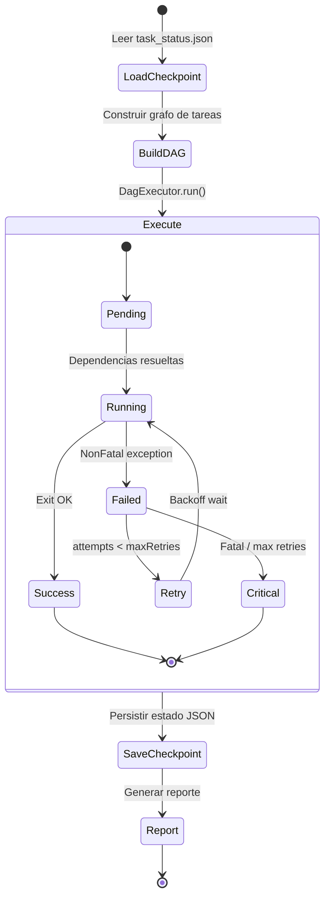

### DagTask — Nodo del Grafo

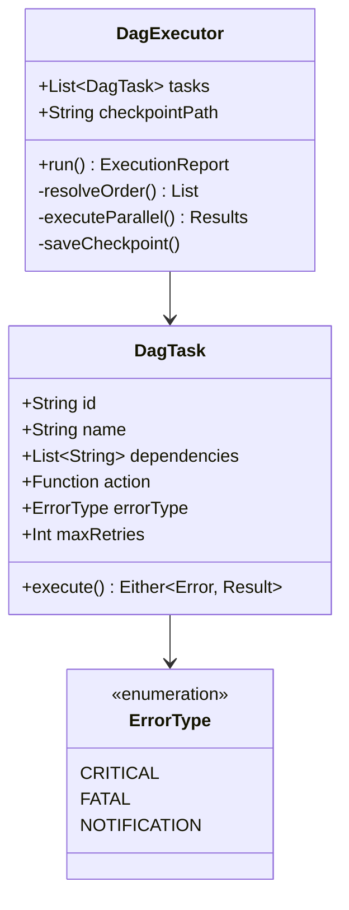

---

## Circuit Breaker

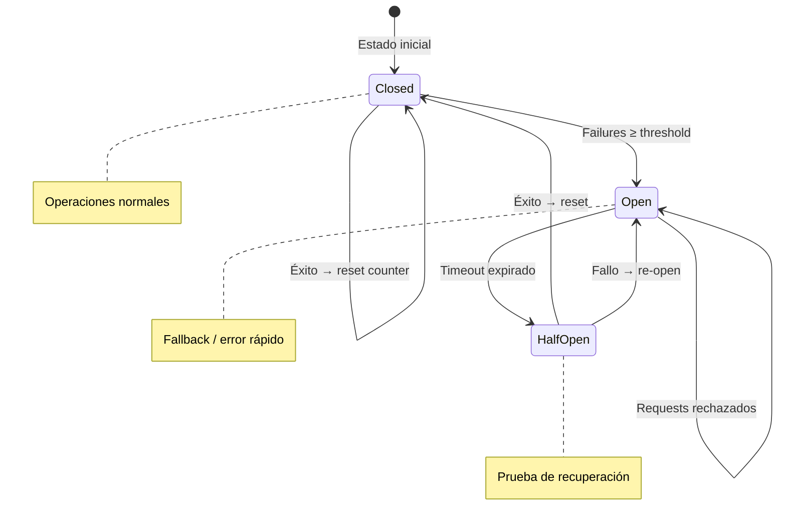

---

## Capas Medallion — Detalle

### Bronze Layer

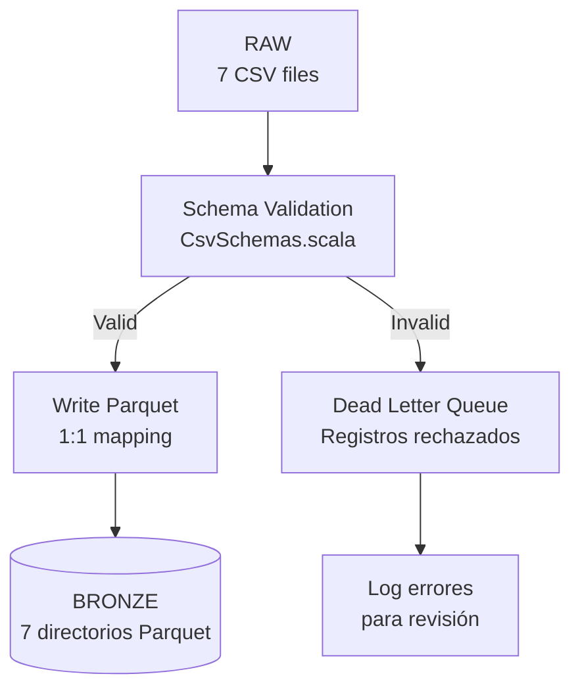

### Silver Layer

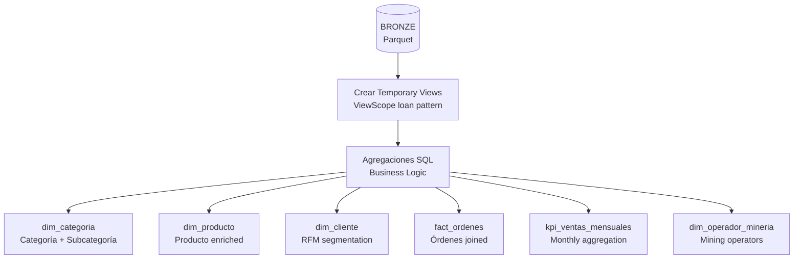

### Gold Layer — Star Schema

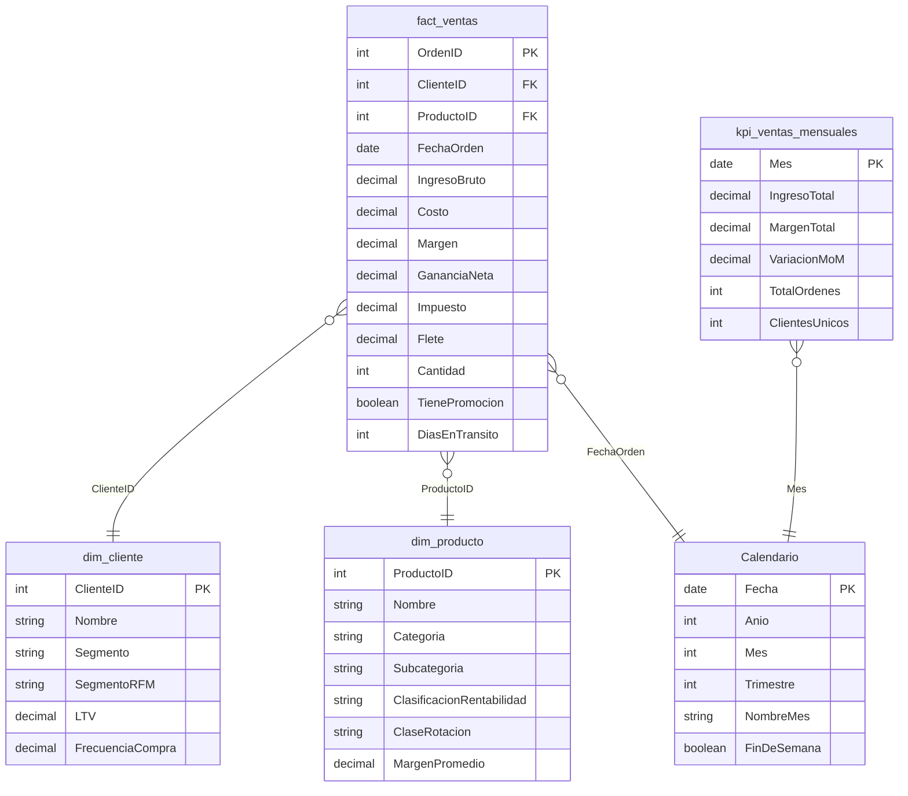

**Formato Gold:** Delta Lake con transacciones ACID.

---

## 6 Workflows

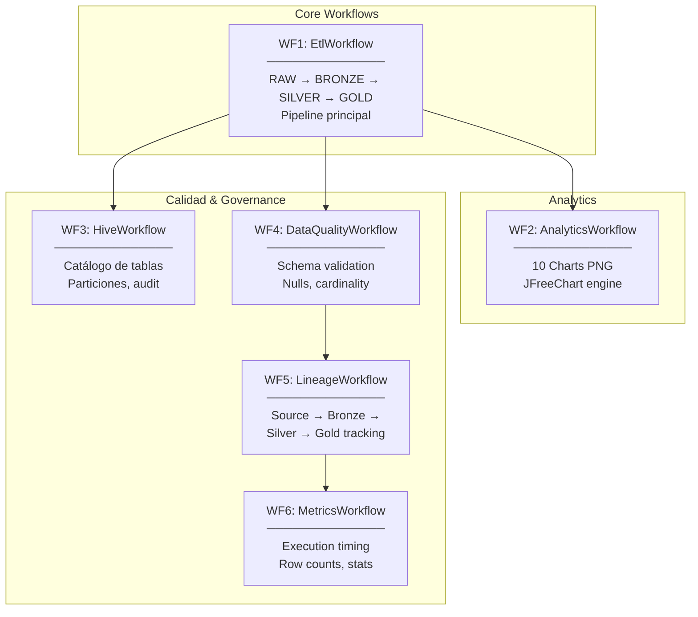

### WF2: Analytics — 10 Charts BI

| # | Chart | Tipo | Fuente |
|---|-------|------|--------|
| 1 | Ingreso Bruto por Categoría | Horizontal bars | `kpi_ventas_mensuales` |
| 2 | Tendencia Margen Mensual | Line series | `kpi_ventas_mensuales` |
| 3 | Segmentación Clientes RFM | Pie chart | `dim_cliente` |
| 4 | Top 10 Productos por Revenue | Vertical bars | `dim_producto` |
| 5 | Clasificación Rentabilidad | Pie chart | `dim_producto` |
| 6 | Variación MoM de Ingresos | Grouped bars | `kpi_ventas_mensuales` |
| 7-10 | Mining/Operational | Various | `FactMine` |

---

## Build — sbt Configuration

| Dependencia | Versión |
|-------------|---------|
| Scala | 2.12 |
| Spark Core/SQL | 3.5 |
| Delta Lake | 3.x |
| JFreeChart | Latest |
| Db2 JCC | 11.5.5 |

**Artefacto:** `root-assembly-2.0.0.jar` (fat JAR)

---

## Arquitectura Final del ETL (v5)

Esta sección consolida la evolución del pipeline tras los fixes de estabilidad y rendimiento aplicados sobre Bronze/Silver/Gold y el motor DAG.

### Vista end-to-end

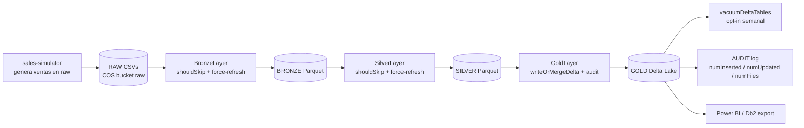

### Cambios incorporados (v4 → v5)

| Componente | Cambio | Beneficio |
|---|---|---|
| `WorkflowRegistry.buildDag` | Sanitiza dependencias eliminadas por feature flags | Evita deadlocks por dep huérfanas |
| `DagExecutor.scheduleReady` | Detección de deadlock + early exit `Failed(Unreachable)` | Termina la sesión Spark en vez de colgar 15 min |
| `DataLakeIO.shouldSkip` | Reemplaza `pathExists` en 13 sitios; respeta `PIPELINE_FORCE_REFRESH` (default `true`) | Bronze/Silver/Gold reprocesan datos nuevos sin borrado manual |
| `DataLakeIO.writeOrMergeDelta` | Estrategia adaptativa overwrite ↔ MERGE según tamaño actual | Costo bajo hoy, escala cuando crece |
| `DataLakeIO.writeDeltaReplaceWhere` | Overwrite parcial por predicate | KPIs reescriben solo los meses tocados |
| `DataLakeIO.logLastOperationMetrics` | Audita el último commit Delta | Visibilidad: qué se insertó/actualizó/borró |
| `DataLakeIO.vacuumDeltaTables` | VACUUM batch best-effort | Limpia parquets de versiones viejas |
| `submit-to-ae.sh --skip-csv-upload` | Preserva CSVs producidos por el simulator | Permite re-runs sin pisar datos generados |

### Capas: estrategia de escritura

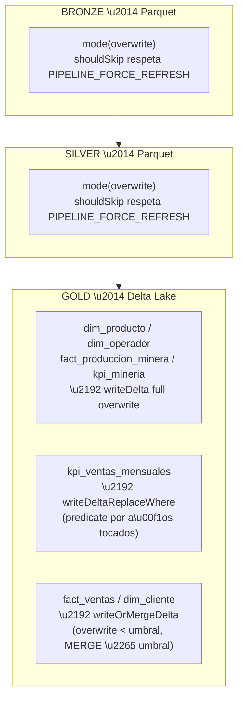

### Decisión adaptativa overwrite ↔ MERGE

`DataLakeIO.chooseWriteStrategy` resuelve la estrategia con esta precedencia:

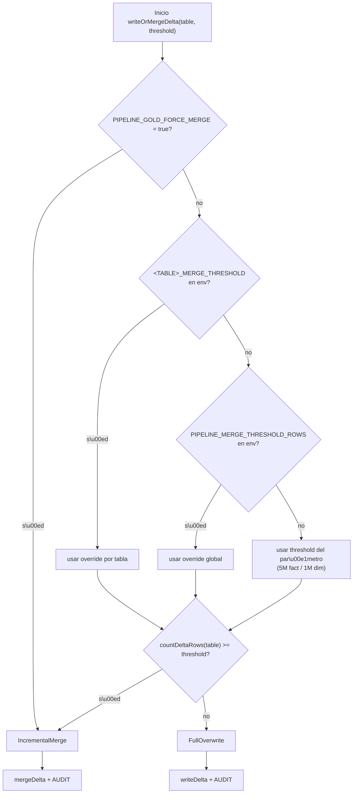

### Variables de entorno operativas

| Variable | Default | Efecto |
|---|---|---|
| `PIPELINE_FORCE_REFRESH` | `true` | `false` activa el comportamiento idempotente original (skip si la tabla existe) |
| `PIPELINE_GOLD_FORCE_MERGE` | `false` | Fuerza MERGE en `fact_ventas` y `dim_cliente` sin esperar al umbral |
| `PIPELINE_MERGE_THRESHOLD_ROWS` | — | Cota global que pisa los defaults (5M fact, 1M dim) |
| `FACT_VENTAS_MERGE_THRESHOLD` | `5_000_000` | Override solo para `fact_ventas` |
| `DIM_CLIENTE_MERGE_THRESHOLD` | `1_000_000` | Override solo para `dim_cliente` |
| `PIPELINE_VACUUM` | `false` | `true` corre `VACUUM` 7d sobre las 7 tablas Gold al final del run |

### DAG: deadlock detection

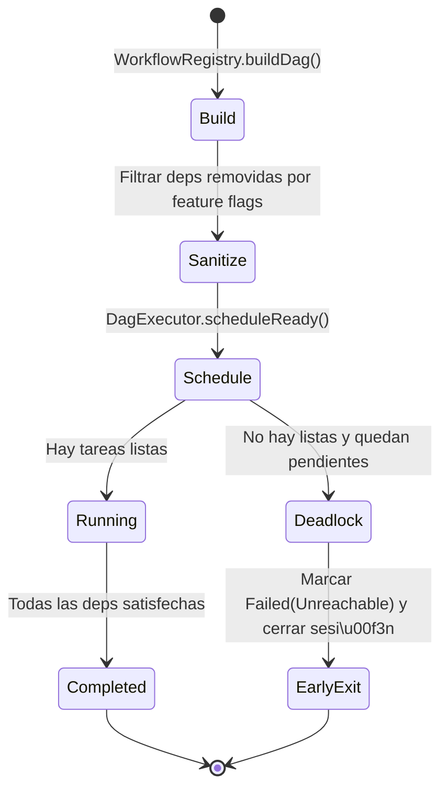

### Auditoría por tabla Delta

Cada escritura Gold emite una línea por commit con métricas extraídas del Delta log:

```
\ud83d\udcca AUDIT fact_ventas v3 op=MERGE ts=2026-04-17 numOutputRows=42202 \\
  numTargetRowsInserted=42202 numTargetRowsUpdated=0 numFiles=1
```

Métricas reportadas: `numOutputRows`, `numTargetRowsInserted`, `numTargetRowsUpdated`, `numTargetRowsDeleted`, `numFiles`, `numRemovedFiles`.

### Mantenimiento programado

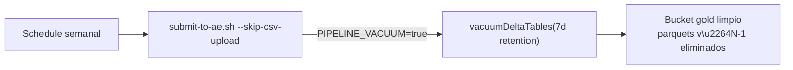

Recomendación operativa: VACUUM semanal para Gold; `OPTIMIZE` (compactación) cuando `numFiles > 100` por tabla.

---

## Estructura de Directorios del Pipeline

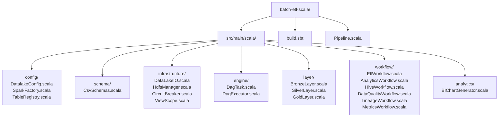
