# IBM Cloud — Infraestructura del Pipeline Medallion

## Tabla de Contenidos

- [¿Qué es esto?](#qué-es-esto)
- [Visión General de la Arquitectura](#visión-general-de-la-arquitectura)
- [Estructura del Directorio](#estructura-del-directorio)
- [Servicios IBM Cloud — Explicación Completa](#servicios-ibm-cloud--explicación-completa)
  - [1. VPC (Virtual Private Cloud) — Tu Red Privada](#1-vpc-virtual-private-cloud--tu-red-privada)
  - [2. Cloud Object Storage (COS) — Almacenamiento de Datos](#2-cloud-object-storage-cos--almacenamiento-de-datos)
  - [3. Analytics Engine Serverless — Motor Spark](#3-analytics-engine-serverless--motor-spark)
  - [4. IKS (IBM Kubernetes Service) — Cluster de Contenedores](#4-iks-ibm-kubernetes-service--cluster-de-contenedores)
  - [5. Db2 on Cloud — Base de Datos Relacional](#5-db2-on-cloud--base-de-datos-relacional)
  - [6. DataStage — Integración de Datos](#6-datastage--integración-de-datos)
  - [7. Key Protect — Cifrado de Datos](#7-key-protect--cifrado-de-datos)
  - [8. Secrets Manager — Gestión de Credenciales](#8-secrets-manager--gestión-de-credenciales)
  - [9. IAM (Identity and Access Management) — Control de Acceso](#9-iam-identity-and-access-management--control-de-acceso)
  - [10. Continuous Delivery — Toolchain CI/CD](#10-continuous-delivery--toolchain-cicd)
  - [11. Observabilidad — Monitoreo y Alertas](#11-observabilidad--monitoreo-y-alertas)
- [¿Cómo se conecta todo? — Flujo de Datos Completo](#cómo-se-conecta-todo--flujo-de-datos-completo)
- [Terraform — Infraestructura como Código](#terraform--infraestructura-como-código)
- [Tekton — CI/CD Pipeline (9 Etapas)](#tekton--cicd-pipeline-9-etapas)
- [Monitoreo — Dashboard y Alertas](#monitoreo--dashboard-y-alertas)
- [Scripts — Herramientas de Operación](#scripts--herramientas-de-operación)
- [Ambientes (dev / staging / prod)](#ambientes-dev--staging--prod)
- [Quick Start — Primeros Pasos](#quick-start--primeros-pasos)
- [Makefile — Referencia de Comandos](#makefile--referencia-de-comandos)
- [Glosario para Principiantes](#glosario-para-principiantes)

---

## ¿Qué es esto?

Este directorio contiene **toda la infraestructura** necesaria para ejecutar un pipeline de datos en IBM Cloud. Imagina que tienes datos de ventas en archivos CSV y necesitas transformarlos en reportes listos para Power BI. Para eso necesitas:

1. **Un lugar para guardar los datos** → Cloud Object Storage (COS)
2. **Un motor que procese los datos** → Analytics Engine (Apache Spark)
3. **Una base de datos para consultas rápidas** → Db2 on Cloud
4. **Seguridad** → VPC, Key Protect, IAM
5. **Automatización** → Tekton CI/CD, Terraform
6. **Monitoreo** → Sysdig, Activity Tracker, Alertas

Todo se provisiona automáticamente con **Terraform** (infraestructura como código) y se despliega con **Tekton** (CI/CD).

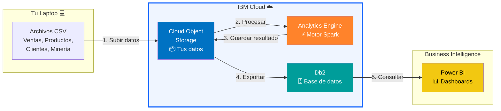

---

## Visión General de la Arquitectura

Este diagrama muestra **todos los servicios** desplegados en IBM Cloud y cómo se comunican entre sí:

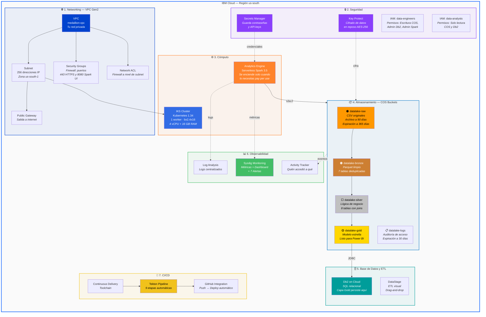

---

## Estructura del Directorio

```
infrastructure/ibm-cloud/
│
├── .env.example              ← Template de credenciales (copiar a .env)
├── .env                      ← TUS credenciales (NUNCA subir a Git)
├── .gitignore                ← Excluye .env, .terraform/, etc.
├── Makefile                  ← 40+ comandos para todo el ciclo de vida
├── README.md                 ← Este archivo
│
├── terraform/                ← Infraestructura como Código
│   ├── main.tf               ← 650+ líneas: TODOS los recursos
│   ├── variables.tf           ← Variables con validación
│   ├── outputs.tf             ← Credenciales y endpoints generados
│   ├── locals.tf              ← Convenciones de nombres
│   ├── versions.tf            ← Versión de Terraform y providers
│   ├── backend.tf             ← Estado remoto en COS
│   └── environments/
│       ├── dev.tfvars         ← Configuración dev (1 worker, gratis)
│       ├── staging.tfvars     ← Configuración staging (2 workers)
│       └── prod.tfvars        ← Configuración prod (3 workers, seguridad total)
│
├── tekton/                   ← CI/CD Pipeline
│   ├── pipeline.yaml          ← 9 etapas con paralelismo
│   ├── tasks.yaml             ← 8 tareas reutilizables
│   └── triggers.yaml          ← Webhooks GitHub → Pipeline automático
│
├── monitoring/               ← Observabilidad
│   ├── dashboard.yaml         ← Dashboard Sysdig (11 paneles)
│   └── alert-policies.yaml    ← 7 alertas (Spark, COS, Db2, IKS)
│
└── scripts/                  ← Herramientas de operación
    ├── setup.sh               ← Instalar CLI + plugins
    ├── submit-to-ae.sh        ← Compilar + Subir + Ejecutar pipeline Spark
    ├── deploy-spark.sh        ← Deploy Spark en Kubernetes
    ├── setup-cicd.sh          ← Crear toolchain de CI/CD
    ├── health-check.sh        ← Validar TODOS los servicios
    ├── rotate-credentials.sh  ← Rotar credenciales automáticamente
    ├── cos-lifecycle.sh       ← Políticas de ciclo de vida en buckets
    └── destroy.sh             ← Destruir infraestructura (con confirmación)
```

---

## Servicios IBM Cloud — Explicación Completa

### 1. VPC (Virtual Private Cloud) — Tu Red Privada

**¿Qué es?** Una red virtual aislada en la nube. Piensa en ella como la "red WiFi privada" de tu infraestructura. Nada puede entrar o salir sin tu permiso.

**¿Por qué la necesitas?** Sin una VPC, tus servidores estarían expuestos directamente a internet. La VPC crea una barrera de seguridad.

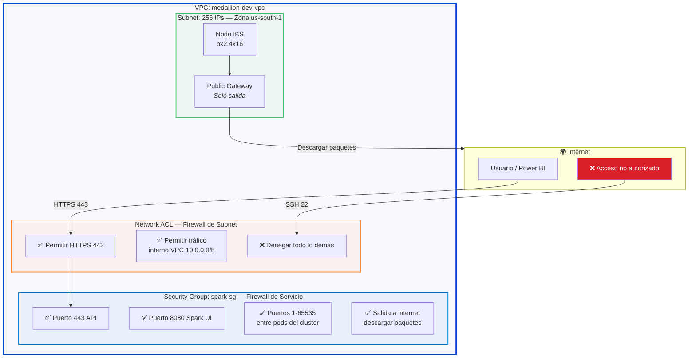

**Componentes creados por Terraform:**

| Recurso | Nombre | Función |
|---------|--------|---------|
| VPC | `medallion-dev-vpc` | Red privada virtual |
| Subnet | `medallion-dev-compute-subnet` | 256 direcciones IP en zona `us-south-1` |
| Public Gateway | `medallion-dev-pgw` | Permite tráfico de salida a internet |
| Security Group | `medallion-dev-spark-sg` | Firewall: puertos 443, 8080, y tráfico entre pods |
| Network ACL | `medallion-dev-compute-acl` | Firewall a nivel de subnet: HTTPS + VPC CIDR |

---

### 2. Cloud Object Storage (COS) — Almacenamiento de Datos

**¿Qué es?** Un servicio de almacenamiento masivo y barato. Funciona como un disco duro infinito en la nube donde guardas archivos organizados en "buckets" (carpetas).

**¿Por qué lo necesitas?** Es donde viven TODOS tus datos. Desde los CSV originales hasta las tablas Gold listas para Power BI.

**El protocolo S3A:** Spark se conecta a COS usando el protocolo S3A (compatible con Amazon S3). Por eso necesitas credenciales **HMAC** (Access Key + Secret Key), similares a un usuario y contraseña.

```mermaid
graph LR
    subgraph COS_SERVICE["IBM Cloud Object Storage"]
        direction TB

        subgraph RAW["🟠 datalake-raw-us-south"]
            R1["Categoria.csv"]
            R2["Producto.csv"]
            R3["VentasInternet.csv"]
            R4["Sucursales.csv"]
            R5["FactMine.csv"]
            R6["Mine.csv"]
            R7["spark-jars/root-assembly-2.0.0.jar"]
            R_POLICY["📋 Políticas:<br/>Archive a Glacier a 90 días<br/>Expiración a 365 días"]
        end

        subgraph BRONZE["🟤 datalake-bronze-us-south"]
            B1["categoria/ Parquet"]
            B2["producto/ Parquet"]
            B3["ventasinternet/ Parquet"]
            B4["sucursales/ Parquet"]
            B5["+3 tablas más"]
            B_DESC["Datos limpios:<br/>schema estricto, sin duplicados,<br/>con fechas de auditoría"]
        end

        subgraph SILVER["⬜ datalake-silver-us-south"]
            S1["catalogo_productos/"]
            S2["ventas_enriquecidas/"]
            S3["segmentacion_clientes/"]
            S4["eficiencia_minera/"]
            S5["+4 tablas más"]
            S_DESC["Lógica de negocio:<br/>joins, cálculos financieros,<br/>RFM, segmentación"]
        end

        subgraph GOLD["🟡 datalake-gold-us-south"]
            G1["dim_producto/"]
            G2["dim_cliente/"]
            G3["fact_ventas/"]
            G4["kpi_ventas_mensuales/"]
            G5["+4 tablas más"]
            G_DESC["Modelo estrella:<br/>dimensiones + hechos + KPIs<br/>Listo para Power BI"]
        end
    end

    RAW -->|"Spark lee CSV"| BRONZE
    BRONZE -->|"Spark aplica joins"| SILVER
    SILVER -->|"Spark crea Star Schema"| GOLD

    style COS_SERVICE fill:#0072c308,stroke:#0072c3,stroke-width:3px
    style RAW fill:#ff980020,stroke:#ff9800,stroke-width:2px
    style BRONZE fill:#cd7f3220,stroke:#cd7f32,stroke-width:2px
    style SILVER fill:#c0c0c020,stroke:#808080,stroke-width:2px
    style GOLD fill:#ffd70020,stroke:#ffd700,stroke-width:2px
```

**Credenciales COS (HMAC):**

| Credencial | Variable `.env` | Uso |
|------------|-----------------|-----|
| Access Key | `COS_ACCESS_KEY` | Identificador (como un usuario) |
| Secret Key | `COS_SECRET_KEY` | Contraseña secreta |
| Endpoint | `COS_ENDPOINT` | URL de conexión: `s3.us-south.cloud-object-storage.appdomain.cloud` |

**Terraform crea dos juegos de credenciales:**
- **Writer** (`medallion-dev-cos-hmac`): Para Spark y el pipeline (lectura + escritura)
- **Reader** (`medallion-dev-cos-reader`): Para analistas (solo lectura)

---

### 3. Analytics Engine Serverless — Motor Spark

**¿Qué es?** Un servicio que ejecuta Apache Spark sin que tengas que administrar servidores. Tú le envías un programa (JAR) y él se encarga de crear los servidores temporales, ejecutar el código, y apagarlos cuando termine. Solo pagas por el tiempo de ejecución.

**¿Por qué lo necesitas?** Apache Spark es el motor que transforma los datos. Lee los CSV de la capa Raw, aplica transformaciones y escribe las tablas en Bronze → Silver → Gold.

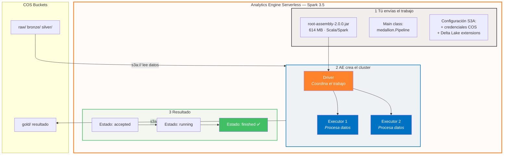

**Variables importantes:**

| Variable | Valor | Descripción |
|----------|-------|-------------|
| `AE_INSTANCE_ID` | `a688f3c4-efa9-...` | ID único de tu instancia AE |
| `AE_REGION` | `us-south` | Región donde corre |
| `AE_API_KEY` | Tu API key | Para autenticarte con el servicio |

**Comando para enviar un trabajo:**
```bash
# El script hace todo: compila, sube JAR a COS, envía a AE, monitorea
make pipeline-submit

# O si el JAR ya está compilado:
make pipeline-submit-skip
```

---

### 4. IKS (IBM Kubernetes Service) — Cluster de Contenedores

**¿Qué es?** Un servicio que ejecuta "contenedores" (mini-servidores) organizados por Kubernetes. Piensa en Docker, pero administrado por IBM.

**¿Por qué lo necesitas?** Para ejecutar Spark en un cluster dedicado (en vez de serverless) y para las pipelines CI/CD de Tekton.

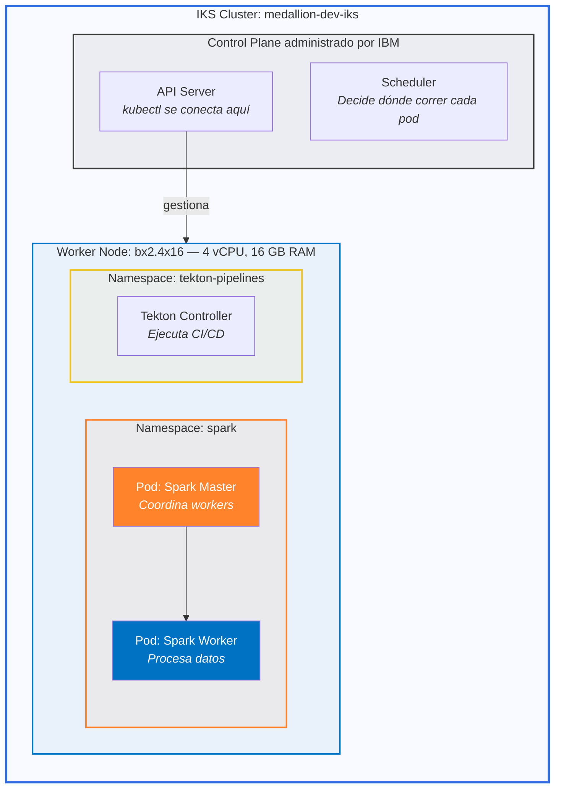

**Configuración por ambiente:**

| Ambiente | Workers | Flavor | vCPU | RAM | K8s Version |
|----------|---------|--------|------|-----|-------------|
| **dev** | 1 | `bx2.4x16` | 4 | 16 GB | 1.34 |
| **staging** | 2 | `bx2.4x16` | 8 | 32 GB | 1.34 |
| **prod** | 3 | `bx2.8x32` | 24 | 96 GB | 1.34 |

---

### 5. Db2 on Cloud — Base de Datos Relacional

**¿Qué es?** Una base de datos SQL administrada por IBM. Aquí persisten las tablas Gold del pipeline para que Power BI y los analistas puedan consultarlas con SQL estándar.

**¿Por qué lo necesitas?** COS es excelente para almacenar datos, pero no para hacer consultas SQL rápidas. Db2 permite hacer `SELECT * FROM fact_ventas WHERE anio = 2024` en milisegundos.

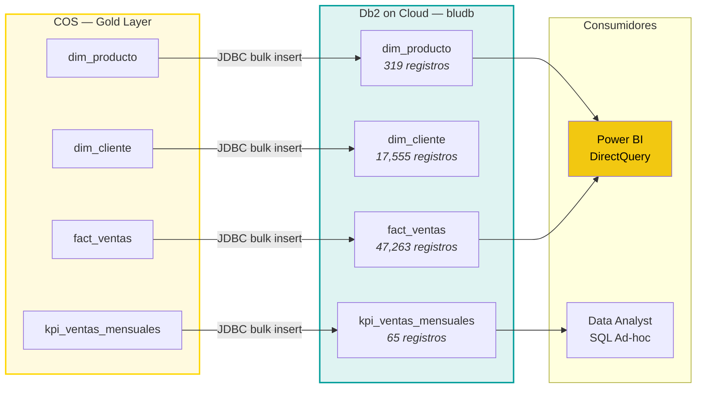

**Conexión JDBC:**
```
jdbc:db2://{hostname}:{port}/bludb:sslConnection=true;
```

| Variable | Descripción |
|----------|-------------|
| `DB2_HOSTNAME` | Servidor (ej: `6667d8e9-...databases.appdomain.cloud`) |
| `DB2_PORT` | Puerto (default: `30376`) |
| `DB2_DATABASE` | Nombre de la base: `bludb` |
| `DB2_USERNAME` | Usuario asignado (ej: `qtn87286`) |
| `DB2_PASSWORD` | Contraseña |

---

### 6. DataStage — Integración de Datos

**¿Qué es?** Una herramienta visual para crear pipelines de datos con drag-and-drop. Es como un "Visio para ETL" — dibujas el flujo de datos y DataStage lo ejecuta.

**¿Por qué lo necesitas?** Para transformaciones simples o integraciones puntuales sin escribir código. Complementa al pipeline Spark para casos de uso específicos.

---

### 7. Key Protect — Cifrado de Datos

**¿Qué es?** Un servicio de gestión de claves de cifrado. Genera y almacena las claves que cifran tus datos en COS y Db2. Sin la clave, los datos son ilegibles.

**¿Por qué lo necesitas?** Regulaciones de seguridad exigen que los datos estén cifrados "en reposo" (cuando están guardados en disco). Key Protect proporciona cifrado AES-256 con claves que tú controlas.

> **Nota:** En el ambiente `dev`, Key Protect está **desactivado** para ahorrar costos. Se activa en `staging` y `prod`.

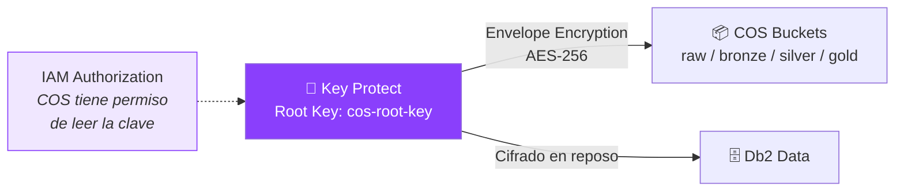

---

### 8. Secrets Manager — Gestión de Credenciales

**¿Qué es?** Un "vault" donde guardas contraseñas, API keys y credenciales de forma segura. En vez de ponerlas en archivos de texto, las guardas aquí y tus aplicaciones las consultan cuando las necesitan.

**¿Por qué lo necesitas?** Evita que las credenciales estén hardcodeadas en el código. Permite rotación automática sin tocar aplicaciones.

> **Nota:** Habilitado solo en ambiente `prod`.

---

### 9. IAM (Identity and Access Management) — Control de Acceso

**¿Qué es?** El sistema de permisos de IBM Cloud. Define **quién** puede hacer **qué** en **cuáles** recursos.

**¿Por qué lo necesitas?** Un data engineer necesita escribir datos, pero un analista solo debería poder leerlos. IAM garantiza el principio de "mínimo privilegio".

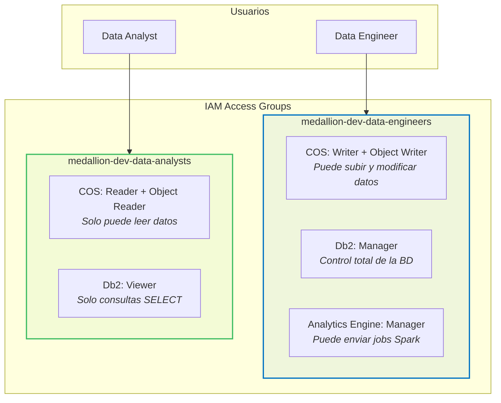

---

### 10. Continuous Delivery — Toolchain CI/CD

**¿Qué es?** Un servicio que conecta tu repositorio de GitHub con pipelines automatizados. Cada vez que haces `git push`, se dispara automáticamente un pipeline que compila, testea y despliega tu código.

**¿Por qué lo necesitas?** Sin CI/CD, tendrías que compilar y desplegar manualmente cada cambio. Con Continuous Delivery + Tekton, todo es automático.

**Componentes:**

| Componente | Descripción |
|------------|-------------|
| **Toolchain** | Contenedor que agrupa todas las herramientas |
| **GitHub Integration** | Conecta el repo para detectar push/PR |
| **Tekton Pipeline** | El motor que ejecuta las 9 etapas |
| **EventListener** | Webhook que escucha eventos de GitHub |

---

### 11. Observabilidad — Monitoreo y Alertas

**¿Qué es?** Un conjunto de 3 servicios que te dicen qué está pasando en tu infraestructura en tiempo real:

| Servicio | Qué monitorea | Ejemplo |
|----------|---------------|---------|
| **Activity Tracker** | Quién accedió a qué recurso | "Usuario X leyó el bucket gold a las 14:30" |
| **Log Analysis** | Logs de aplicaciones | "Spark job falló: OutOfMemoryError" |
| **Sysdig Monitoring** | Métricas + Dashboard + Alertas | "CPU del cluster al 85%" |

> **Nota:** En `dev` están desactivados. Se activan gradualmente en `staging` y `prod`.

---

## ¿Cómo se conecta todo? — Flujo de Datos Completo

Este diagrama muestra el recorrido completo de los datos, desde que subes un CSV hasta que aparece en Power BI:

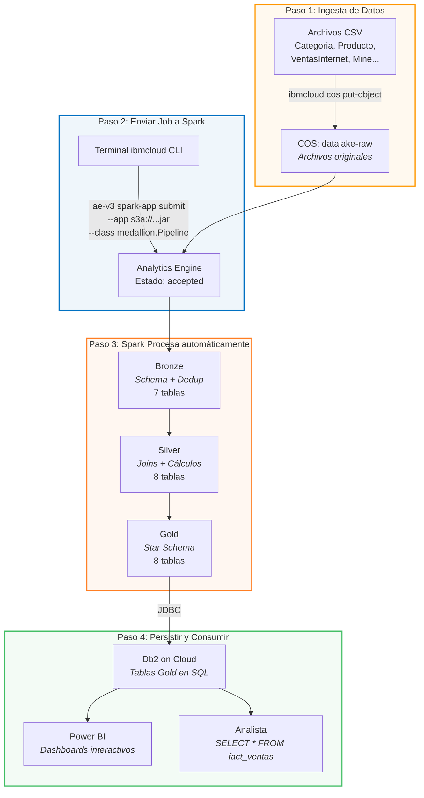

---

## Terraform — Infraestructura como Código

**¿Qué es Terraform?** Una herramienta que crea recursos en la nube escribiendo código (archivos `.tf`). En vez de hacer clic en la consola de IBM Cloud para crear cada servicio manualmente, describes lo que quieres en código y Terraform lo crea automáticamente.

**¿Por qué es importante?**
- **Reproducible**: Puedes recrear toda la infraestructura en minutos
- **Versionado**: Los cambios quedan en Git
- **Consistente**: No hay errores humanos de configuración

### Archivos Terraform

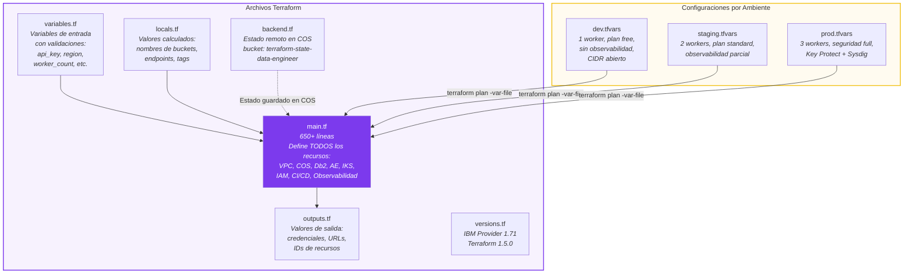

### Resumen de Recursos Terraform (33 recursos)

| # | Categoría | Recurso | Nombre |
|---|-----------|---------|--------|
| 1 | Networking | VPC | `medallion-dev-vpc` |
| 2 | Networking | Subnet | `medallion-dev-compute-subnet` |
| 3 | Networking | Public Gateway | `medallion-dev-pgw` |
| 4 | Networking | Security Group | `medallion-dev-spark-sg` |
| 5-8 | Networking | SG Rules (4) | Inbound cluster, outbound all, UI 8080, API 443 |
| 9 | Networking | Network ACL | `medallion-dev-compute-acl` |
| 10 | Networking | Subnet-PGW Attachment | Conecta subnet con gateway |
| 11 | Seguridad | Key Protect (opcional) | `medallion-dev-key-protect` |
| 12 | Seguridad | KMS Root Key (opcional) | `medallion-dev-cos-root-key` |
| 13 | Seguridad | Secrets Manager (opcional) | `medallion-dev-secrets-mgr` |
| 14 | Compute | IKS Cluster | `medallion-dev-iks` |
| 15-16 | Storage | COS HMAC Keys (2) | Writer + Reader credentials |
| 17-20 | Storage | COS Buckets (4) | raw, bronze, silver, gold |
| 21 | Storage | COS Logs Bucket (opcional) | `datalake-logs-us-south-dev` |
| 22 | Database | Db2 on Cloud | `medallion-dev-db2` |
| 23 | Database | Db2 Credentials | `medallion-dev-db2-key` |
| 24 | ETL | DataStage | `medallion-dev-datastage` |
| 25 | Analytics | Analytics Engine | `medallion-dev-ae` |
| 26 | Analytics | AE Credentials | `medallion-dev-ae-key` |
| 27-29 | Observabilidad | Activity Tracker, Log Analysis, Sysdig (opcionales) | |
| 30 | CI/CD | Continuous Delivery | `medallion-dev-cd` |
| 31 | CI/CD | Toolchain | `medallion-dev-toolchain` |
| 32 | CI/CD | GitHub Tool | `data-engineer-repo` |
| 33 | IAM | Random ID (suffix) | Para nombres únicos |
| 34-35 | IAM | Access Groups (2) | `data-engineers`, `data-analysts` |
| 36-40 | IAM | Access Policies (5) | COS, Db2, AE por grupo |

### Estado Remoto (Backend)

Terraform guarda el "estado" de tu infraestructura en un archivo `terraform.tfstate`. Para que tu equipo pueda trabajar junto, este archivo se guarda en un bucket COS dedicado:

```
bucket: terraform-state-data-engineer
key:    ibm-cloud/medallion-pipeline/terraform.tfstate
```

---

## Tekton — CI/CD Pipeline (9 Etapas)

**¿Qué es Tekton?** Un framework de CI/CD que corre dentro de Kubernetes. Ejecuta "tareas" (tasks) organizadas en un "pipeline" cada vez que detecta un cambio en GitHub.

```mermaid
flowchart LR
    subgraph TRIGGER["Trigger"]
        GIT_PUSH["git push main<br/><i>Deploy completo</i>"]
        GIT_PR["Pull Request<br/><i>Solo tests</i>"]
        WEBHOOK["EventListener<br/>+ TriggerBinding<br/><i>Escucha webhooks<br/>de GitHub</i>"]
    end

    subgraph PIPELINE["Tekton Pipeline — medallion-data-pipeline"]
        direction LR

        subgraph S1["Etapa 1"]
            CLONE["clone-repo<br/><i>Git checkout</i>"]
        end

        subgraph PARALLEL["Etapas 2-3 en paralelo"]
            direction TB
            TEST["run-tests<br/><i>pytest + sbt test</i><br/>Scala: 2 GB RAM<br/>Python: 512 MB RAM"]
            SCAN_T["security-scan<br/><i>pip-audit<br/>detect-secrets<br/>Trivy HIGH/CRITICAL</i>"]
        end

        subgraph S4["Etapa 4"]
            BUILD_JAR["build-jar<br/><i>sbt assembly<br/>Fat JAR 614 MB</i><br/>4 GB RAM / 2 CPU"]
        end

        subgraph AE_PATH["Ruta Serverless AE"]
            direction TB
            UPLOAD["upload-to-cos<br/><i>JAR a datalake-raw/<br/>spark-jars/</i>"]
            SUBMIT_T["submit-to-ae<br/><i>Spark 3.5<br/>medallion.Pipeline<br/>Timeout: 10 min</i>"]
            UPLOAD --> SUBMIT_T
        end

        subgraph IKS_PATH["Ruta Container IKS"]
            direction TB
            BUILD_IMG["build-image<br/><i>Kaniko a us.icr.io/<br/>spark-hadoop:latest</i>"]
            DEPLOY_T["deploy-to-iks<br/><i>kubectl apply<br/>namespace: spark</i>"]
            BUILD_IMG --> DEPLOY_T
        end
    end

    subgraph FINALLY["Finally siempre"]
        NOTIFY["notify<br/><i>Slack / Webhook<br/>Estado del pipeline</i>"]
    end

    GIT_PUSH -->|"full deploy"| WEBHOOK
    GIT_PR -->|"test only"| WEBHOOK
    WEBHOOK --> CLONE
    CLONE --> TEST
    CLONE --> SCAN_T
    TEST --> BUILD_JAR
    SCAN_T --> BUILD_JAR
    BUILD_JAR --> UPLOAD
    TEST --> BUILD_IMG
    SCAN_T --> BUILD_IMG
    SUBMIT_T -.->|"siempre"| NOTIFY
    DEPLOY_T -.->|"siempre"| NOTIFY

    style TRIGGER fill:#24292e10,stroke:#24292e,stroke-width:2px
    style PIPELINE fill:#0f62fe08,stroke:#0f62fe,stroke-width:3px
    style FINALLY fill:#da1e2810,stroke:#da1e28,stroke-width:2px
    style PARALLEL fill:#42be6510,stroke:#42be65,stroke-width:2px
    style AE_PATH fill:#ff832b10,stroke:#ff832b,stroke-width:2px
    style IKS_PATH fill:#326ce510,stroke:#326ce5,stroke-width:2px
    style CLONE fill:#393939,color:#fff
    style TEST fill:#42be65,color:#fff
    style SCAN_T fill:#da1e28,color:#fff
    style BUILD_JAR fill:#f1c21b,color:#000
    style UPLOAD fill:#0072c3,color:#fff
    style SUBMIT_T fill:#ff832b,color:#fff
    style BUILD_IMG fill:#0072c3,color:#fff
    style DEPLOY_T fill:#326ce5,color:#fff
    style NOTIFY fill:#a56eff,color:#fff
    style GIT_PUSH fill:#24292e,color:#fff
    style GIT_PR fill:#24292e,color:#fff
```

### Detalle de cada Tarea

| # | Tarea | Imagen Docker | Recursos | Qué hace |
|---|-------|---------------|----------|----------|
| 1 | `clone-repo` | `alpine/git` | — | Clona el repositorio de GitHub |
| 2 | `run-tests` | `python:3.12-slim` + `sbtscala/scala-sbt` | 2 GB RAM | Ejecuta pytest (Python) y sbt test (Scala) |
| 3 | `security-scan` | `aquasec/trivy` | — | Escanea vulnerabilidades HIGH/CRITICAL en código y Dockerfile |
| 4 | `build-jar` | `sbtscala/scala-sbt` | 4 GB RAM, 2 CPU | Compila el JAR de 614 MB con `sbt assembly` |
| 5 | `upload-to-cos` | `ibmcloud CLI` | — | Sube el JAR a `datalake-raw/spark-jars/` |
| 6 | `submit-to-ae` | `ibmcloud CLI` | — | Envía el job a Analytics Engine, monitorea cada 10s |
| 7 | `build-image` | `gcr.io/kaniko` | — | Construye imagen Docker y la sube a IBM Container Registry |
| 8 | `deploy-to-iks` | `bitnami/kubectl` | — | Aplica los manifests de Kubernetes |
| 9 | `notify` | `curlimages/curl` | — | Envía webhook con el resultado (Slack) |

### Triggers (Disparadores)

| Evento | Filtro CEL | Acción | Timeout |
|--------|-----------|--------|---------|
| `git push` a `main` | `body.ref == 'refs/heads/main'` | Pipeline completo (9 etapas) | 30 min |
| `Pull Request` abierto/actualizado | `body.action in ['opened', 'synchronize']` | Solo tests + security scan | 15 min |

---

## Monitoreo — Dashboard y Alertas

### Dashboard Sysdig (11 Paneles)

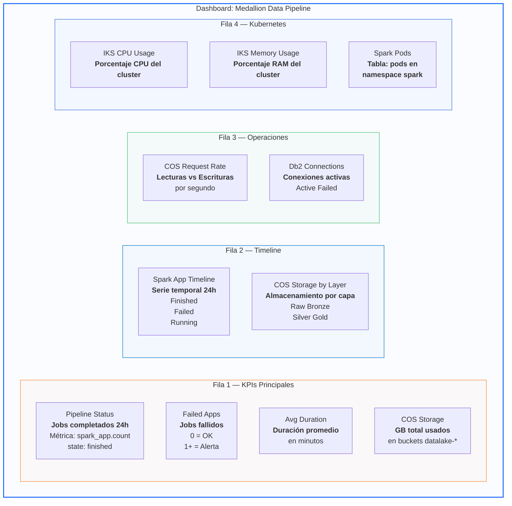

### Alertas (7 Políticas)

| # | Alerta | Severidad | Condición | Notificación |
|---|--------|-----------|-----------|--------------|
| 1 | **Spark App Failed** | Crítico | Un job de Spark falló | Slack + Email |
| 2 | **COS Access Denied** | Alto | 5+ accesos denegados en COS en 5 min | Slack |
| 3 | **COS Gold Bucket Large** | Warning | Gold bucket > 10 GB | Email |
| 4 | **Db2 Connection Error** | Alto | >3 conexiones fallidas en 5 min | Slack + Email |
| 5 | **IKS Node Not Ready** | Crítico | Un nodo del cluster no responde por 5 min | Slack + Email |
| 6 | **Pipeline Exceeds SLA** | Warning | Job de Spark tarda >10 minutos | Slack |
| 7 | **Service Key Expiring** | Warning | API key creada hace +7 días | Email |

---

## Scripts — Herramientas de Operación

Cada script está en `scripts/` y es un comando de operación:

### setup.sh — Configuración Inicial

Instala el CLI de IBM Cloud y 8 plugins necesarios:

| Plugin | Servicio que gestiona |
|--------|----------------------|
| `container-service` | IKS (Kubernetes) |
| `container-registry` | Registro de imágenes Docker |
| `cloud-object-storage` | COS (buckets y objetos) |
| `vpc-infrastructure` | VPC, subnets, security groups |
| `analytics-engine-v3` | Analytics Engine (Spark) |
| `continuous-delivery` | Toolchain CI/CD |
| `key-protect` | Cifrado de datos |
| `schematics` | Terraform automation |

### submit-to-ae.sh — Ejecutar Pipeline Spark

```bash
# Ciclo completo: compilar → subir → enviar → monitorear
./scripts/submit-to-ae.sh

# Solo enviar (JAR ya compilado y en COS)
./scripts/submit-to-ae.sh --skip-build

# Ver estado de un job
./scripts/submit-to-ae.sh --status <APP_ID>

# Ver logs de un job
./scripts/submit-to-ae.sh --logs <APP_ID>

# Listar todos los jobs
./scripts/submit-to-ae.sh --list
```

### health-check.sh — Diagnóstico Completo

Valida la conectividad y estado de **todos** los servicios:

```bash
./scripts/health-check.sh          # Chequeo completo
./scripts/health-check.sh --ae     # Solo Analytics Engine
./scripts/health-check.sh --cos    # Solo COS
./scripts/health-check.sh --db2    # Solo Db2
./scripts/health-check.sh --iks    # Solo IKS
./scripts/health-check.sh --json   # Salida JSON
```

Resultado ejemplo:
```
IBM Cloud CLI
  ✔ PASS  CLI installed — ibmcloud 2.42.0
  ✔ PASS  Authenticated — Federico Pfund's Account
  ✔ PASS  Plugins — 7 plugins installed

Cloud Object Storage
  ✔ PASS  datalake-raw-us-south — 16 objects
  ✔ PASS  datalake-bronze-us-south — 14 objects
  ✔ PASS  datalake-silver-us-south — 16 objects
  ✔ PASS  datalake-gold-us-south — 17 objects

Analytics Engine Serverless
  ✔ PASS  AE Instance — State: active (Spark 3.5)
  ✔ PASS  Last App — State: finished
```

### rotate-credentials.sh — Rotación de Credenciales

Rota automáticamente las credenciales de COS, Db2 y AE, actualiza `.env` y hace backup:

```bash
./scripts/rotate-credentials.sh             # Rotar todo
./scripts/rotate-credentials.sh --cos-only  # Solo COS HMAC
./scripts/rotate-credentials.sh --db2-only  # Solo Db2
./scripts/rotate-credentials.sh --ae-only   # Solo AE
./scripts/rotate-credentials.sh --dry-run   # Solo mostrar qué haría
```

### destroy.sh — Destruir Infraestructura

```bash
./scripts/destroy.sh               # Interactivo (pide confirmación: "DESTROY")
./scripts/destroy.sh --data-only   # Solo borrar datos de COS
./scripts/destroy.sh --force       # Sin confirmación (para CI/CD)
```

**Orden de destrucción:** IKS workloads → COS data → AE apps → Terraform destroy

---

## Ambientes (dev / staging / prod)

La infraestructura soporta tres ambientes completamente aislados. Cada uno tiene sus propios buckets, cluster y configuración:

| Parámetro | dev | staging | prod |
|-----------|:---:|:-------:|:----:|
| Workers IKS | 1 x `bx2.4x16` | 2 x `bx2.4x16` | 3 x `bx2.8x32` |
| vCPU total | 4 | 8 | 24 |
| RAM total | 16 GB | 32 GB | 96 GB |
| Plan Db2 | free | standard | standard |
| Key Protect (cifrado) | No | Si | Si |
| Secrets Manager | No | No | Si |
| Activity Tracker | No | Si | Si |
| Log Analysis | No | Si | Si |
| Sysdig Monitoring | No | No | Si |
| Lifecycle Policies | No | Si | Si |
| CIDR Permitido | `0.0.0.0/0` | `10.0.0.0/8` | `10.0.0.0/8` |
| Naming | `*-us-south-dev` | `*-us-south-staging` | `*-us-south-prod` |

```bash
# Desplegar un ambiente específico
make infra-plan ENV=prod
make infra-apply ENV=prod
```

---

## Quick Start — Primeros Pasos

### Prerequisitos

- Cuenta IBM Cloud ([cloud.ibm.com](https://cloud.ibm.com))
- Terminal bash (Linux, Mac o WSL)
- Terraform >= 1.5.0

### Paso 1: Configurar credenciales

```bash
cd infrastructure/ibm-cloud

# Instalar CLI + plugins
make setup

# Crear archivo de credenciales
cp .env.example .env
# Editar .env con tus valores:
#   IBMCLOUD_API_KEY, COS_ACCESS_KEY, COS_SECRET_KEY,
#   DB2_HOSTNAME, DB2_PASSWORD, AE_INSTANCE_ID

# Verificar que todo esté configurado
make check-env
```

### Paso 2: Login y desplegar infraestructura

```bash
# Login con SSO
make login

# Planificar (ver qué se va a crear)
make infra-plan ENV=dev

# Crear toda la infraestructura
make infra-apply ENV=dev

# Ver los recursos creados
make infra-output
```

### Paso 3: Ejecutar el pipeline de datos

```bash
# Opción A: Scala + Analytics Engine (recomendado)
make pipeline-submit

# Opción B: Notebooks PySpark
make notebooks-all
```

### Paso 4: Verificar que todo funcione

```bash
# Health check completo
make health

# Ver estado de la última ejecución Spark
make pipeline-list
```

---

## Makefile — Referencia de Comandos

| Comando | Descripción |
|---------|-------------|
| **Setup** | |
| `make setup` | Instalar CLI + plugins + verificar login |
| `make check-env` | Validar `.env` tiene todas las variables |
| `make login` | Login a IBM Cloud (SSO) |
| **Infraestructura** | |
| `make infra-init` | Inicializar Terraform (backend + providers) |
| `make infra-plan ENV=dev` | Planificar cambios por ambiente |
| `make infra-apply ENV=dev` | Aplicar infraestructura |
| `make infra-destroy ENV=dev` | Destruir infraestructura (con confirmación) |
| `make infra-output` | Mostrar outputs de Terraform |
| `make infra-state` | Listar recursos en state |
| **Pipeline Scala** | |
| `make build-jar` | Compilar fat JAR con `sbt assembly` |
| `make pipeline-submit` | Build + Upload + Submit a Analytics Engine |
| `make pipeline-submit-skip` | Submit JAR pre-compilado |
| `make pipeline-status APP_ID=<id>` | Estado de aplicación Spark |
| `make pipeline-logs APP_ID=<id>` | Logs de aplicación Spark |
| `make pipeline-list` | Listar apps enviadas a AE |
| **Pipeline Python** | |
| `make notebooks-all` | Ejecutar todos los notebooks (B a S a G) |
| `make notebooks-bronze` | Solo capa Bronze |
| `make notebooks-silver` | Solo capa Silver |
| `make notebooks-gold` | Solo capa Gold |
| **Deploy IKS + CI/CD** | |
| `make deploy-spark` | Deploy Spark master/workers en IKS |
| `make deploy-cicd` | Configurar toolchain Continuous Delivery |
| `make deploy-tekton` | Aplicar definiciones Tekton al cluster |
| **Monitoreo** | |
| `make health` | Health check completo |
| `make health-ae` | Solo Analytics Engine |
| `make health-cos` | Solo COS buckets |
| `make health-db2` | Solo Db2 |
| **Datos** | |
| `make cos-list` | Listar contenido de buckets |
| `make cos-usage` | Mostrar uso de almacenamiento por bucket |
| **Seguridad** | |
| `make rotate-credentials` | Rotar credenciales COS/Db2/AE |
| `make audit-secrets` | Escanear codebase por secrets hardcodeados |
| **Limpieza** | |
| `make clean` | Eliminar artifacts locales |

---

## Glosario para Principiantes

| Término | Explicación Simple |
|---------|-------------------|
| **VPC** | Red privada virtual. Como una red WiFi privada en la nube |
| **Subnet** | Subdivisión de la VPC. Agrupa servidores por zona |
| **Security Group** | Firewall que controla qué puertos están abiertos |
| **Network ACL** | Firewall a nivel de subnet (más general que Security Group) |
| **COS** | Cloud Object Storage. Almacén de archivos ilimitado y barato |
| **Bucket** | Carpeta dentro de COS |
| **HMAC** | Tipo de credencial (Access Key + Secret Key) para acceder a COS |
| **S3A** | Protocolo para conectar Spark con almacenamiento compatible con Amazon S3 |
| **IKS** | IBM Kubernetes Service. Ejecuta contenedores Docker en la nube |
| **Pod** | La unidad mínima en Kubernetes. Un contenedor + su configuración |
| **Namespace** | Agrupación lógica de pods en Kubernetes (ej: `spark`, `tekton-pipelines`) |
| **Analytics Engine** | Servicio serverless de Spark. Pagas solo cuando procesas datos |
| **Serverless** | No administras servidores. El servicio los crea y destruye automáticamente |
| **JAR** | Archivo Java/Scala compilado. Contiene el código del pipeline |
| **Db2** | Base de datos relacional SQL de IBM |
| **JDBC** | Protocolo para conectarse a bases de datos desde Java/Scala |
| **Terraform** | Herramienta que crea infraestructura en la nube desde código |
| **tfvars** | Archivo con valores de variables para Terraform |
| **State** | Archivo donde Terraform recuerda qué recursos creó |
| **Backend** | Dónde se almacena el state de Terraform (en este caso: COS) |
| **Tekton** | Framework de CI/CD que corre dentro de Kubernetes |
| **Pipeline** | Secuencia de tareas automatizadas (ej: test → build → deploy) |
| **Task** | Un paso individual dentro de un pipeline |
| **Trigger** | Evento que inicia un pipeline (ej: `git push`) |
| **EventListener** | Webhook que escucha eventos de GitHub y dispara pipelines |
| **Sysdig** | Herramienta de monitoreo. Métricas, dashboards y alertas |
| **Activity Tracker** | Servicio que registra quién accedió a qué recurso |
| **Key Protect** | Servicio de cifrado. Genera llaves para proteger datos |
| **IAM** | Identity and Access Management. Control de permisos |
| **Access Group** | Grupo de usuarios con los mismos permisos |
| **Toolchain** | Conjunto de herramientas conectadas para CI/CD |
| **Delta Lake** | Formato de tabla que soporta transacciones ACID y time travel |
| **Star Schema** | Modelo de datos para BI: tablas de hechos + dimensiones |
| **Medallion** | Arquitectura de datos: Raw → Bronze → Silver → Gold |
| **RFM** | Recency, Frequency, Monetary. Técnica de segmentación de clientes |
