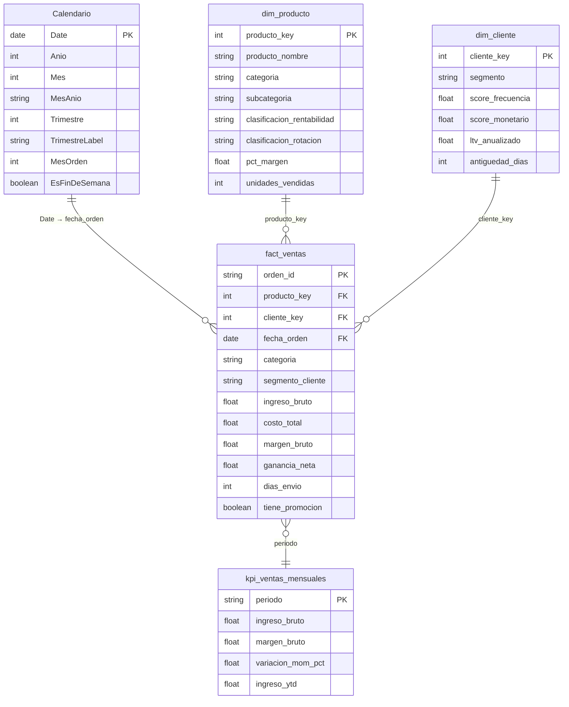
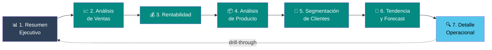
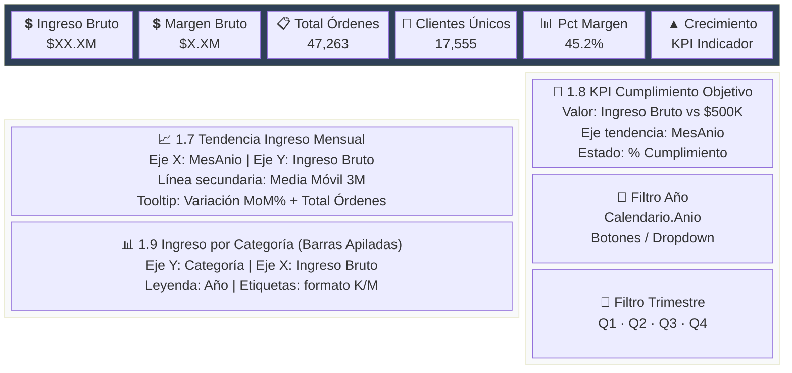
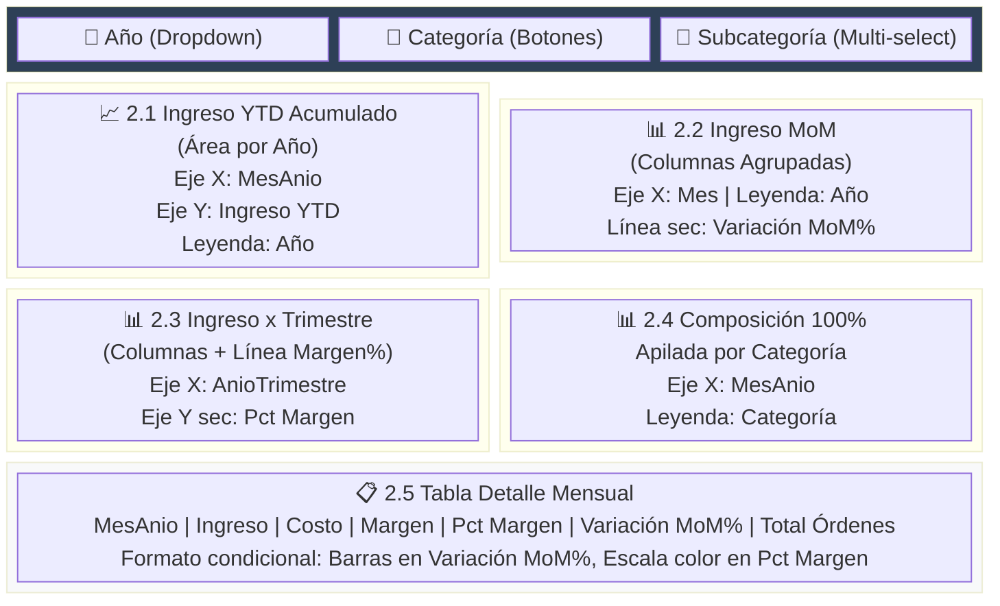
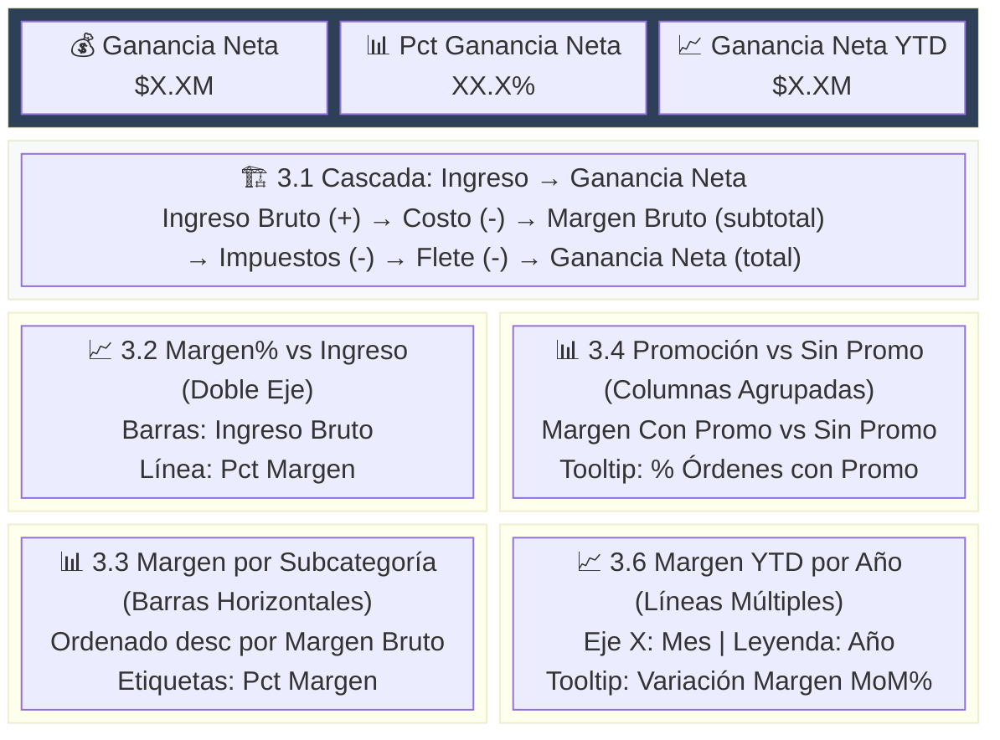
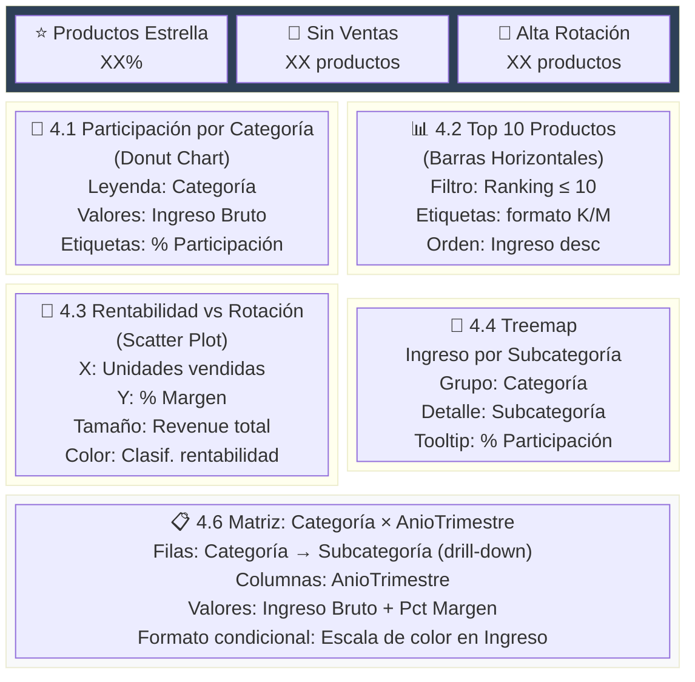
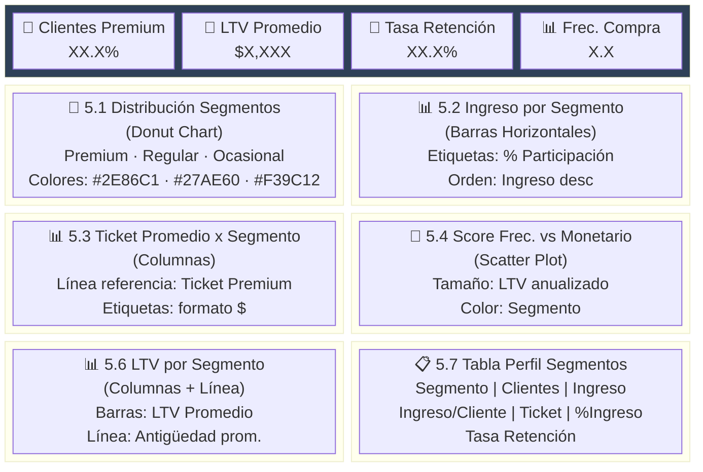
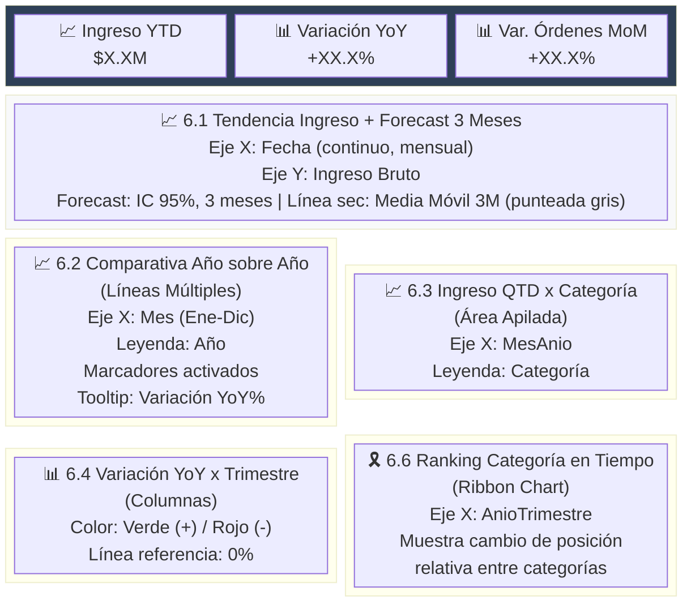
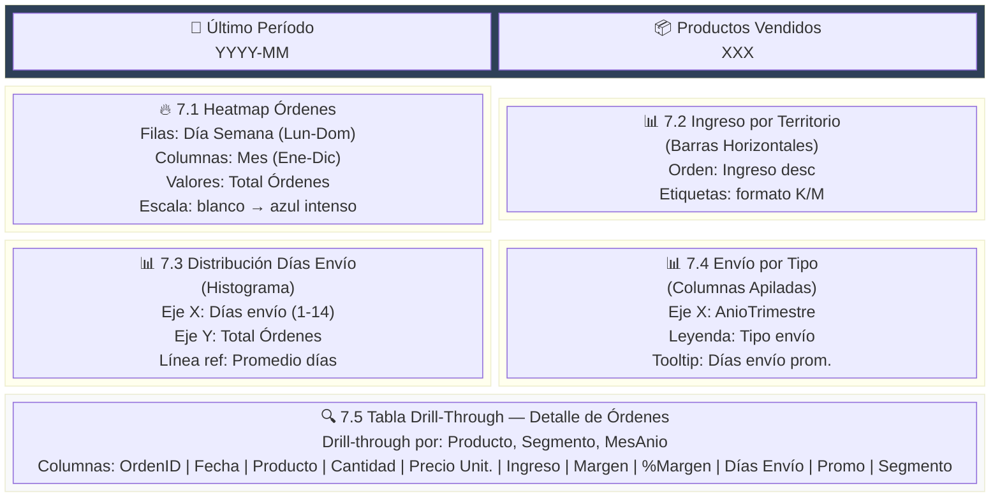
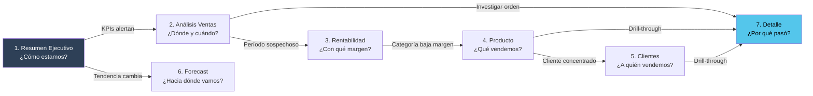

# Power BI — Dashboard Retail Analytics

Especificación visual y analítica del dashboard ejecutivo de ventas retail, construido sobre el modelo dimensional Gold del Data Lakehouse (Star Schema: `fact_ventas` + `dim_cliente` + `dim_producto` + `Calendario` + `kpi_ventas_mensuales`).

---

## Modelo de Datos

---

## Navegación de Páginas

---

## Filtros Globales (Todas las Páginas)

Panel de filtros persistente sincronizado entre páginas:

| # | Campo | Tipo | Estilo |
|---|-------|------|--------|
| 1 | `Calendario[Anio]` | Fecha | Dropdown |
| 2 | `Calendario[TrimestreLabel]` | Fecha | Botones (Q1, Q2, Q3, Q4) |
| 3 | `fact_ventas[categoria]` | Categoría | Botones |
| 4 | `fact_ventas[segmento_cliente]` | Segmento | Dropdown |

---

## Tema de Colores

| Rol | Color | Hex | Uso |
|-----|-------|-----|-----|
| Primario | 🟦 Azul oscuro | `#2E4057` | Fondo de headers |
| Secundario | 🟩 Verde azulado | `#048A81` | Barras principales |
| Acento 1 | 🔵 Celeste | `#54C6EB` | Líneas secundarias |
| Acento 2 | 🔵 Celeste claro | `#8EE3EF` | Áreas |
| Positivo | 🟢 Verde | `#27AE60` | Indicadores de crecimiento |
| Negativo | 🔴 Rojo | `#E74C3C` | Indicadores de caída |
| Neutro | ⚪ Gris | `#95A5A6` | Estable / referencia |
| Fondo | ⬜ Gris claro | `#F8F9FA` | Fondo general |
| Texto | ⬛ Gris oscuro | `#2C3E50` | Texto principal |

---

## Página 1: Resumen Ejecutivo

**Propósito analítico**: Vista gerencial de alto nivel con KPIs principales y tendencia. Permite al C-Level evaluar en segundos la salud del negocio: ingresos totales, nivel de margen, volumen transaccional y dirección de la tendencia (crecimiento/caída/estable).

### Layout

### Componentes Visuales

| ID | Tipo | Campo Principal | Análisis |
|----|------|----------------|----------|
| 1.1 | Tarjeta | `Ingreso Bruto` | **Volumen total de negocio**. Métrica north-star del dashboard. Formato moneda abreviado (K/M) para lectura rápida |
| 1.2 | Tarjeta | `Margen Bruto` | **Rentabilidad absoluta** antes de impuestos y flete. Complementa al ingreso para dimensionar la ganancia real |
| 1.3 | Tarjeta | `Total Ordenes` | **Volumen transaccional**. Indica la actividad comercial independiente del ticket. Caída de órdenes con ingreso estable sugiere concentración en tickets altos |
| 1.4 | Tarjeta | `Clientes Unicos` | **Base de clientes activos**. Un ratio Órdenes/Clientes > 1 indica frecuencia de recompra saludable |
| 1.5 | Tarjeta | `Pct Margen` | **Eficiencia del pricing**. Semáforo condicional: verde ≥45%, amarillo ≥35%, rojo <35%. Alerta temprana de erosión de margen |
| 1.6 | Tarjeta | `KPI Indicador Ingreso` | **Dirección de la tendencia** (▲/▼/►). Basado en variación MoM con umbrales ±5%. Señal rápida sin necesidad de analizar gráficos |
| 1.7 | Líneas | `Ingreso Bruto` + `Media Móvil 3M` | **Tendencia temporal con suavizado**. La media móvil filtra ruido estacional. Divergencia entre línea real y MM3 indica cambio de tendencia |
| 1.8 | KPI Visual | `Ingreso Bruto` vs `Objetivo` | **Gap de cumplimiento**. Objetivo mensual $500K como referencia. Permite evaluar desempeño goal-oriented vs trend-oriented |
| 1.9 | Barras Apiladas | `Ingreso` por `Categoría` × `Año` | **Composición del ingreso por línea de producto**. Identifica qué categorías impulsan el crecimiento y cuáles decrecen interanualmente |
| 1.10 | Segmentador | `Calendario[Anio]` | Filtro temporal principal para aislar períodos |
| 1.11 | Segmentador | `Calendario[TrimestreLabel]` | Granularidad trimestral para análisis estacional |

---

## Página 2: Análisis de Ventas

**Propósito analítico**: Desagregación temporal y categórica del ingreso. Diseñada para el analista de ventas que necesita identificar estacionalidad, comparar períodos, evaluar variaciones MoM/YoY y entender la composición del revenue por categoría a lo largo del tiempo.

### Layout

### Componentes Visuales

| ID | Tipo | Análisis |
|----|------|----------|
| 2.1 | Área por Año | **Curva de acumulación YTD**. Cada año como una serie permite comparar la velocidad de acumulación de ingresos. Si la curva 2013 está por debajo de 2012 en el mismo mes, hay contracción interanual. Tooltip con Variación YoY% cuantifica el gap |
| 2.2 | Columnas Agrupadas + Línea | **Estacionalidad mensual + variación MoM**. Las barras agrupadas por año revelan patrones estacionales (ej.: picos en Q4). La línea de variación MoM en eje secundario detecta aceleración/desaceleración dentro del año |
| 2.3 | Columnas + Línea | **Ingreso trimestral con margen overlaid**. Combina volumen (barras) con eficiencia (línea %). Si el ingreso sube pero el margen cae, hay erosión por descuentos o mix de productos de bajo margen |
| 2.4 | 100% Apiladas | **Evolución del mix de categorías en el tiempo**. Muestra si una categoría gana o pierde participación relativa. Ideal para detectar cambios estructurales en el portfolio |
| 2.5 | Tabla | **Vista tabular de respaldo**. Para validación numérica precisa. Barras de datos en Variación MoM facilitan la detección visual de meses problemáticos. Escala de color en Pct Margen alerta sobre períodos de baja rentabilidad |
| 2.6 | Segmentadores | Año + Categoría + Subcategoría permiten drill-down progresivo: de visión macro a análisis por línea de producto |

---

## Página 3: Rentabilidad

**Propósito analítico**: Análisis de márgenes, estructura de costos e impacto de promociones en la rentabilidad. Responde las preguntas: ¿dónde se pierde margen?, ¿las promociones son rentables?, ¿cuál es la ganancia neta real después de todos los costos?

### Layout

### Componentes Visuales

| ID | Tipo | Análisis |
|----|------|----------|
| 3.1 | Cascada (Waterfall) | **Descomposición del P&L operativo**. Muestra el camino de Ingreso Bruto a Ganancia Neta paso a paso: Costo, Impuestos y Flete como decrementos. Identifica qué componente absorbe más margen. Si el flete crece proporcionalmente más que el costo, indica ineficiencia logística |
| 3.2 | Doble Eje (Combo) | **Correlación volumen-eficiencia temporal**. Cuando las barras de ingreso suben pero la línea de margen baja, hay indicios de descuentos agresivos o shift hacia productos de menor margen. Cruce de tendencias señala punto de inflexión |
| 3.3 | Barras Horizontales | **Ranking de rentabilidad por subcategoría**. Ordena subcategorías por margen absoluto. Las etiquetas de %Margen complementan: una subcategoría con alto margen absoluto pero bajo % está sostenida solo por volumen |
| 3.4 | Columnas Agrupadas | **Impacto de promociones en la rentabilidad**. Compara margen con vs sin promoción. Si el margen con promo es significativamente menor, las promociones erosionan rentabilidad. El tooltip muestra qué % de órdenes usa promo |
| 3.5 | Tarjetas ×3 | **KPIs de rentabilidad neta**: Ganancia Neta absoluta, %Ganancia Neta (eficiencia global) y Ganancia Neta YTD (acumulado del ejercicio) |
| 3.6 | Líneas por Año | **Evolución interanual del margen acumulado**. Comparar curvas YTD por año revela si la rentabilidad mejora o empeora estructuralmente. Tooltip con variación MoM del margen detecta meses de deterioro |

---

## Página 4: Análisis de Producto

**Propósito analítico**: Performance de productos, categorías y clasificación de rentabilidad/rotación. Responde: ¿cuáles son los productos estrella?, ¿hay productos sin ventas que ocupan inventario?, ¿cómo se distribuye el ingreso por categoría y subcategoría?

### Layout

### Componentes Visuales

| ID | Tipo | Análisis |
|----|------|----------|
| 4.1 | Donut | **Concentración del revenue por categoría**. Alta concentración (>60% en una categoría) indica riesgo de dependencia. Cambio en la distribución entre períodos revela shifts estratégicos en el mix |
| 4.2 | Barras Top 10 | **Ley de Pareto aplicada a productos**. Los top 10 productos por ingreso suelen concentrar un % desproporcionado del revenue. Si los top 10 representan >50%, la cola larga tiene baja contribución |
| 4.3 | Scatter Plot | **Cuadrante BCG simplificado**. Eje X=rotación, Y=margen%. Cuadrante superior-derecho = Estrellas (alta rotación + alto margen). Inferior-derecho = Volumen (rotan pero con bajo margen). Superior-izquierdo = Nicho (buen margen, baja rotación). El tamaño de la burbuja (revenue) pondera la importancia |
| 4.4 | Treemap | **Mapeo proporcional del ingreso**. La jerarquía Categoría→Subcategoría permite identificar visualmente las subcategorías dominantes y las marginales dentro de cada categoría |
| 4.5 | Tarjetas ×3 | **Salud del catálogo**: % de Productos Estrella (cuántos son realmente rentables), Productos Sin Ventas (inventario muerto), Alta Rotación (los que generan flujo) |
| 4.6 | Matriz con drill-down | **Heat map temporal de rendimiento por categoría**. Subtotales cruzados permiten identificar trimestres débiles por categoría. El drill-down a subcategoría localiza exactamente dónde se origina un problema |

---

## Página 5: Segmentación de Clientes

**Propósito analítico**: Perfil RFM, valor de vida del cliente y retención. Responde: ¿qué porcentaje de clientes son Premium?, ¿cuánto vale un cliente a lo largo de su ciclo de vida?, ¿estamos reteniendo clientes o la base se renueva constantemente?

### Layout

### Componentes Visuales

| ID | Tipo | Análisis |
|----|------|----------|
| 5.1 | Donut | **Composición de la base de clientes por segmento RFM**. Si Ocasional domina (>50%), la adquisición es alta pero la fidelización baja. Si Premium crece proporcionalmente, las estrategias de retención están funcionando |
| 5.2 | Barras | **Concentración del ingreso por segmento**. El segmento Premium debería aportar un % de ingreso desproporcionado a su % de clientes (ej.: 20% de clientes = 60% de ingreso). Si no ocurre, el pricing no diferencia segmentos |
| 5.3 | Columnas + Línea ref | **Brecha de ticket por segmento**. La línea de Ticket Premium como referencia muestra cuánto gap hay entre segmentos. Un gap amplio indica oportunidad de up-sell en segmentos inferiores |
| 5.4 | Scatter Plot RFM | **Mapa de valor de clientes**. Cuadrante superior-derecho = clientes con alta frecuencia Y alto valor monetario (los más valiosos). Burbujas grandes (alto LTV) concentradas en un cuadrante indican dónde está el valor real |
| 5.5 | Tarjetas ×4 | **KPIs de salud de la base**: % Premium (calidad), LTV Promedio (valor futuro), Tasa Retención (fidelización), Frecuencia de Compra (engagement) |
| 5.6 | Columnas + Línea | **Relación LTV-Antigüedad por segmento**. Si Premium tiene alto LTV pero baja antigüedad, son clientes nuevos de alto valor (buena señal). Si Ocasional tiene alta antigüedad pero bajo LTV, son clientes dormidos |
| 5.7 | Tabla | **Vista comparativa consolidada**. Para el analista que necesita números exactos. Barras de datos en Ingreso facilitan la comparación visual rápida entre segmentos |

---

## Página 6: Tendencia y Forecast

**Propósito analítico**: Patrones estacionales, comparativas interanuales y proyecciones. Diseñada para planificación: ¿qué esperar los próximos meses?, ¿la estacionalidad se mantiene?, ¿qué categorías ganan/pierden posición en el tiempo?

### Layout

### Componentes Visuales

| ID | Tipo | Análisis |
|----|------|----------|
| 6.1 | Líneas + Forecast | **Proyección estadística a 3 meses** con intervalo de confianza 95%. La Media Móvil 3M como línea base valida si el forecast es consistente con la tendencia suavizada. Si el forecast rompe el patrón de la MM, hay un cambio estructural anticipado |
| 6.2 | Líneas Múltiples | **Superposición de años en eje mensual (Ene-Dic)**. Detecta estacionalidad: si todas las curvas suben en el mismo mes, es un patrón estacional consistente. Divergencias indican factores no estacionales (campañas, macro, etc.) |
| 6.3 | Área Apilada QTD | **Acumulación trimestral por categoría**. Muestra qué categorías aceleran/desaceleran dentro del trimestre. Útil para forecast de cierre trimestral |
| 6.4 | Columnas con color condicional | **Semáforo de crecimiento YoY por trimestre**. Verde = crecimiento, Rojo = contracción. La línea en 0% marca el punto de equilibrio. Permite identificar trimestres problemáticos de un vistazo |
| 6.5 | Tarjetas ×3 | **KPIs de tendencia**: Ingreso YTD (acumulado del ejercicio), Variación YoY% (comparativa interanual), Variación Órdenes MoM% (momentum de corto plazo) |
| 6.6 | Ribbon Chart | **Evolución del ranking competitivo entre categorías**. Los "cruces" de ribbons indican cuándo una categoría supera a otra en ingreso. Cambios frecuentes de posición sugieren alta competitividad interna del portfolio |

---

## Página 7: Detalle Operacional

**Propósito analítico**: Drill-through granular para investigación operativa. Responde preguntas tácticas: ¿qué días de la semana tienen más actividad?, ¿cómo se distribuyen los tiempos de envío?, ¿qué territorios generan más ingreso?, ¿cuál es el detalle de una orden específica?

### Layout

### Componentes Visuales

| ID | Tipo | Análisis |
|----|------|----------|
| 7.1 | Mapa de Calor (Matriz) | **Patrón de demanda semanal-mensual**. Identifica concentraciones de actividad: ¿se vende más los lunes o fines de semana?, ¿hay meses con días específicos de alta actividad? Útil para planificación de staffing y logística |
| 7.2 | Barras por Territorio | **Distribución geográfica del ingreso**. Ranking territorial permite priorizar mercados. Desbalances extremos indican oportunidad de expansión o dependencia de un mercado |
| 7.3 | Histograma | **SLA de envío**. La distribución de días de envío revela si la operación logística es predecible. La línea del promedio contextualiza. Cola larga (muchos envíos >7 días) indica problemas operativos |
| 7.4 | Columnas Apiladas | **Mix de tipo de envío en el tiempo**. Cambios en la composición del tipo de envío sugieren migración de clientes a métodos premium o reducción de costos logísticos |
| 7.5 | Tabla Drill-Through | **Detalle granular bajo demanda**. Accesible desde cualquier visual del dashboard mediante drill-through. Muestra cada orden individual con todas sus métricas para investigación de casos específicos |
| 7.6 | Tarjetas ×2 | **Contexto temporal y de catálogo**: Último Período con datos (validación de frescura) y Productos Vendidos (cobertura del catálogo activo) |

---

## Flujo Analítico Recomendado

**El flujo de investigación típico es**:
1. El ejecutivo revisa **Resumen Ejecutivo** → detecta KPI fuera de rango
2. Navega a **Análisis Ventas** → identifica el trimestre/mes problemático
3. Abre **Rentabilidad** → descubre si el problema es de margen o volumen
4. Profundiza en **Producto** → localiza categoría/subcategoría responsable
5. Analiza **Clientes** → verifica si el problema está concentrado en un segmento
6. Consulta **Forecast** → evalúa si el problema es puntual o tendencial
7. Hace drill-through a **Detalle** → examina órdenes individuales para root cause

---

## Archivos DAX

| Archivo | Contenido | Medidas |
|---------|-----------|---------|
| [`01_Calendario.dax`](dax/01_Calendario.dax) | Tabla calculada CALENDAR (2010-2014) con 15 columnas temporales | Tabla base |
| [`02_Medidas_Ventas_Base.dax`](dax/02_Medidas_Ventas_Base.dax) | Métricas fundamentales de agregación, conteo y ratios | 17 medidas |
| [`03_Time_Intelligence.dax`](dax/03_Time_Intelligence.dax) | Variaciones MoM, YoY, acumulados YTD/QTD, media móvil | 14 medidas |
| [`04_Medidas_Producto.dax`](dax/04_Medidas_Producto.dax) | Participación, ranking, clasificación rentabilidad/rotación | 6 medidas |
| [`05_Medidas_Cliente.dax`](dax/05_Medidas_Cliente.dax) | Segmentación RFM, LTV, retención, comportamiento | 8 medidas |
| [`06_Medidas_KPI_Promocion.dax`](dax/06_Medidas_KPI_Promocion.dax) | KPIs scorecards, promociones, formato K/M | 12 medidas |
