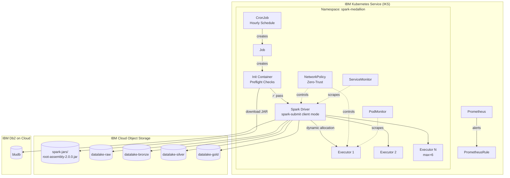
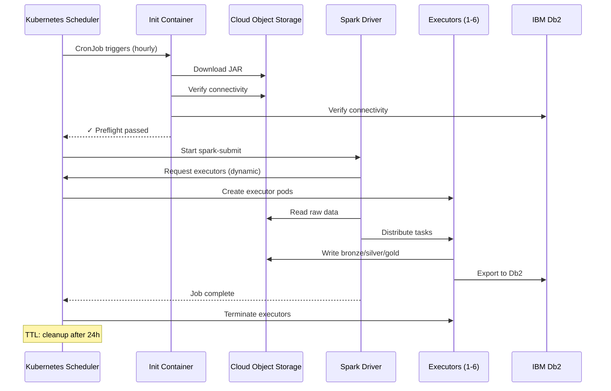

# Spark Medallion Pipeline — Kubernetes CronJob

Implementación production-grade del pipeline ETL **Medallion** (Raw → Bronze → Silver → Gold) ejecutado como **CronJob en IBM Kubernetes Service (IKS)**.

## Arquitectura



## Componentes

| Archivo | Descripción |
|---------|-------------|
| `kubernetes/namespace.yaml` | Namespace `spark-medallion` con labels de entorno |
| `kubernetes/rbac.yaml` | ServiceAccount, Role (executor CRUD), ResourceQuota, LimitRange |
| `kubernetes/secrets.yaml` | Template con `envsubst` para COS, Db2, IBM Cloud API credentials |
| `kubernetes/configmaps.yaml` | Spark config, spark-defaults.conf, scripts de preflight/healthcheck/postrun |
| `kubernetes/cronjob.yaml` | CronJob completo: init container, driver, dynamic allocation, probes, security |
| `kubernetes/network-policy.yaml` | Políticas zero-trust para driver y executors |
| `kubernetes/service.yaml` | ClusterIP para Spark UI (4040), driver RPC (7078), block manager (7079) |
| `kubernetes/monitoring.yaml` | ServiceMonitor, PodMonitor, PrometheusRule con alertas |
| `docker/Dockerfile.k8s` | Imagen multi-stage: Spark 3.3.1 + Delta Lake + S3A + Db2 JDBC |
| `docker/entrypoint.sh` | Entrypoint con JVM flags, preflight delegation |
| `Makefile` | Operaciones: deploy, delete, logs, trigger, port-forward, lint, clean |

## Quick Start

### Pre-requisitos

- `kubectl` configurado contra el cluster IKS
- `ibmcloud` CLI con plugin Container Registry
- Variables de entorno para secrets:

```bash
export COS_ACCESS_KEY="..."
export COS_SECRET_KEY="..."
export DB2_HOSTNAME="..."
export DB2_PORT="30376"
export DB2_USERNAME="..."
export DB2_PASSWORD="..."
export IBM_CLOUD_API_KEY="..."
```

### Deploy

```bash
cd infrastructure/spark-k8s

# Validar manifests
make lint

# Deploy completo (namespace + RBAC + secrets + configmaps + network + CronJob)
make deploy

# Verificar estado
make status
```

### Operaciones

```bash
# Ejecutar pipeline manualmente (sin esperar al schedule)
make trigger

# Ver logs del último job
make logs

# Ver logs del init container (preflight)
make logs-init

# Port-forward al Spark UI
make port-forward

# Limpiar jobs/pods completados
make clean

# Eliminar todo
make delete
```

## Características Avanzadas

### Security
- **Non-root execution**: UID 185 (spark), `runAsNonRoot: true`
- **Read-only rootfs**: Solo `/tmp` y `/opt/spark/work-dir` son writable
- **No privilege escalation**: `allowPrivilegeEscalation: false`
- **Capabilities dropped**: `ALL`
- **Network zero-trust**: Solo tráfico explícitamente permitido
- **Secrets como template**: Nunca se commitean credenciales

### Resiliencia
- **Init container preflight**: Verifica JAR, conectividad COS, conectividad Db2
- **Dynamic allocation**: 1–6 executors según carga
- **Concurrency policy**: `Forbid` — no hay jobs superpuestos
- **Backoff limit**: 2 reintentos antes de fallar
- **TTL cleanup**: Jobs completados se eliminan tras 24h
- **History limits**: 3 exitosos, 3 fallidos

### Observabilidad
- **Prometheus ServiceMonitor**: Scraping del driver cada 30s
- **PodMonitor**: Scraping de executors efímeros
- **PrometheusRule**: 7 alertas (job failed, stuck, missed, OOM risk, crash-loop, pending, quota)
- **Liveness/Readiness probes**: Health checks configurados

### Performance
- **Spark defaults optimizados**: Kryo serializer, AQE, broadcast 256MB
- **S3A tuning**: Fast upload, output committer v2, connection pool 200
- **Delta Lake**: Auto-optimize, optimized writes
- **Resource limits**: CPU/memory requests y limits granulares

## Flujo de Ejecución


